Socio-economic Determinants of Mortality
========================================

Abstract
--------

The purpose of the study is to explore the factors that lead to greater
mortality on the county level. The problem is the United States spends
the most on healthcare but gets poor results. Could action on the county
level reduce mortality?

The procedures employed in the study is to determine the causes of
mortality the decision tree analysis and identify regional
characteristics through clustering.

The results show the decision tree analysis is accurate for predicting
the number of deaths and gives insights into the causes. The clustering
identifies regions of the country based upon those features that are
related to those causes of mortality. The individual clusters of
counties show a stark difference in mortality rates.

The conclusions of the study support the notion of increased community
intervention and support the greater health initiatives of the
Affordable Care Act such as Patient Navigators.

Background
==========

One of the aspects that is a draw to Regis University are its values.
This project is an attempt at embodying the spirit of giving and
providing service to those in need and it is hoped that the conclusions
are a call out for action. Perhaps as a society, we can make better
choices for our communities in the most efficient manner as possible to
gain the most benefits.

Besides the obvious age related deterioration, what are the
social/economic factors that affect mortality? This project combines age
corrected county level data from CDC, IRS and CHR and examines the
relationships. The wider field will allow more feature selection and
exploration.

The Rural Health Reform Policy Research Center (2013) identified that
mortality rates are worse in rural areas compared with more populous
areas. It further states that cause-specific mortality varies by region
and speculates that culture and health behaviors may impact those
mortality rates. This project attempts to identify those cultural and
health dynamics that lead to specific mortality rates.

A 2012 study, reported in the New England Journal of Medicine, found
that states in which Medicaid expansions took place saw a significant
reduction in all-cause mortality: down about 19.6 death per 100,000
adults (Sommers, Baicker, & Epstein, 2012). As part of the Affordable
Care Act, Patient Navigators have a role to play to engage patients in a
holistic manner to address more than just the clinical issues concerning
their health. Patient Navigators help to cut through “red-tape” and
assist patients with language and cultural issues. As most things
related to the Affordable Care Act, even the very concept of Patient
Navigators is facing political attacks. While this study is not about
Patient Navigators directly, it does give insights into expanded roles
they may play.

Data Sources
============

Internal Revenue Service Statistics of Income (IRS SOI) – The IRS
publishes statistics by county about returns which include the number of
dependents claimed, wages, and aspects of business types such as
farming.

County Health Rankings (CHR) – CHR accumulates data of many factors to
strive to make communities healthier places to live by getting a
complete picture of the social/economic characteristics of counties.

Centers for Disease Control and Prevention (CDC) – WONDER is a query
tool in which public use files of mortality records can be retrieved for
further analysis. The public use files are about 83 megabytes per year.

United States Census Bureau – The Small Area Health Insurance Estimates
(SAHIE) program gathers health insurance estimates per county.

Data Collection and Preparation
===============================

Various age groups in the CDC file are combined into three age groups:
senior citizens (SENIOR), working adults (ADULTS) and those 19 and under
(YOUTH). Accounting for age by studying the condensed age groups
separately.

In the study a data pipeline approach is utilized. The need for which is
the complexity of the CHR data. Another important aspect is the
reproducibility the analysis. It was not uncommon to rerun the analysis
when a data source issue was identified and corrected.

EDA (Exploratory Data Analysis)
===============================

The analytics escalator goes from hindsight to foresight, with that in
mind the goal of this project is not to be purely predictive focused but
rather prescriptive in nature.

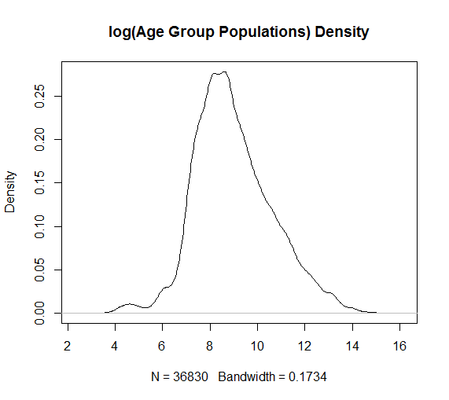

In this paper, the population being studied are those assigned to age
groups. As a whole, the age groups population sizes are lognormal
meaning that some counties have a very large population but most do not.

Data sparseness
---------------

If an age group has less than 10 deaths in the county, then the CDC
doesn't reveal it due to the privacy concerns. So, in a category of
those under 19 years old, a county needs at least 11,692 people since
the national Mortality rate is 1 in 1169 to be represented.

There are 3142 counties in the USA, however not all counties meet the
greater than 10 deaths criteria for inclusion.

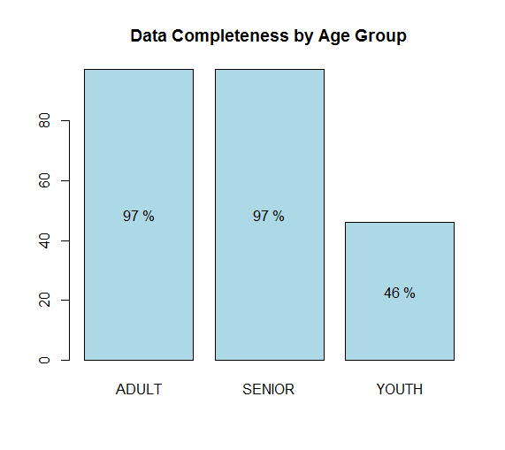

Binomial model
--------------

Deaths on a per county basis follow the binomial distribution. Each
county acts as a Bernoulli process, with each inhabitant acting as a
trial with death being a failure and continued life a success. For
sufficiently rare events of counts, the chance of occurrence may fail
below the threshold of a unit. So, when one views the
count/population\*100k to get a per-100k capita, for sufficiently small
populations, there can be an outlier numeric behavior. The found source
of the issue is shown in the mortality rate in different age groups.

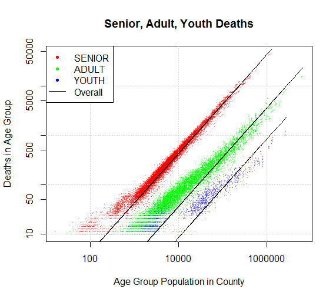

The clipping unfortunately introduces some bias as those counties with a
very low population and a very low incidence of mortality are not
represented. To address that, weighting and modeling as a binomial
process minimizes the leverage that the low population counties exert.

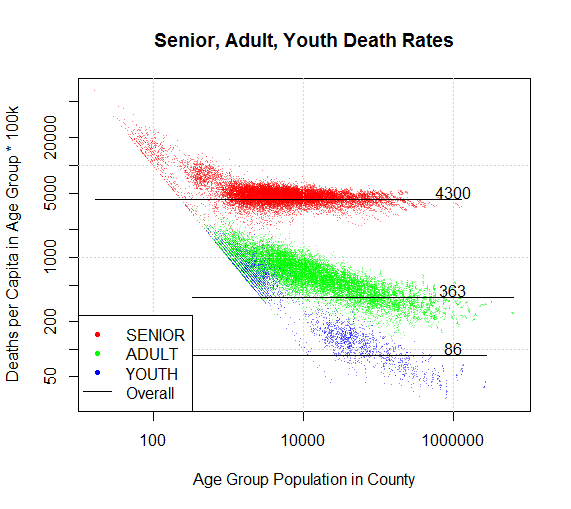

The darker lines are the priori trend lines based the total populations.
Notice how for lower populations, the number of deaths are higher than
they should be.

Per the Rural Health Reform Policy Research Center (2013),
“cause-specific mortality is often higher in rural counties than urban
counties”. In the above chart, data is trimmed by the CDC when there are
fewer than 10 deaths in an age group.

Winsorization 
--------------

Winsorization is a process in which extreme values are capped. That
process is employed for some visualization graphs to make the scale more
visually meaningful. In addition, for the standardization process for
K-Means clustering, winsorization is used in order to reduce leverage
enacted by extreme values.

Known Death Rates
-----------------

The death rate maps are they using the median rates over the five-year
study period.

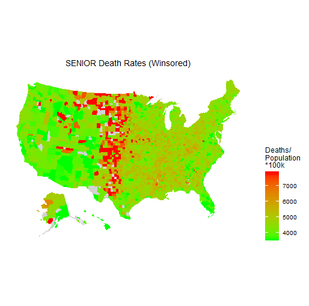

The senior death rates map highlights that in rural farming communities
the mortality rate among senior citizens is rather high.

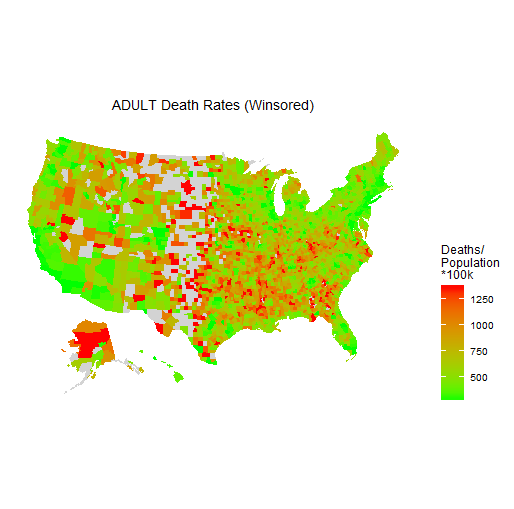

The counties in gray lack sufficient information to be accounted for.
The counties in red are those in which the adult mortality rate is
higher.

The above map shows sparseness, that is because mortality rates for
youth tend to fall below the threshold of 10 per county. Nonetheless,
the study will attempt to decipher the root causes of higher mortality
in that age group.

Analysis Methods
================

Imputation
----------

Due to the nature of the county Health Report data, there is many
missing values for the social economic data. Therefore, for those years
in which those surveys were not done, the average value for the county
is utilized. The best description for this would be a hot deck mean
imputation. However, for those counties where a measure is completely
missing, those are left absent as *rpart* decision trees can
automatically handle missing data.

Feature Selection
-----------------

Over 300 predictor variables are accumulated, of those about 90 were
chosen. Only those variables that are mutable through community action
are of the 92 initial predictor variables. Variables such as the ethnic
nature of the community were left out of the analysis as they cannot be
changed. E.g. population size is left out as well since de-population
need not be considered. Of those variables, highly correlated variables
were removed via caret::findCorrelation. The rpart decision trees are
used for variable selection with cross-validation and pruning via the
important fields attribute for the construction of decision trees. For
K-means, only the top most important fields are utilized based on each
variable account for at least 30% of the contribution of the top most
variable. Finally, a variance inflation factor check is done to ensure
no multi-collinearity for the K-Means variables.

Decision Tree Modeling
----------------------

Decision trees give insight into why it makes decisions. Decision trees
are favorable due to their interpretable nature.

To address the binomial nature of the data, weighted learning is
utilized. The weighting reduces the outlier effect of the death rate in
small counties. Even though this causes the learning methods to not have
such a high rate of death in the small counties, it more accurately
predicts the actual number of deaths over groups of counties. In
addition, it is shown that it more accurately predicts the reasons for
the higher death rate in over the entire set of counties. One must keep
in mind, for this study, the exact number of deaths is not important, it
is the reasons behind those deaths that are truly important.

Cross validation and tree pruning is utilized to prevent overfitting in
addition to a test hold out sample.

­­­ 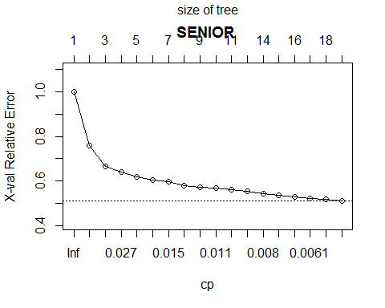

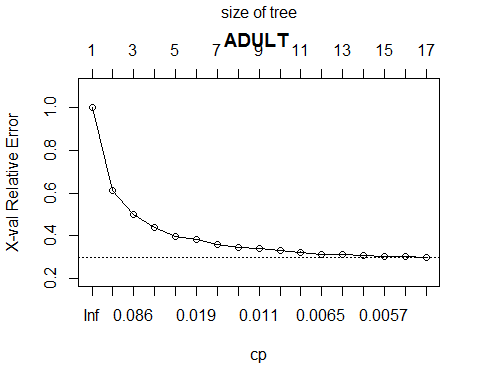

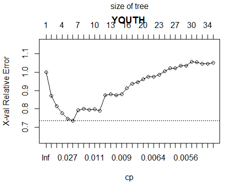

In the above cross validation results, the youth tree has a chosen
complexity parameter that reduces the cross-validation errors. The
senior and adult trees did not need pruning as the cross validation did
not warrant it.

### Important Variables

The decision trees to reveal the individual importance the predictor
features and an individual course of action or a county to undertake.

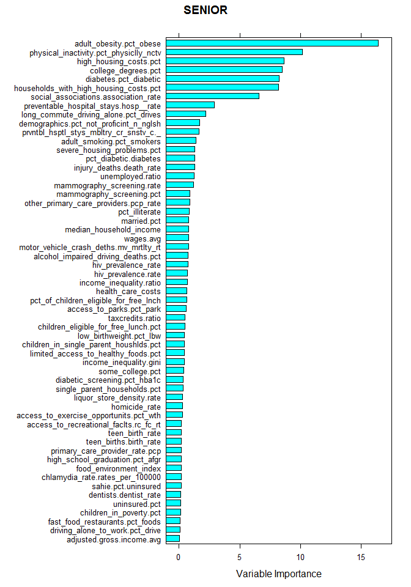

In regards to the senior citizen important variables, obesity and
physical activity play a major role. However, one should note that high
housing costs affect senior mortality rates. Efforts to reduce obesity
as well as other personal health issues should be undertaken in addition
to greater community concerns such as housing. One of the side benefits
of the Affordable Care Act is a more holistic view of the patients’
situation.

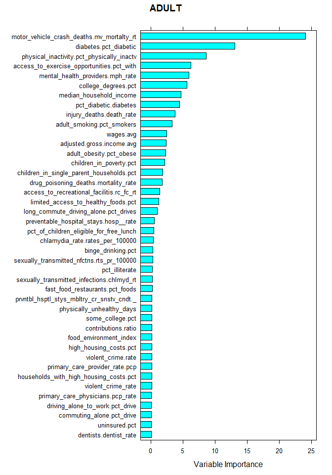

Adult risks are predominant by motor vehicle accidents but exercise and
personal health issues still have a role to play.

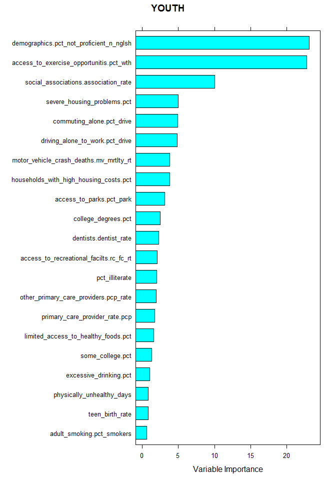

Problems in the youth age group are predominated by lack of English
proficiency and access to exercise opportunities. The following tree
views give more direct insight into the underlying causes of mortality.

### Decision Trees

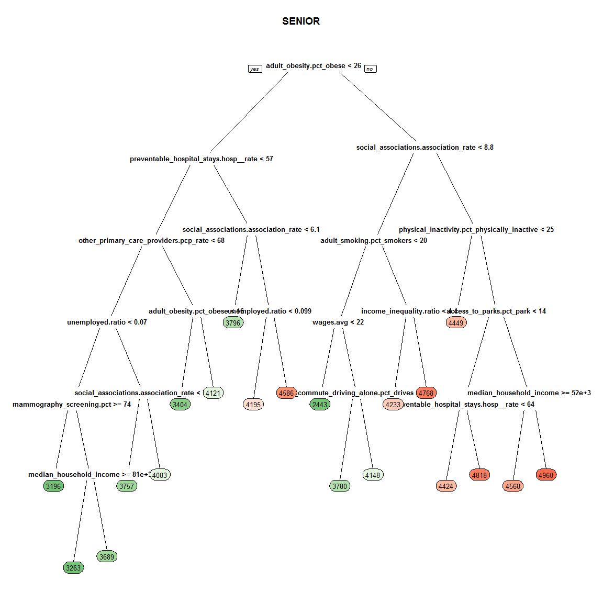

Deciphering the graphical tree can be daunting.

`##  1) root Counties:14460 Death.per.100k:4300  `\
`##    2) ``adult_obesity.pct_obese< 26 Counties:2191 Death.per.100k:3900``  `\
`##      4) preventable_hospital_stays.hosp__rate< 57 Counties:1581 Death.per.100k:3800  `\
`##        8) other_primary_care_providers.pcp_rate< 68 Counties:1052 Death.per.100k:3700  `\
`##         16) unemployed.ratio< 0.07 Counties:508 Death.per.100k:3600  `\
`##           32) mammography_screening.pct>=74 Counties:54 Death.per.100k:3200 *`\
`##           33) mammography_screening.pct< 74 Counties:454 Death.per.100k:3600  `\
`##             66) median_household_income>=8.1e+04 Counties:70 Death.per.100k:3300 *`\
`##             67) median_household_income< 8.1e+04 Counties:384 Death.per.100k:3700 *`\
`##         17) unemployed.ratio>=0.07 Counties:544 Death.per.100k:3900  `\
`##           34) ``social_associations.association_rate``< 7.3 Counties:183 Death.per.100k:3800 *`\
`##           35) ``social_associations.association_rate``>=7.3 Counties:361 Death.per.100k:4100 *`\
`##        9) other_primary_care_providers.pcp_rate>=68 Counties:529 Death.per.100k:4000  `\
`##         18) adult_obesity.pct_obese< 16 Counties:22 Death.per.100k:3400 *`\
`##         19) adult_obesity.pct_obese>=16 Counties:507 Death.per.100k:4100 *`\
`##      5) preventable_hospital_stays.hosp__rate>=57 Counties:610 Death.per.100k:4200  `\
`##       10) ``social_associations.association_rate``< 6.1 Counties:77 Death.per.100k:3800 *`\
`##       11) ``social_associations.association_rate``>=6.1 Counties:533 Death.per.100k:4300  `\
`##         22) unemployed.ratio< 0.099 Counties:369 Death.per.100k:4200 *`\
`##         23) unemployed.ratio>=0.099 Counties:164 Death.per.100k:4600 *`\
`##    3) ``adult_obesity.pct_obese>=26 Counties:12269 Death.per.100k:4600``  `\
`##      6) ``social_associations.association_rate``< 8.8 Counties:2124 Death.per.100k:4200  `\
`##       12) adult_smoking.pct_smokers< 20 Counties:818 Death.per.100k:4000  `\
`##         24) primary_care_provider_rate.pcp< 42 Counties:166 Death.per.100k:3200  `\
`##           48) physical_inactivity.pct_physically_inactive< 24 Counties:34 Death.per.100k:2700 *`\
`##           49) physical_inactivity.pct_physically_inactive>=24 Counties:132 Death.per.100k:4300 *`\
`##         25) primary_care_provider_rate.pcp>=42 Counties:652 Death.per.100k:4100  `\
`##           50) injury_deaths.death_rate< 39 Counties:78 Death.per.100k:3700 *`\
`##           51) injury_deaths.death_rate>=39 Counties:574 Death.per.100k:4100 *`\
`##       13) adult_smoking.pct_smokers>=20 Counties:1306 Death.per.100k:4500  `\
`##         26) income_inequality.ratio< 4.4 Counties:476 Death.per.100k:4200 *`\
`##         27) income_inequality.ratio>=4.4 Counties:830 Death.per.100k:4800 *`\
`##      7) ``social_associations.association_rate``>=8.8 Counties:10145 Death.per.100k:4700  `\
`##       14) physical_inactivity.pct_physically_inactive< 25 Counties:1586 Death.per.100k:4400 *`\
`##       15) physical_inactivity.pct_physically_inactive>=25 Counties:8559 Death.per.100k:4800  `\
`##         30) access_to_parks.pct_park< 14 Counties:4422 Death.per.100k:4700  `\
`##           60) preventable_hospital_stays.hosp__rate< 64 Counties:1244 Death.per.100k:4400 *`\
`##           61) preventable_hospital_stays.hosp__rate>=64 Counties:3178 Death.per.100k:4800 *`\
`##         31) access_to_parks.pct_park>=14 Counties:4137 Death.per.100k:4900  `\
`##           62) median_household_income>=5.2e+04 Counties:480 Death.per.100k:4600 *`\
`##           63) median_household_income< 5.2e+04 Counties:3657 Death.per.100k:5000 *`

Looking at the top predictor obesity, a major pivot point is the 26%
obesity mark. Looking further with linear regression, for every
percentage point that obesity is reduced in the senior population, the
number of deaths per 100k goes down by 79.

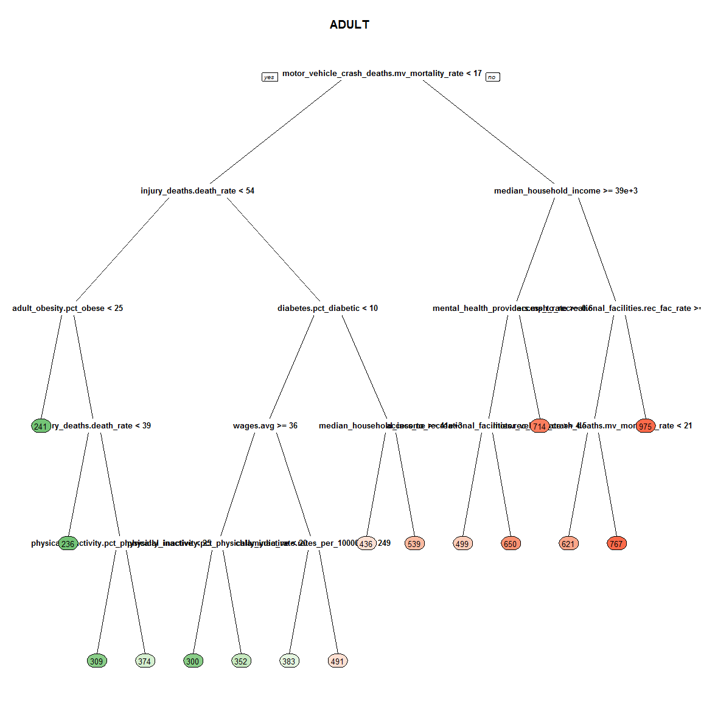

In the splits chart, above, one can see the splits around social
associations. CHR (2017) postulated that social associations can be
helpful for community well-being. However, this analysis shows an
over-reliance on social associations may be a poor substitute for proper
governmental organization.

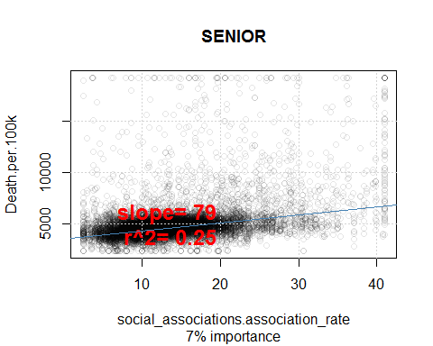

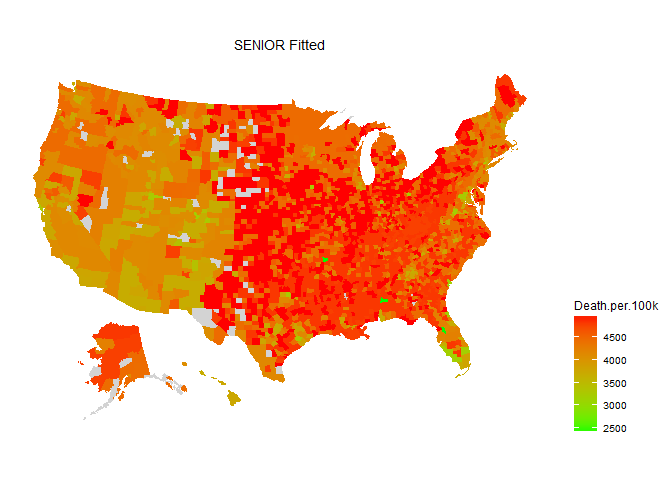

Unfortunately, the graphical layout suffers from overlaps.

`## ADULT  tree depth is 5 `\
`## n= 12675 `\
`## `\
`## node), split, n, ``yval`\
`##       * denotes terminal node`\
`## `\
`##  1) root Counties:12675 Death.per.100k:360  `\
`##    ``2) motor_vehicle_crash_deaths.mv_mortality_rate< 17 Counties:5416 Death.per.100k:330``  `\
`##      4) injury_deaths.death_rate< 54 Counties:1843 Death.per.100k:270  `\
`##        8) adult_obesity.pct_obese< 25 Counties:512 Death.per.100k:240 *`\
`##        9) adult_obesity.pct_obese>=25 Counties:1331 Death.per.100k:310  `\
`##         18) injury_deaths.death_rate< 39 Counties:155 Death.per.100k:240 *`\
`##         19) injury_deaths.death_rate>=39 Counties:1176 Death.per.100k:320  `\
`##           38) physical_inactivity.pct_physically_inactive< 25 Counties:670 Death.per.100k:310 *`\
`##           39) physical_inactivity.pct_physically_inactive>=25 Counties:506 Death.per.100k:370 *`\
`##      5) injury_deaths.death_rate>=54 Counties:3573 Death.per.100k:390  `\
`##       10) diabetes.pct_diabetic< 10 Counties:1907 Death.per.100k:350  `\
`##         20) wages.avg>=36 Counties:896 Death.per.100k:330  `\
`##           40) physical_inactivity.pct_physically_inactive< 20 Counties:248 Death.per.100k:300 *`\
`##           41) physical_inactivity.pct_physically_inactive>=20 Counties:648 Death.per.100k:350 *`\
`##         21) wages.avg< 36 Counties:1011 Death.per.100k:410  `\
`##           42) chlamydia_rate.rates_per_100000>=2.5e+02 Counties:355 Death.per.100k:380 *`\
`##           43) chlamydia_rate.rates_per_100000< 2.5e+02 Counties:656 Death.per.100k:490 *`\
`##       11) diabetes.pct_diabetic>=10 Counties:1666 Death.per.100k:460  `\
`##         22) median_household_income>=4.1e+04 Counties:999 Death.per.100k:440 *`\
`##         23) median_household_income< 4.1e+04 Counties:667 Death.per.100k:540 *`\
`##    ``3) motor_vehicle_crash_deaths.mv_mortality_rate>=17 Counties:7259 Death.per.100k:610``  `\
`##      6) median_household_income>=3.9e+04 Counties:3495 Death.per.100k:530  `\
`##       12) mental_health_providers.mph_rate>=0.6 Counties:2320 Death.per.100k:510  `\
`##         24) access_to_recreational_facilities.rec_fac_rate>=4.5 Counties:1804 Death.per.100k:500 *`\
`##         25) access_to_recreational_facilities.rec_fac_rate< 4.5 Counties:516 Death.per.100k:650 *`\
`##       13) mental_health_providers.mph_rate< 0.6 Counties:1175 Death.per.100k:710 *`\
`##      7) median_household_income< 3.9e+04 Counties:3764 Death.per.100k:740  `\
`##       14) access_to_recreational_facilities.rec_fac_rate>=0.33 Counties:2407 Death.per.100k:700  `\
`##         28) motor_vehicle_crash_deaths.mv_mortality_rate< 21 Counties:677 Death.per.100k:620 *`\
`##         29) motor_vehicle_crash_deaths.mv_mortality_rate>=21 Counties:1730 Death.per.100k:770 *`\
`##       15) access_to_recreational_facilities.rec_fac_rate< 0.33 Counties:1357 Death.per.100k:970 *`

As indicated above, motor vehicle crashes are a major concern, through
regression analysis, the crashes may account for 56% of proportion of
the variance in mortality.

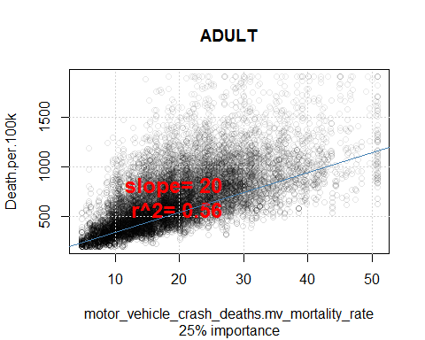

The lower the income, the more mortality inflicted. Job training
programs not only teach a career but may save a life. This may reflect
the affordability of healthcare.

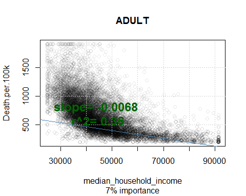

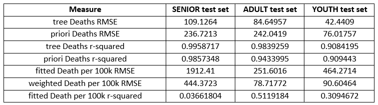

Again, reading the graphical tree can be difficult. The text output is
easier to consume with practice.

`## YOUTH  tree depth is 3 `\
`## n= 2313 `\
`## `\
`## node), split, n, ``yval`\
`##       * denotes terminal node`\
`## `\
`##  1) root Counties:2313 Death.per.100k: 86  `\
`##    2) ``demographics.pct_not_proficient_in_english>=3.9 Counties:908 Death.per.100k: 69``  `\
`##      4) social_associations.association_rate< 7.3 Counties:370 Death.per.100k: 57 *`\
`##      5) social_associations.association_rate>=7.3 Counties:538 Death.per.100k:100  `\
`##       10) access_to_exercise_opportunities.pct_with>=83 Counties:360 Death.per.100k: 93 *`\
`##       11) access_to_exercise_opportunities.pct_with< 83 Counties:178 Death.per.100k:240 *`\
`##    3) ``demographics.pct_not_proficient_in_english< 3.9 Counties:1405 Death.per.100k:170``  `\
`##      6) access_to_exercise_opportunities.pct_with>=71 Counties:1002 Death.per.100k:150  `\
`##       12) access_to_exercise_opportunities.pct_with>=86 Counties:408 Death.per.100k:120 *`\
`##       13) access_to_exercise_opportunities.pct_with< 86 Counties:594 Death.per.100k:220 *`\
`##      7) access_to_exercise_opportunities.pct_with< 71 Counties:403 Death.per.100k:460 *`

Lack of proficiency in English may appear to negatively affect mortality
but it does **not**. Why would knowing more English be a bad thing? This
may be a case of correlation is not causation.

Peering deeper into Node 1, perhaps it is negatively associated with
social associations rate. More research is in order.

`## Node number 1: 2313 observations,    complexity ``param``=0.1345629`\
`##   mean=85.66406, MSE=10208.18 `\
`##   left son=2 (908 ``obs``) right son=3 (1405 ``obs``)`\
`##   Primary splits:`\
`##       demographics.pct_not_proficient_in_english   < 3.873321 to the right, improve=0.13456290, (0 missing)`\
`##       social_associations.association_rate         < 7.547315 to the left,  improve=0.11589750, (1 missing)`\
`##       high_housing_costs.pct                       < 30.29605 to the right, improve=0.10937370, (0 missing)`\
`##       motor_vehicle_crash_deaths.mv_mortality_rate < 14.68285 to the left,  improve=0.09595310, (1 missing)`\
`##       ``long_commute_driving_alone.pct_drives``        < 30.65    to the right, improve=0.09399445, (1 missing)`\
`##   Surrogate splits:`\
`##       social_associations.association_rate < 9.795606 to the left,  agree=0.867, ``adj``=0.247, (0 split)`\
`##       severe_housing_problems.pct          < 16.35279 to the right, agree=0.865, ``adj``=0.234, (0 split)`\
`##       ``commuting_alone.pct_drive``            < 82.35599 to the left,  agree=0.864, ``adj``=0.232, (0 split)`\
`##       high_housing_costs.pct               < 31.38978 to the right, agree=0.854, ``adj``=0.172, (0 split)`\
`##       diabetes.pct_diabetic                < 10.50417 to the left,  agree=0.849, ``adj``=0.147, (0 split)`

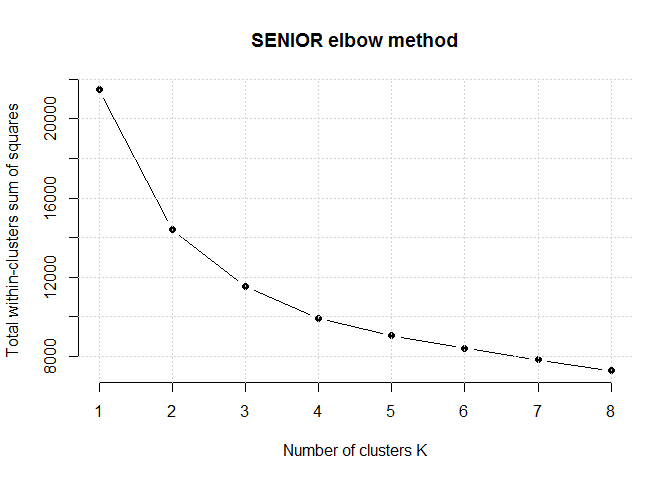

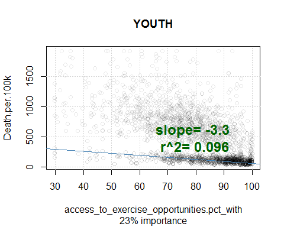

More exercise for youth is a life saver. This is also closely related
with *access to parks* as reported by the rpart summary.

### Prediction Maps

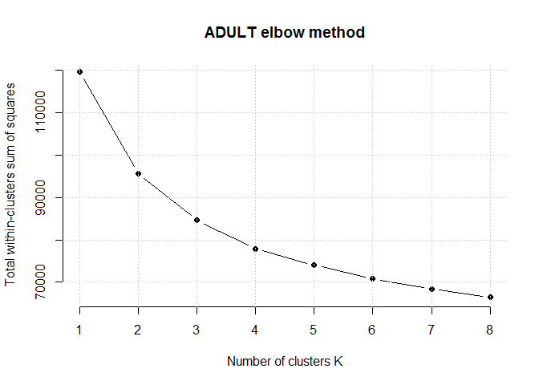

The decision tree has some difficulty in predicting the exact mortality
rate for seniors living in counties. However, the general shape the
intensity of the mortality rates show some similarity to the actuals.

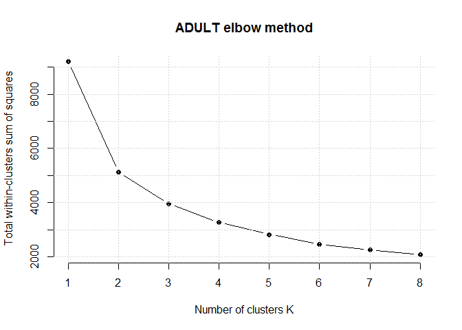

Visually comparing the adult predicted mortality rates with the actual
mortality rates show a strong visual similarity of the heat maps.

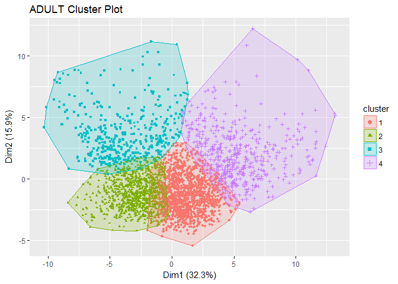

The youth fitted heat map fills in a lot of the missing data from the
actual map. In the above map, metropolitan areas tend to have a more
favorable environment.

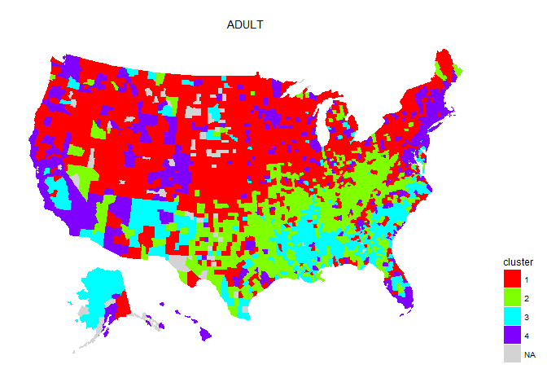

Looking at the performance metrics, with respect to predicting the
actual number of deaths, the trees perform quite well and reduce the
root mean squared error by nearly in half. The r squared values of the
predicted mortality rates are less stellar. The senior citizen rates
being especially difficult to infer. The study is more focused into the
cause of mortality, the shortcomings and predicting the mortality rates
themselves should not be too alarming. Especially when the number of
deaths it so accurately predicted. The major shortcoming for the low r
squared in the actual mortality death rates may be due to the
heteroskedastic nature of those mortality death rates in those counties
that have a low age group population.

K-Means
-------

The intention of the clustering is to identify regional areas in which
to set up programs on a larger scale to address concerns in a more
sweeping manner.

Initially k-means was performed but good results were not found. Feature
selection is just as important in K-means as for supervised methods in
this case. After the important predictors are used from the recursive
partitioning trees (rpart) is utilized the k-means analyzed produced
cohesive clusters.

When constructing the k-means clusters, the important variables as
identified by the tree analysis for utilized. Using the elbow method
three clusters or determined to be optimal. However, it is admitted that
there is a bit of subjectivity to the number of clusters. The dataset
for clustering was standardized.

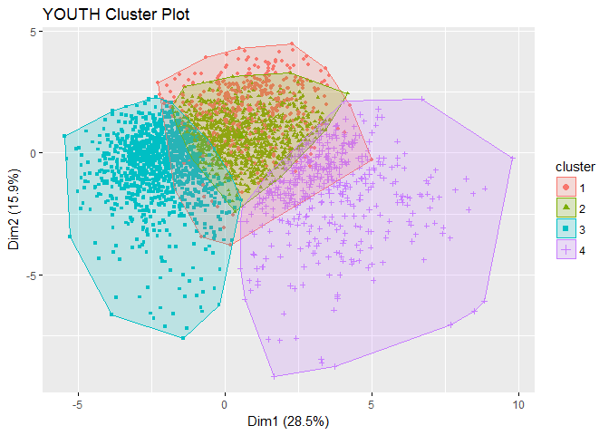
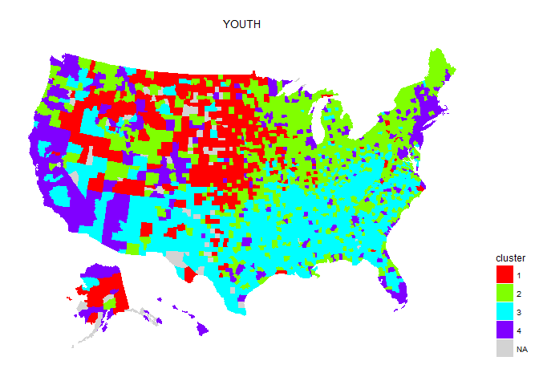
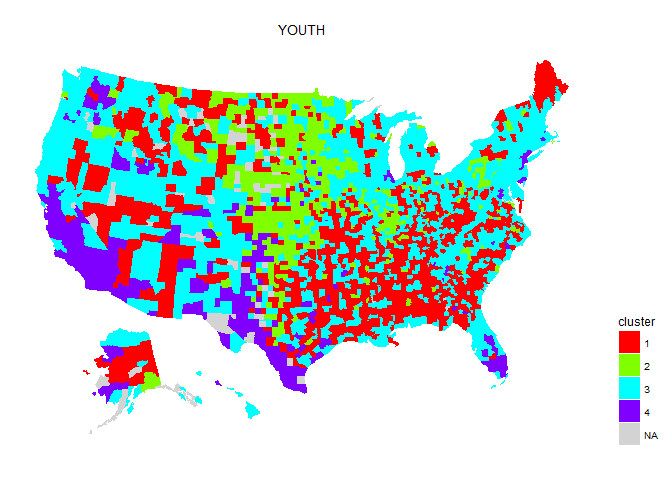

\#\# SENIOR cluster= 1 deathRate per 100k: 2393.272 counties: 716\
\#\# SENIOR cluster= 2 deathRate per 100k: 1673.197 counties: 991\
\#\# SENIOR cluster= 3 deathRate per 100k: 1274.992 counties: 942\
\#\# SENIOR cluster= 4 deathRate per 100k: 809.0095 counties: 419

The clusters for senior citizens happen to be ranked from bad to good.
One can see in the pattern, the metropolitan areas have a better
environment for senior citizens with the beltway of America being one of
the one of the worst.

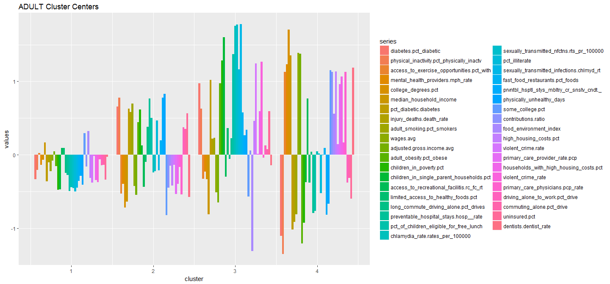

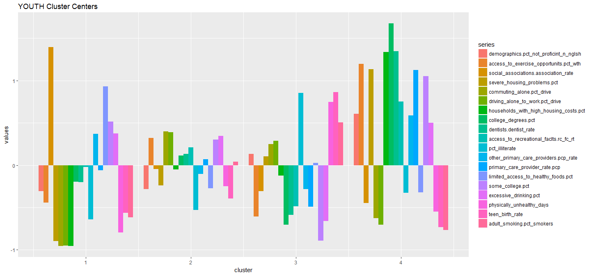

\#\# ADULT cluster= 1 deathRate per 100k: 1294.359 counties: 1304\
\#\# ADULT cluster= 2 deathRate per 100k: 847.3716 counties: 701\
\#\# ADULT cluster= 3 deathRate per 100k: 1875.764 counties: 750\
\#\# ADULT cluster= 4 deathRate per 100k: 1857.314 counties: 313

The clustering identifies the high population metropolitan areas in
addition to Colorado being a favorable environment for adult longevity.

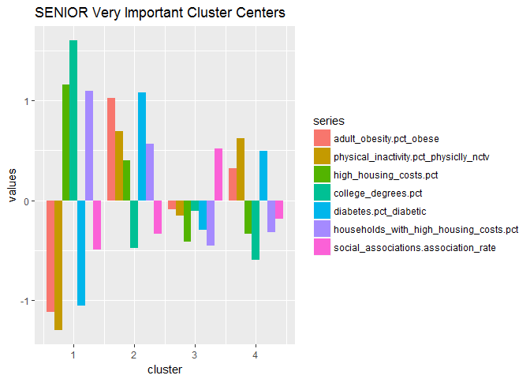
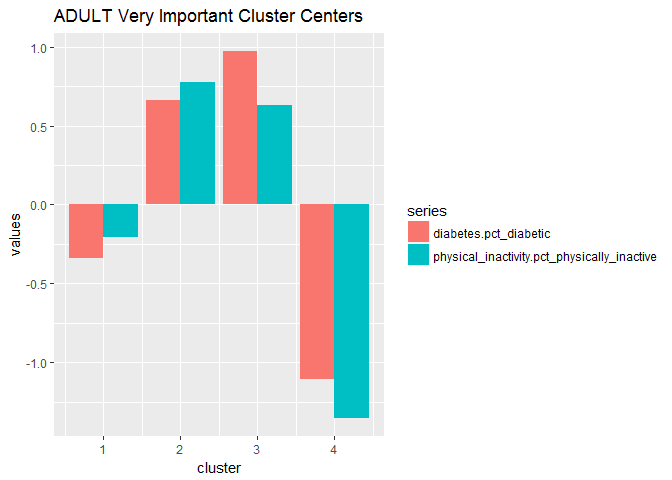
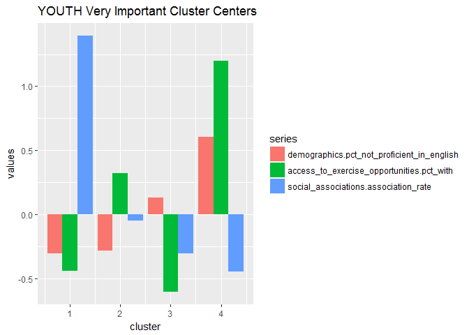

\#\# YOUTH cluster= 1 deathRate per 100k: 1884.152 counties: 1022\
\#\# YOUTH cluster= 2 deathRate per 100k: 2344.622 counties: 472\
\#\# YOUTH cluster= 3 deathRate per 100k: 1162.552 counties: 1368\
\#\# YOUTH cluster= 4 deathRate per 100k: 717.2535 counties: 206

The youth clusters identify rural Midwest farming being the highest
concern.

Cluster Characteristics
-----------------------

The following charts illustrate the mean values of the various
characteristics that make up a cluster.

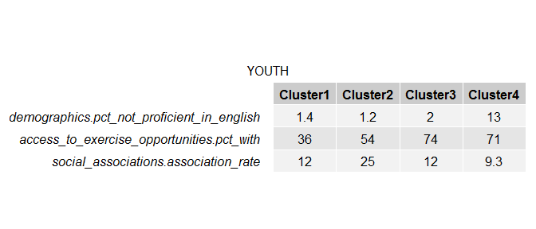

The following charts illustrate the magnitude of the various
characteristics that make up a cluster. The way to read the chart is to
remember that the bar charts are by magnitude of standard deviation.
Thus, a very tall bar represents an extreme value while a very low bar
represents a very small value. The bar charts give greater insight into
those geographic areas.

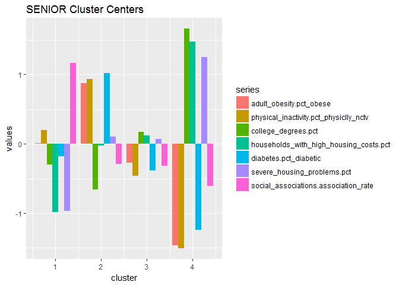
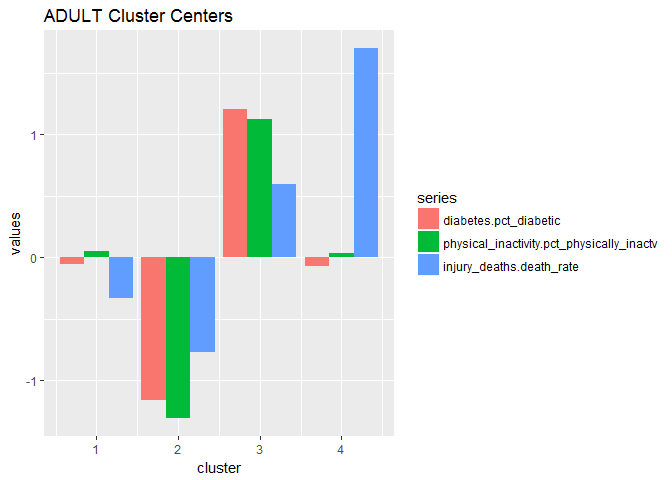

Conclusion
==========

Dr. Elizabeth H Bradley and her fellow researchers (Bradley, Elkins,
Herrin, & Elbel, 2011) state increased social expenditures in comparison
to health expenditures is significantly associated with better outcomes
mortality. This research supports that claim. Patient Navigators is a
mechanism to address some of the issues highlighted. Natale-Pereira,
Enard, Nevarez and Jones (2011) discuss the role of a Patient Navigator
and how they can break through literacy barriers and facilitate access
to care with sensitivity to cultural barriers. Contrary to some
politicians believe, this study suggests that continued use of Patient
Navigators and the expansion of that program is most likely in order.

The adult age group is most susceptible to accidents. One might presume
that the youth age group would be susceptible to accidents as well.
However, to the contrary, much like the senior citizens, the youth age
group shows problems of lack of exercise and poor diet. Michelle Obama
emphasis on obesity reduction through diet and exercise was very well
placed.

With the adult age group showing a large sensitivity to motor vehicle
accidents, the crumbling infrastructure of the United States but over
capacity of roads, highways, and bridges, is much more than an economic
stimulus opportunity but clearly one of life and death. It is
unfortunate that after a full year out Republican rule, a stimulus plan
has yet to materialize.

A lot of commonality exist in the regional clusters. Large metropolitan
areas tend to have the best outcomes. Rural areas suffer from a lack of
infrastructure. The deep south generally faces the most challenges.

The author of this report gained a heightened awareness of the
importance of exercise in addition to the usual New Year's resolutions
has promised himself to do far more exercise in the upcoming year. The
importance of having places to exercise is highlighted. Just like
Carnegie brought libraries across America perhaps another great purpose
for a charitable organization is to bring playground and parks and
revival to communities.

References
==========

Bradley, E.H., Elkins, B.R., Herrin, J., & Elbel, B. (2011). Health and
social services expenditures: associations with health outcomes.
Retrieved from: <http://dx.doi.org/10.1136/bmjqs.2010.048363>

Centers for Disease Control and Prevention (2017) WONDER. Retrieved
from: <https://wonder.cdc.gov/>

County Health Rankings & Roadmaps (2017). Rankings Data. Retrieved from:
<http://www.countyhealthrankings.org/>

IRS (2015). SOI Tax Stats - County Data. Retrieved from:
<https://www.irs.gov/statistics/soi-tax-stats-county-data>

Natale-Pereira, A., Enard, K. R., Nevarez, L. & Jones, L. A. (2011). The
Role of Patient Navigators in Eliminating Health Disparities. Retrieved
from: <http://onlinelibrary.wiley.com/doi/10.1002/cncr.26264/pdf>

Rural Health Reform Policy Research Center (2013). Mapping Rural and
Urban Mortality Differences by HHS Region. Retrieved from:
<https://ruralhealth.und.edu/projects/health-reform-policy-research-center/pdf/mapping-rural-urban-mortality-differences-hhs-regions.pdf>

Sommers, B. D., Baicker, K., Epstein, A. M. (2012) Mortality and Access
to Care among Adults after State Medicaid Expansions. N Engl J Med.
Retrieved from:
<http://www.nejm.org/doi/full/10.1056/nejmsa1202099#t=article>

United States Census Bureau (2015). Small Area Health Insurance
Estimates (SAHIE). Retrieved from:
<https://www.census.gov/programs-surveys/sahie.html>
