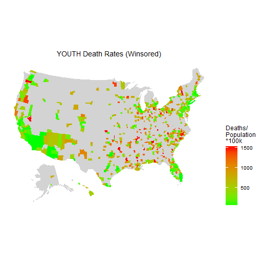
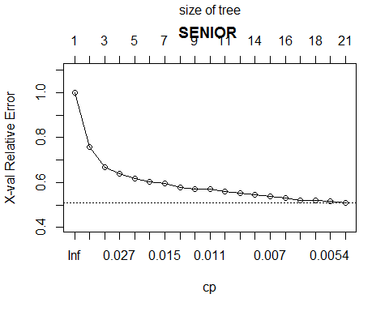
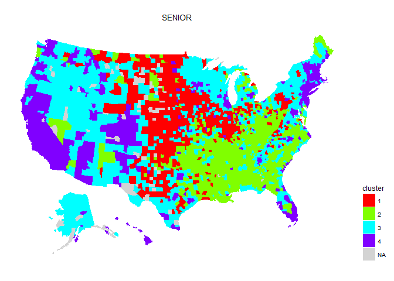
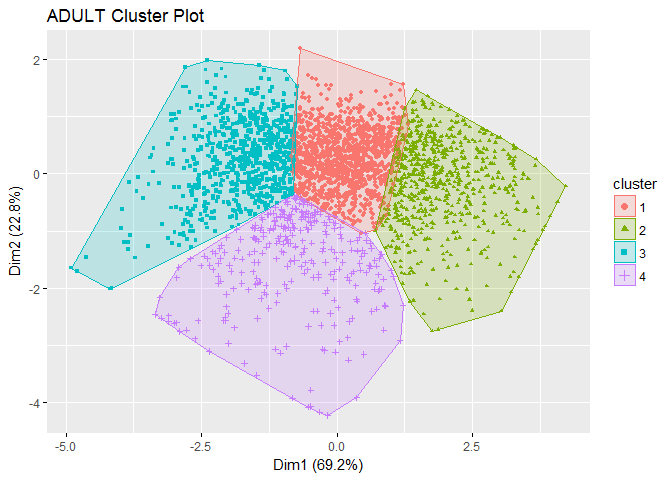
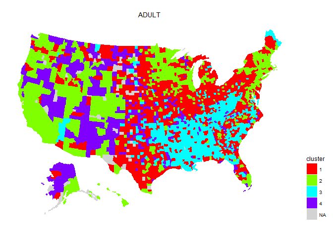
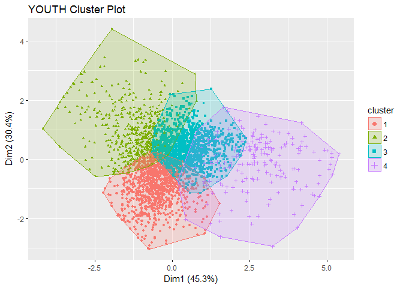
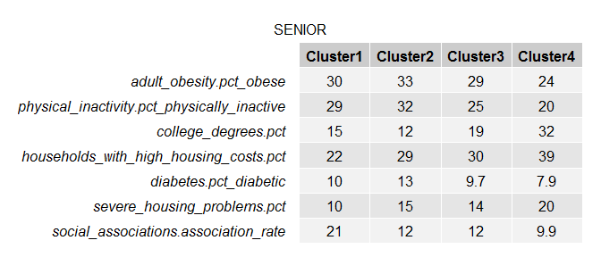

Socio-economic Determinants of Mortality
========================================

Abstract
--------

The purpose of the study is to explore the factors that lead to greater
mortality on the county level. The problem is the United States spends
the most on healthcare but gets poor results. Could action on the county
level reduce mortality?

The procedures employed in the study is to determine the causes of
mortality the decision tree analysis and identify regional
characteristics through clustering.

The results show the decision tree analysis is accurate for predicting
the number of deaths and gives insights into the causes. The clustering
identifies regions of the country based upon those features that are
related to those causes of mortality. The individual clusters of
counties show a stark difference in mortality rates.

The conclusions of the study support the notion of increased community
intervention and support the greater health initiatives of the
Affordable Care Act such as Patient Navigators.

Background
==========

One of the aspects that is a draw to Regis University are its values.
This project is an attempt at embodying the spirit of giving and
providing service to those in need and it is hoped that the conclusions
are a call out for action. Perhaps as a society, we can make better
choices for our communities in the most efficient manner as possible to
gain the most benefits.

Besides the obvious age related deterioration, what are the
social/economic factors that affect mortality? This project combines age
corrected county level data from CDC, IRS and CHR and examines the
relationships. The wider field will allow more feature selection and
exploration.

The Rural Health Reform Policy Research Center (2013) identified that
mortality rates are worse in rural areas compared with more populous
areas. It further states that cause-specific mortality varies by region
and speculates that culture and health behaviors may impact those
mortality rates. This project attempts to identify those cultural and
health dynamics that lead to specific mortality rates.

A 2012 study reported in the New England Journal of Medicine found that
states in which Medicaid expansions took place a significant reduction
in all-cause mortality occurred down about 19.6 death per 100,000 adults
(Sommers, Baicker, & Epstein, 2012). As part of the Affordable Care Act,
Patient Navigators have a role to play to engage patients in a holistic
manner to address more than just the clinical issues concerning their
health. Patient Navigators help to cut through “red-tape” and assist
patients with language and cultural issues. As most things related to
the Affordable Care Act, even the very concept of Patient Navigators is
facing political attacks. While this study is not about Patient
Navigators directly, it does give insights into expanded roles they may
play.

Data Sources
============

Internal Revenue Service Statistics of Income (IRS SOI) – The IRS
publishes statistics by county about returns which include the number of
dependents claimed, wages, and aspects of business types such as
farming.

County Health Rankings (CHR) – CHR accumulates data of many factors to
strive to make communities healthier places to live by getting a
complete picture of the social/economic characteristics of counties.

Centers for Disease Control and Prevention (CDC) – WONDER is a query
tool in which public use files of mortality records can be retrieved for
further analysis. The public use files are about 83 megabytes per year.

United States Census Bureau – The Small Area Health Insurance Estimates
(SAHIE) program gathers health insurance estimates per county.

Data Collection and Preparation
===============================

Various age groups in the CDC file are combined into three age groups:
senior citizens (SENIOR), working adults (ADULTS) and those 19 and under
(YOUTH). Accounting for age by studying the condensed age groups
separately.

In the study a data pipeline approach is utilized. The need for which is
the complexity of the CHR data. Another important aspect is the
reproducibility the analysis. It was not uncommon to rerun the analysis
when a data source issue was identified and corrected.

EDA (Exploratory Data Analysis)
===============================

The analytics escalator goes from hindsight to foresight, with that in
mind the goal of this project is not to be purely predictive focused but
rather prescriptive in nature.

In this paper, the population being studied are those assigned to age
groups. As a whole, the age groups population sizes are lognormal
meaning that some counties have a very large population but most do not.

Data sparseness
---------------

If an age group has less than 10 deaths in the county, then the CDC
doesn't reveal it due to the privacy concerns. So, in a category of
those under 19 years old, a county needs at least 11,692 people since
the national Mortality rate is 1 in 1169 to be represented.

There are 3142 counties in the USA, however not all counties meet the
greater than 10 deaths criteria for inclusion.

Binomial model
--------------

Deaths on a per county basis follow the binomial distribution. Each
county acts as a Bernoulli process, with each inhabitant acting as a
trial with death being a failure and continued life a success. For
sufficiently rare events of counts, the chance of occurrence may fail
below the threshold of a unit. So, when one views the
count/population\*100k to get a per-100k capita, for sufficiently small
populations, there can be an outlier numeric behavior. The found source
of the issue is shown in the mortality rate in different age groups.

The clipping unfortunately introduces some bias as those counties with a
very low population and a very low incidence of mortality are not
represented. To address that, weighting and modeling as a binomial
process minimizes the leverage that the low population counties exert.

The darker lines are the priori trend lines based the total populations.
Notice how for lower populations, the number of deaths are higher than
they should be.

Per the Rural Health Reform Policy Research Center (2013),
“cause-specific mortality is often higher in rural counties than urban
counties”. In the above chart, data is trimmed by the CDC when there are
fewer than 10 deaths in an age group.

Winsorization 
--------------

Winsorization is a process in which extreme values are capped. That
process is employed for some visualization graphs to make the scale more
visually meaningful. In addition, for the standardization process for
K-Means clustering, winsorization is used in order to reduce leverage
enacted by extreme values.

Known Death Rates
-----------------

The death rate maps are they using the median rates over the five-year
study period.

The senior death rates map highlights that in rural farming communities
the mortality rate among senior citizens is rather high.

The counties in gray lack sufficient information to be accounted for.
The counties in red are those in which the adult mortality rate is
higher.

The above map shows sparseness, that is because mortality rates for
youth tend to fall below the threshold of 10 per county. Nonetheless,
the study will attempt to decipher the root causes of higher mortality
in that age group.

Analysis Methods
================

Imputation
----------

Due to the nature of the county Health Report data, there is many
missing values for the social economic data. Therefore, for those years
in which those surveys were not done, the average value for the county
is utilized. The best description for this would be a hot deck mean
imputation. However, for those counties where a measure is completely
missing, those are left absent as rpart decision trees can automatically
handle missing data.

Feature Selection
-----------------

Over 300 predictor variables are accumulated, of those 92 were chosen.
Only those variables that are mutable through community action are of
the 92 initial predictor variables. Variables such as the ethnic nature
of the community were left out of the analysis as they cannot be
changed. Population size is left out as well since de-population need
not be considered.

Decision Trees
--------------

Decision trees give insight into why it makes decisions. Decision trees
are favorable due to their interpretable nature.

To address the binomial nature of the data, weighted learning will be
utilized. The weighting reduces the outlier effect of the death rate in
small counties. Even though this will cause the learning methods to not
have such a high rate of death in the small counties, it will more
accurately predict the actual number of deaths over groups of counties.
In addition, it is shown that it more accurately predicts the reasons
for the higher death rate in over the entire set of counties. One must
keep in mind, for this study, the exact number of deaths isn't
important, it is the reasons behind those deaths that are truly
important.

Cross validation and tree pruning is utilized to prevent overfitting in
addition to a test hold out sample.

In the above cross validation results, the youth tree has a chosen
complexity parameter that reduces the cross-validation errors. The
senior and adult trees did not need pruning as the cross validation did
not warrant it.

The decision trees to reveal the individual importance the predictor
features and an individual course of action or a county to undertake.

In regards to the senior citizen important variables, obesity and
physical activity play a major role. However, one should note that high
housing costs affect senior mortality rates. Efforts to reduce obesity
as well as other personal health issues should be undertaken in addition
to greater community concerns such as housing. One of the side benefits
of the Affordable Care Act is a more holistic view of the patients’
situation.

Adult risks are predominant by motor vehicle accidents but exercise and
personal health issues still have a role to play.

Problems in the youth age group are predominated by lack of English
proficiency and access to exercise opportunities. The following tree
views give more direct insight into the underlying causes of mortality.

Above one can see the splits around social associations. CHR (2017)
postulated that social associations can be helpful for community
well-being. However, this analysis shows an over-reliance on social
associations may be a poor substitute for proper governmental
organization.

Lack of proficiency in English or the lack of multilingual services
deeply effects certain counties. Patient Navigators have been shown to
assist in this area.

The decision tree has some difficulty in predicting the exact mortality
rate for seniors living in counties. However, the general shape the
intensity of the mortality rates show some similarity to the actuals.

Visually comparing the adult predicted mortality rates with the actual
mortality rates show a strong visual similarity of the heat maps.

The youth fitted heat map fills in a lot of the missing data from the
actual map. In the above map, metropolitan areas tend to have a more
favorable environment.

Looking at the performance metrics, with respect to predicting the
actual number of deaths, the trees perform quite well and reduce the
root mean squared error by nearly in half. The r squared values of the
predicted mortality rates are less stellar. The senior citizen rates
being especially difficult to infer. The study is more focused into the
cause of mortality, the shortcomings and predicting the mortality rates
themselves should not be too alarming. Especially when the number of
deaths it so accurately predicted. The major shortcoming for the low r
squared in the actual mortality death rates may be due to the
heteroskedastic nature of those mortality death rates in those counties
that have a low age group population.

K-Means
-------

The intention of the clustering is to identify regional areas in which
to set up programs on a larger scale to address concerns in a more
sweeping manner.

Initially k-means was performed but good results were not found. Feature
selection is just as important in K-means as for supervised methods in
this case. After the important predictors are used from the recursive
partitioning trees (rpart) is utilized the k-means analyzed produced
cohesive clusters.

When constructing the k-means clusters, the important variables as
identified by the tree analysis for utilized. Using the elbow method
three clusters or determined to be optimal. However, it is admitted that
there is a bit of subjectivity to the number of clusters. The dataset
for clustering was standardized.

\#\# SENIOR cluster= 1 deathRate per 100k: 867.6311 counties: 554\
\#\# SENIOR cluster= 2 deathRate per 100k: 1074.51 counties: 394\
\#\# SENIOR cluster= 3 deathRate per 100k: 1675.77 counties: 1131\
\#\# SENIOR cluster= 4 deathRate per 100k: 1727.55 counties: 989

The clusters for senior citizens happen to be ranked from good to bad.
One can see in the pattern, the metropolitan areas have a better
environment for senior citizens with the beltway of America being one of
the one of the worst.

\#\# ADULT cluster= 1 deathRate per 100k: 1612.417 counties: 1285\
\#\# ADULT cluster= 2 deathRate per 100k: 1939.683 counties: 856\
\#\# ADULT cluster= 3 deathRate per 100k: 1139.201 counties: 429\
\#\# ADULT cluster= 4 deathRate per 100k: 845.8497 counties: 498

The clustering identifies the high population metropolitan areas in
addition to Colorado being a favorable environment for adult longevity.

\#\# YOUTH cluster= 1 deathRate per 100k: 3473.614 counties: 433\
\#\# YOUTH cluster= 2 deathRate per 100k: 1416.39 counties: 1040\
\#\# YOUTH cluster= 3 deathRate per 100k: 1676.141 counties: 1139\
\#\# YOUTH cluster= 4 deathRate per 100k: 838.4864 counties: 456

The youth clusters identify rural Midwest farming being the highest
concern.

Cluster Characteristics
-----------------------

Due to the numerous selecting important fields, these bar charts can be
difficult to read. The following charts illustrate the magnitude of the
various characteristics that make up a cluster. The way to read the
chart is to remember that the bar charts are by magnitude of standard
deviation. Thus, a very tall bar represents an extreme value while a
very low bar represents a very small value.

The following bar charts select only the top important fields. Thus, to
make the charts far more readable.

The bar charts give greater insight into those geographic areas.

Conclusion
==========

Dr. Elizabeth H Bradley and her fellow researchers (Bradley, Elkins,
Herrin, & Elbel, 2011) state increased social expenditures in comparison
to health expenditures is significantly associated with better outcomes
mortality. This research supports that claim. Patient Navigators is a
mechanism to address some of the issues highlighted. Natale-Pereira,
Enard, Nevarez and Jones (2011) discuss the role of a Patient Navigator
and how they can break through literacy barriers and facilitate access
to care with sensitivity to cultural barriers. Contrary to some
politician believe, this study suggests that continued use of Patient
Navigators and the expansion of that program is most likely in order.

The adult age group is most susceptible to accidents. One might presume
that the youth age group would be susceptible to accidents as well.
However, to the contrary, much like the senior citizens, the youth age
group shows problems of lack of exercise and poor diet. Michelle Obama
emphasis on obesity reduction through diet and exercise was very well
placed.

With the adult age group showing a large sensitivity to motor vehicle
accidents, the crumbling infrastructure of the United States but over
capacity of roads, highways, and bridges, is much more than an economic
stimulus opportunity but clearly one of life and death. It is
unfortunate that after a full year out Republican rule, a stimulus plan
has yet to materialize.

A lot of commonality exist in the regional clusters. Large metropolitan
areas tend to have the best outcomes. Rural areas suffer from a lack of
infrastructure. The deep south generally faces the most challenges.

The author of this report gained a heightened awareness of the
importance of exercise in addition to the usual New Year's resolutions
has promised himself to do far more exercise in the upcoming year. The
importance of having places to exercise is highlighted. Just like
Carnegie brought libraries across America perhaps another great purpose
for a charitable organization is to bring playground and parks and
revival to communities.

References
==========

Bradley, E.H., Elkins, B.R., Herrin, J., & Elbel, B. (2011). Health and
social services expenditures: associations with health outcomes.
Retrieved from: <http://dx.doi.org/10.1136/bmjqs.2010.048363>

Centers for Disease Control and Prevention (2017) WONDER. Retrieved
from: <https://wonder.cdc.gov/>

County Health Rankings & Roadmaps (2017). Rankings Data. Retrieved from:
<http://www.countyhealthrankings.org/>

IRS (2015). SOI Tax Stats - County Data. Retrieved from:
<https://www.irs.gov/statistics/soi-tax-stats-county-data>

Natale-Pereira, A., Enard, K. R., Nevarez, L. & Jones, L. A. (2011). The
Role of Patient Navigators in Eliminating Health Disparities. Retrieved
from: <http://onlinelibrary.wiley.com/doi/10.1002/cncr.26264/pdf>

Rural Health Reform Policy Research Center (2013). Mapping Rural and
Urban Mortality Differences by HHS Region. Retrieved from:
<https://ruralhealth.und.edu/projects/health-reform-policy-research-center/pdf/mapping-rural-urban-mortality-differences-hhs-regions.pdf>

Sommers, B. D., Baicker, K., Epstein, A. M. (2012) Mortality and Access
to Care among Adults after State Medicaid Expansions. N Engl J Med.
Retrieved from:
<http://www.nejm.org/doi/full/10.1056/nejmsa1202099#t=article>

United States Census Bureau (2015). Small Area Health Insurance
Estimates (SAHIE). Retrieved from:
<https://www.census.gov/programs-surveys/sahie.html>
