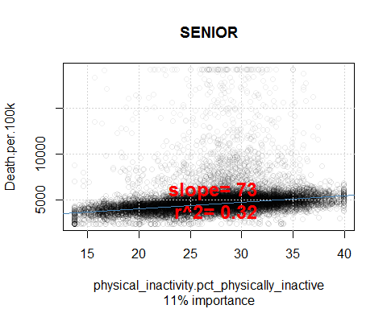
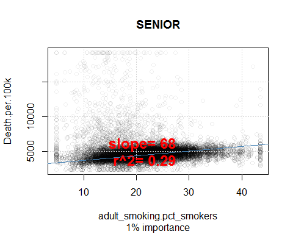
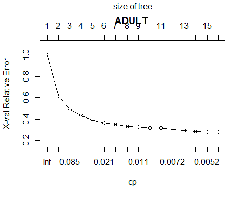
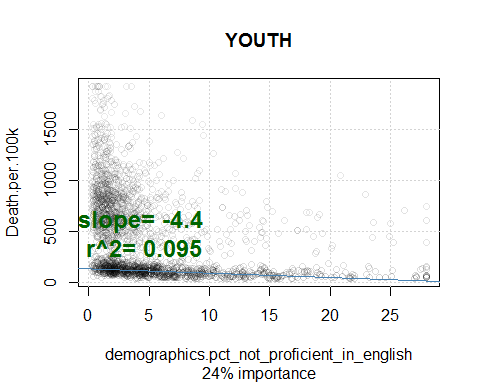
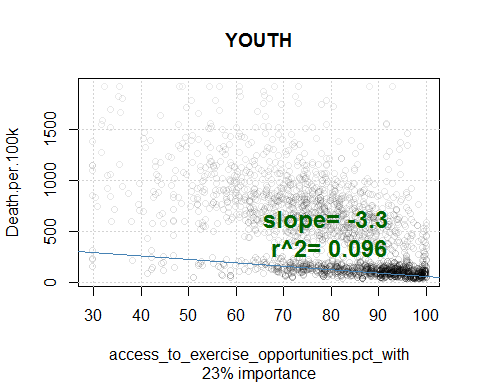
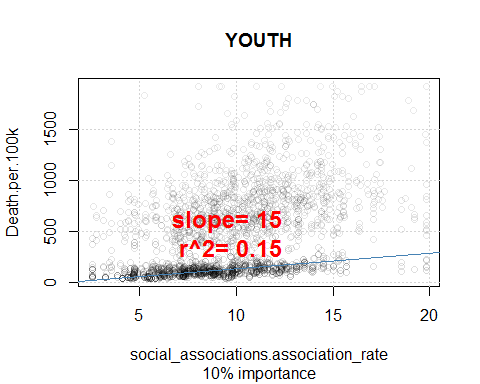

This does the modeling

Load libraries
==============

    ##regis\practicum2\test>pandoc -f docx -t markdown "Chris Busch - practicum2 proposal.docx" -o foo.md
    ##pandoc --extract-media ./myMediaFolder input.docx -o output.md

    rm(list = ls(all = TRUE)) #clear memory
    library(stringr)

    setwd("~/../practicum2")
    source("common.R")
    require(ggplot2)

    ## Loading required package: ggplot2

    ###############load all the data

    bigdata=NULL
    for(year in 2010:2015){
      filenames=c(Sys.glob(paste0('data/county/',year,'*.csv')),
                  Sys.glob(paste0('data/irsclean/',year,'*.csv')),
                  Sys.glob(paste0('data/wonderclean/',year,'*.csv')))
      yeardata=NULL
      for(f in filenames){# f=filenames[2]
        ##gotta go by year
        message(year,' ',f)
        fn=str_match(f, '/(\\d+)')[,2]
        d=read.csv(f,stringsAsFactors = T)
        
        if(!is.null(yeardata)){
          message('merging')
          yeardata=(merge(yeardata,d,by=c('fips','Year')))
        }else{
          yeardata=d
        }
      }
      message('storing')
      if(is.null(bigdata)){
        bigdata=yeardata
      }else{
        bigdata=dplyr::bind_rows(bigdata,yeardata)
      }
    }

    ## 2010 data/county/2010Ranked Measure Data.csv

    ## 2010 data/irsclean/2010-irs-soi.csv

    ## merging

    ## 2010 data/wonderclean/2010cdc.csv

    ## merging

    ## storing

    ## 2011 data/county/2011Additional Measure Data.csv

    ## 2011 data/county/2011Ranked Measure Data.csv

    ## merging

    ## 2011 data/irsclean/2011-irs-soi.csv

    ## merging

    ## 2011 data/wonderclean/2011cdc.csv

    ## merging

    ## storing

    ## Warning in bind_rows_(x, .id): Unequal factor levels: coercing to character

    ## Warning in bind_rows_(x, .id): binding character and factor vector,
    ## coercing into character vector

    ## Warning in bind_rows_(x, .id): binding character and factor vector,
    ## coercing into character vector

    ## Warning in bind_rows_(x, .id): Unequal factor levels: coercing to character

    ## Warning in bind_rows_(x, .id): binding character and factor vector,
    ## coercing into character vector

    ## Warning in bind_rows_(x, .id): binding character and factor vector,
    ## coercing into character vector

    ## 2012 data/county/2012Additional Measure Data.csv

    ## 2012 data/county/2012Ranked Measure Data.csv

    ## merging

    ## 2012 data/irsclean/2012-irs-soi.csv

    ## merging

    ## 2012 data/wonderclean/2012cdc.csv

    ## merging

    ## storing

    ## Warning in bind_rows_(x, .id): binding character and factor vector,
    ## coercing into character vector

    ## Warning in bind_rows_(x, .id): binding character and factor vector,
    ## coercing into character vector

    ## 2013 data/county/2013Additional Measure Data.csv

    ## 2013 data/county/2013Ranked Measure Data.csv

    ## merging

    ## 2013 data/irsclean/2013-irs-soi.csv

    ## merging

    ## 2013 data/wonderclean/2013cdc.csv

    ## merging

    ## storing

    ## Warning in bind_rows_(x, .id): binding character and factor vector,
    ## coercing into character vector

    ## Warning in bind_rows_(x, .id): binding character and factor vector,
    ## coercing into character vector

    ## 2014 data/county/2014Additional Measure Data.csv

    ## 2014 data/county/2014Ranked Measure Data.csv

    ## merging

    ## 2014 data/irsclean/2014-irs-soi.csv

    ## merging

    ## 2014 data/wonderclean/2014cdc.csv

    ## merging

    ## storing

    ## Warning in bind_rows_(x, .id): binding character and factor vector,
    ## coercing into character vector

    ## Warning in bind_rows_(x, .id): binding character and factor vector,
    ## coercing into character vector

    ## 2015 data/county/2015Additional Measure Data.csv

    ## 2015 data/county/2015Ranked Measure Data.csv

    ## merging

    ## 2015 data/irsclean/2015-irs-soi.csv

    ## merging

    ## 2015 data/wonderclean/2015cdc.csv

    ## merging

    ## storing

    ## Warning in bind_rows_(x, .id): binding character and factor vector,
    ## coercing into character vector

    ## Warning in bind_rows_(x, .id): binding character and factor vector,
    ## coercing into character vector

    rm(yeardata)
    rm(d)

    ###done loading

    checkVar=function(var1){
      message(var1,'not na=',length(which(!is.na(bigdata[[var1]]))))
      print(table(!is.na(bigdata[[ var1  ]]),bigdata$Year,dnn=c(var1,'Year')))
      summary(bigdata[[ var1  ]])
    }

    #this checks to see if a var was renamed
    sapply(qw('diabetes.pct_diabetic pct_diabetic.diabetes'),checkVar)

    ## diabetes.pct_diabeticnot na=24566

    ##                      Year
    ## diabetes.pct_diabetic 2010 2011 2012 2013 2014 2015
    ##                 FALSE 6125 6120    0    0    0    0
    ##                 TRUE     0    0 6114 6120 6157 6175

    ## pct_diabetic.diabetesnot na=6120

    ##                      Year
    ## pct_diabetic.diabetes 2010 2011 2012 2013 2014 2015
    ##                 FALSE 6125    0 6114 6120 6157 6175
    ##                 TRUE     0 6120    0    0    0    0

    ##         diabetes.pct_diabetic pct_diabetic.diabetes
    ## Min.                  3.20000              3.000000
    ## 1st Qu.               9.00000              8.500000
    ## Median               10.50000              9.800000
    ## Mean                 10.58208              9.922827
    ## 3rd Qu.              12.00000             11.300000
    ## Max.                 21.60000             18.200000
    ## NA's              12245.00000          30691.000000

    ##              #thisVar becomes thatVar
    varsToCombine=
      c(pct_diabetic.diabetes='diabetes.pct_diabetic',
        some_college_post_secondary_education.psed='some_college_post_secondary_education.pct',
        some_college_post_secondary_education.pct_psed='some_college_post_secondary_education.pct',
        access_to_healthy_foods.pct.x='access_to_healthy_foods.pct_food',
        access_to_recreational_facilities.rec_facility_rate='access_to_recreational_facilities.rec_fac_rate',
        air_pollution_particulate_matter.average_daily_pm2_5='daily_fine_particulate_matter.average_pm25',
        air_pollution_particulate_matter.average_daily_pm25='daily_fine_particulate_matter.average_pm25',
        diabetic_monitoring.pct_receiving_hba1c='diabetic_screening.pct_hba1c'
      )
    for(n in names(varsToCombine)){
      print(table(sign(bigdata[[ varsToCombine[n]  ]]),bigdata$Year,dnn=c(varsToCombine[n],'Year (before)')))
      bigdata[[ varsToCombine[n]  ]]  = ifelse(is.na(bigdata[[ varsToCombine[n]  ]]),bigdata[[ n  ]],bigdata[[ varsToCombine[n]  ]])
      bigdata[[ n  ]]=NULL
      print(table(sign(bigdata[[ varsToCombine[n]  ]]),bigdata$Year,dnn=c(varsToCombine[n],'Year (after)')))
    }

    ##                      Year (before)
    ## diabetes.pct_diabetic 2010 2011 2012 2013 2014 2015
    ##                     1    0    0 6114 6120 6157 6175
    ##                      Year (after)
    ## diabetes.pct_diabetic 2010 2011 2012 2013 2014 2015
    ##                     1    0 6120 6114 6120 6157 6175
    ##                                          Year (before)
    ## some_college_post_secondary_education.pct 2010 2011 2012 2013 2014 2015
    ##                                         1    0    0    0 6120 6157    0
    ##                                          Year (after)
    ## some_college_post_secondary_education.pct 2010 2011 2012 2013 2014 2015
    ##                                         1    0 6120    0 6120 6157    0
    ##                                          Year (before)
    ## some_college_post_secondary_education.pct 2010 2011 2012 2013 2014 2015
    ##                                         1    0 6120    0 6120 6157    0
    ##                                          Year (after)
    ## some_college_post_secondary_education.pct 2010 2011 2012 2013 2014 2015
    ##                                         1    0 6120 6114 6120 6157    0
    ##                                 Year (before)
    ## access_to_healthy_foods.pct_food 2010 2011 2012 2013 2014 2015
    ##                                0   68   33    0    0    0    0
    ##                                1 6057 6078    0    0    0    0
    ##                                 Year (after)
    ## access_to_healthy_foods.pct_food 2010 2011 2012 2013 2014 2015
    ##                                0   68   33   35    0    0    0
    ##                                1 6057 6078 6069    0    0    0
    ##                                               Year (before)
    ## access_to_recreational_facilities.rec_fac_rate 2010 2011 2012 2013 2014
    ##                                              0    0 1180 1269    0    0
    ##                                              1    0 4940 4845    0    0
    ##                                               Year (before)
    ## access_to_recreational_facilities.rec_fac_rate 2015
    ##                                              0    0
    ##                                              1    0
    ##                                               Year (after)
    ## access_to_recreational_facilities.rec_fac_rate 2010 2011 2012 2013 2014
    ##                                              0    0 1180 1269 1320    0
    ##                                              1    0 4940 4845 4800    0
    ##                                               Year (after)
    ## access_to_recreational_facilities.rec_fac_rate 2015
    ##                                              0    0
    ##                                              1    0
    ##                                           Year (before)
    ## daily_fine_particulate_matter.average_pm25 2010 2011 2012 2013 2014 2015
    ##                                          1    0    0    0 6079    0    0
    ##                                           Year (after)
    ## daily_fine_particulate_matter.average_pm25 2010 2011 2012 2013 2014 2015
    ##                                          1    0    0    0 6079    0 6134
    ##                                           Year (before)
    ## daily_fine_particulate_matter.average_pm25 2010 2011 2012 2013 2014 2015
    ##                                          1    0    0    0 6079    0 6134
    ##                                           Year (after)
    ## daily_fine_particulate_matter.average_pm25 2010 2011 2012 2013 2014 2015
    ##                                          1    0    0    0 6079 6119 6134
    ##                             Year (before)
    ## diabetic_screening.pct_hba1c 2010 2011 2012 2013 2014 2015
    ##                            1 6084 6045 6107 6110 6154    0
    ##                             Year (after)
    ## diabetic_screening.pct_hba1c 2010 2011 2012 2013 2014 2015
    ##                            1 6084 6045 6107 6110 6154 6163

    #################  define the predictors under consideration
    yvar='Death.per.100k'
    predictors=read.csv('data/predictors.csv',stringsAsFactors = F,na.strings = "")
    predictors$column=coalesce(predictors$shorter,predictors$origcolumn)
    ##rename those pesky long column names
    changelist=list()
    for(i in 1:nrow(predictors)){
      if(!is.na(predictors$shorter[i])){
        changelist[[ predictors$origcolumn[i] ]]= predictors$shorter[i]
      }
    }
    predictors[!is.na(predictors$shorter),c('shorter','origcolumn')]

    ##                       shorter
    ## 219   mentally_unhealthy_days
    ## 223 physically_unhealthy_days
    ##                                         origcolumn
    ## 219     poor_mental_health_days.mentally_unhealthy
    ## 223 poor_physical_health_days.physically_unhealthy

    bigdata=rename.columns(bigdata,changelist)

    ## poor_physical_health_days.physically_unhealthy renamed columns to physically_unhealthy_days

    ## poor_mental_health_days.mentally_unhealthy renamed columns to mentally_unhealthy_days

    setdiff(names(bigdata),predictors$column) ##what is missing in the first compared to second

    ## [1] "Death.per.100k"

    setdiff(predictors$column,names(bigdata)) ##what is missing in the first compared to second

    ## [1] "access_to_healthy_foods.pct.x"                       
    ## [2] "access_to_recreational_facilities.rec_facility_rate" 
    ## [3] "air_pollution_particulate_matter.average_daily_pm2_5"
    ## [4] "air_pollution_particulate_matter.average_daily_pm25" 
    ## [5] "diabetic_monitoring.pct_receiving_hba1c"             
    ## [6] "pct_diabetic.diabetes"                               
    ## [7] "some_college_post_secondary_education.pct_psed"      
    ## [8] "some_college_post_secondary_education.psed"

    ignore=unique(predictors$column[predictors$predictor==0])
    discardVars=c(ignore)
    predictorVarsRaw=unique(predictors$column[predictors$predictor==1 & predictors$column!=yvar])

    average.out=function(bigdata){
      shush({
        bigdata=bigdata[!is.na(bigdata$Death.per.100k),] ##only data with Death.per.100k
        impute.df=as.data.frame(aggregate(bigdata,list(fips=bigdata$fips),FUN=function(x) mean(x,na.rm=T)))
      })
      impute.df
    }

    median.out=function(bigdata){
      shush({
        bigdata=bigdata[!is.na(bigdata$Death.per.100k),] ##only data with Death.per.100k
        impute.df=as.data.frame(aggregate(bigdata,list(fips=bigdata$fips),FUN=function(x) median(x,na.rm=T)))
      })
      impute.df
    }

    impute.df=average.out(bigdata);

    cor(bigdata[,qw('other_primary_care_providers.pcp_rate
    previous_other_primary_care_providers_data.pcp_rate
                    previous_primary_care_physician_data_used_to_calculate_rankings.pcp_rate
                    primary_care_physicians.pcp_rate
                    ')],use = "pairwise.complete.obs")

    ##                                                                          other_primary_care_providers.pcp_rate
    ## other_primary_care_providers.pcp_rate                                                                1.0000000
    ## previous_other_primary_care_providers_data.pcp_rate                                                  0.9917949
    ## previous_primary_care_physician_data_used_to_calculate_rankings.pcp_rate                                    NA
    ## primary_care_physicians.pcp_rate                                                                     0.5299042
    ##                                                                          previous_other_primary_care_providers_data.pcp_rate
    ## other_primary_care_providers.pcp_rate                                                                              0.9917949
    ## previous_other_primary_care_providers_data.pcp_rate                                                                1.0000000
    ## previous_primary_care_physician_data_used_to_calculate_rankings.pcp_rate                                                  NA
    ## primary_care_physicians.pcp_rate                                                                                   0.5243828
    ##                                                                          previous_primary_care_physician_data_used_to_calculate_rankings.pcp_rate
    ## other_primary_care_providers.pcp_rate                                                                                                          NA
    ## previous_other_primary_care_providers_data.pcp_rate                                                                                            NA
    ## previous_primary_care_physician_data_used_to_calculate_rankings.pcp_rate                                                                1.0000000
    ## primary_care_physicians.pcp_rate                                                                                                        0.9614487
    ##                                                                          primary_care_physicians.pcp_rate
    ## other_primary_care_providers.pcp_rate                                                           0.5299042
    ## previous_other_primary_care_providers_data.pcp_rate                                             0.5243828
    ## previous_primary_care_physician_data_used_to_calculate_rankings.pcp_rate                        0.9614487
    ## primary_care_physicians.pcp_rate                                                                1.0000000

What years hold what data
=========================

    fullness=function() {
      years=c()
      for(y in unique(bigdata$Year)){
        years[[as.character(y)]]=0
        for(n in names(bigdata)){
          #catln(y,n,mean(!is.na(bigdata[[n]][bigdata$Year==y])))
          years[[as.character(y)]]=years[[as.character(y)]]+mean(!is.na(bigdata[[n]][bigdata$Year==y]))
        }
      }
      years
    }
    fullness()

    ##      2010      2011      2012      2013      2014      2015 
    ##  68.32180  99.32582 115.05806 150.32745 126.24395 142.90623

bigdata hotdeck mean imputation to only impute those measures for the
same fips county

    for(n in names(bigdata)){
      if(is.numeric(bigdata[[n]]) && any(is.na(bigdata[[n]]) )){
        
        lookup=impute.df[[n]]
        names(lookup)=as.character(impute.df$fips)
        
        bigdata[[n]]=ifelse(is.na(bigdata[[n]]), lookup[as.character(bigdata$fips)] ,bigdata[[n]])
      }
    }
    fullness()

    ##     2010     2011     2012     2013     2014     2015 
    ## 294.1607 296.1165 296.0870 295.9634 295.9289 296.0363

    require(usmap)

    ## Loading required package: usmap

    ## Warning: package 'usmap' was built under R version 3.4.2

    for(age in unique(bigdata$Age.Grouping)){
      # plot_counties(bigdata[bigdata$Age.Grouping==age,c('fips','Deaths')],
      #               yvar='Deaths',low='green',high='red',main=paste(age,"Deaths"))
      plot_counties(winsor1Df(
        median.out(bigdata[bigdata$Age.Grouping==age,c('fips','Death.per.100k')]),
                              ignore='fips',fraction=.05),
                    yvar='Death.per.100k',low='green',high='red',
                    main=paste(age,"Death Rates (Winsored)"),ylab='Deaths/\nPopulation\n*100k')
    }

    ## void winsor(){ //generated by winsor1Df 
    ## Death.per.100k =max( 3582.19444996898 ,min( 7819.82215733183 , Death.per.100k )); //limits are  518.116166354715 3582.19444996898 7819.82215733183 41463.4146341463 
    ## }

    ## void winsor(){ //generated by winsor1Df 
    ## Death.per.100k =max( 288.532980447823 ,min( 1355.51046017491 , Death.per.100k )); //limits are  137.962103908121 288.532980447823 1355.51046017491 3254.43786982249 
    ## }

    ## void winsor(){ //generated by winsor1Df 
    ## Death.per.100k =max( 67.1297848933185 ,min( 1515.55824885756 , Death.per.100k )); //limits are  31.5845054292382 67.1297848933185 1515.55824885756 3703.7037037037 
    ## }

    a100k=100000
    n='ADULT' #hand executing this line allows one to step into the loop to bypass the for loop
    for(n in unique(bigdata$Age.Grouping)){
      
      d=bigdata[bigdata$Age.Grouping==n,]
      d=d[!is.na(d$Deaths) & !is.na(d$Population),]
      #plot(density(log(d$Population)),main=paste(n,'log(Age Group Populations) Density'))
      m=sum(d$Deaths)/sum(d$Population)
      priori=sum(d$Deaths,na.rm = T)/sum(d$Population,na.rm = T)
      prioriweight=1/priori * 10
      catln(n,priori,prioriweight)
      priori=sum(d$Deaths[d$Population>prioriweight],na.rm = T)/sum(d$Population[d$Population>prioriweight],na.rm = T)
      prioriweight=1/priori * 10
      catln(n,priori,prioriweight)
      
      ##good
      plot(d$Population, (d$Deaths)/(d$Population)*a100k,
           col=rgb(1,0,0,0.2),log='x',main=paste('Deaths/Population for',n,'Group'),
           xlab='Age Group Population in County',
           ylab='Deaths/Population*100k in Age Group')
      # points(d$Population,
      #        (d$Deaths+10/2)/(d$Population+prioriweight/2), #*a100k,
      #        col='purple',pch='.')
      abline(v=10*1/priori,col='gray');
      grid()
      abline(h=quantile((d$Deaths)/(d$Population)*a100k,0.95),col='blue') #winsor
      text(10*1/priori,max((d$Deaths)/(d$Population)*a100k)*0.05,round(prioriweight))
      ##
      # plot(d$Population, 
      #      d$Deaths,pch=20,
      #      col=rgb(1,0,0,0.1),main=n,log='xy',xlab='Age Group Population',ylab='Deaths in Age Group');grid()
      # points(sort(d$Population),sort(d$Population)*priori,type='l')
      # abline(v=prioriweight,col='gray');grid()
      # text(prioriweight,800,round(10*1/priori))
      ###
      print(summary(d$Deaths))
      catln(n,'priori',priori,
            'prioriweight',prioriweight,
            'need at least a pop of this size',min(d$Deaths)*1/priori,
            " small counties ",      sum(d$Population<round(10*1/priori)),
            " big counties ",sum(d$Population>=round(10*1/priori) ))
    }

    ## SENIOR 0.04299791 232.5694 
    ## SENIOR 0.04298034 232.6645

    ##    Min. 1st Qu.  Median    Mean 3rd Qu.    Max. 
    ##    10.0   101.0   210.0   624.5   502.0 45604.0 
    ## SENIOR priori 0.04298034 prioriweight 232.6645 need at least a pop of this size 232.6645  small counties  461  big counties  17611 
    ## ADULT 0.003633879 2751.88 
    ## ADULT 0.003605117 2773.835

    ##    Min. 1st Qu.  Median    Mean 3rd Qu.    Max. 
    ##    10.0    35.0    77.0   236.4   197.0 15835.0 
    ## ADULT priori 0.003605117 prioriweight 2773.835 need at least a pop of this size 2773.835  small counties  2705  big counties  13128 
    ## YOUTH 0.0008552847 11692.01 
    ## YOUTH 0.000729517 13707.7

    ##    Min. 1st Qu.  Median    Mean 3rd Qu.    Max. 
    ##   10.00   14.00   24.00   54.51   57.00 1182.00 
    ## YOUTH priori 0.000729517 prioriweight 13707.7 need at least a pop of this size 13707.7  small counties  1605  big counties  1301

Trees
=====

    age='SENIOR' #hand executing this line allows one to step into the loop to bypass the for loop
    age='ADULT'
    age='YOUTH'
    year=0
    importance=data.frame()
    trees=list()
    perf.table=NULL
    for(age in unique(bigdata$Age.Grouping)){
      
      d=bigdata[bigdata$Age.Grouping==age & !is.na(bigdata$Death.per.100k),] 
      set.seed(7)
      trainset=runif(nrow(d))<0.8
      label=paste(age,ifelse(year==0,'',year))
      mean(is.na(d$Death.per.100k))
      
      d=winsor1Df(d,ignore = ignore,trace=F) 
      
      #trees handle missing data
      #d=impute(d,ignore = ignore,missing.threshold = 0.25)
      
      require(MASS)
      
      predictorVars=intersect(names(d),predictorVarsRaw)

      colinearvars=caret::findCorrelation(cor(d[,predictorVars],use="pairwise.complete.obs"),names = T)
      colinearpos=caret::findCorrelation(cor(d[,predictorVars],use="pairwise.complete.obs"),names = F)
      catln('co-linear variables to be ignored:',caret::findCorrelation(cor(d[,predictorVars],use="pairwise.complete.obs"),names = T))
      if(! setequal(predictorVars[colinearpos],colinearvars)) stop('vars mismatch')
      predictorVars=predictorVars[-colinearpos]
      
      require(rpart)
      require(rpart.plot)
      library(partykit)
      require(dplyr)
      summary(d$Population)
      
      mtree=rpart(ezformula(c(yvar,predictorVars)),d[trainset,],weights = d$Population[trainset],
                  control = rpart.control(cp = 0.005))
      #printcp(mtree) # display the results 
      plotcp(mtree,main=label) # visualize cross-validation results 
      cp=mtree$cptable[which.min(mtree$cptable[,"xerror"]),"CP"] ##best CP
      message(label,'cp=',cp)
      mtree=prune(mtree,cp)

      catln(label,'tree depth is',max(rpart:::tree.depth(as.numeric(rownames(mtree$frame)))))
      print_rpart(mtree,digits=2,nlab = 'Counties:',ylab=paste0(yvar,':'))
      
      agedata=bigdata[bigdata$Age.Grouping==age & !is.na(bigdata$Death.per.100k),] 
      if(nrow(agedata)!=nrow(d))stop('the winsored and not-winsored should be the same length')

      catln(age,'all data')
      cbind(agedata,node=round((predict(mtree,agedata,type='vector'))),
            response=(predict(mtree,agedata,type='vector'))) %>%
        dplyr::group_by(node) %>% 
        dplyr::summarise(counties=length(fips),
                         deaths.pred=round(sum(response/100000*Population)),
                         deaths.act=sum(Deaths),
                         age.pop=sum(Population),
                         #dr100k.mean=mean(Death.per.100k),
                         dr100k.fit=mean(response)) %>% 
        dplyr::mutate(dr100k.group=deaths.act*100000/age.pop) %>% as.data.frame %>% print
      
      catln(age,'test data')
      cbind(agedata[!trainset,],node=round((predict(mtree,agedata[!trainset,],type='vector'))),
            response=(predict(mtree,agedata[!trainset,],type='vector'))) %>%
        dplyr::group_by(node) %>% 
        dplyr::summarise(counties=length(fips),
                         deaths.pred=round(sum(response/100000*Population)),
                         deaths.act=sum(Deaths),
                         age.pop=sum(Population),
                         #dr100k.mean=mean(Death.per.100k),
                         dr100k.fit=mean(response)) %>% 
        dplyr::mutate(dr100k.group=deaths.act*100000/age.pop) %>% as.data.frame %>% print
      
      importance=dplyr::bind_rows(importance,
                                  cbind(data.frame(age=age,year=year),
                                        as.data.frame(t(as.data.frame(mtree$variable.importance)))))
      
      #savedPlots=list()
      for(n in (used.rpart.vars(mtree))){
        lm.m=lm(ezformula(c(yvar,n)),d[trainset,],weights = d$Population[trainset])
        s.lm.m=summary(lm.m)
        c.lm.m=coef(s.lm.m)
        if(c.lm.m[2,"Pr(>|t|)"]<0.05){
          catln(n,paste("slope=",signif(c.lm.m[2,"Estimate"],2),
                        "r^2=",signif(s.lm.m$adj.r.squared,2)))
          plot(d[trainset,c(n,yvar)],ylab=yvar,
               xlab=n,main=age,
               sub=paste0(round(mtree$variable.importance[[n]]/sum(mtree$variable.importance)*100),'% importance'),
               #col=rgb(0,0,0,0.1/2)
               col=rgb(0,0,0,(log(d$Population[trainset])/log(max(d$Population[trainset])))/5)
               );grid()
          text(mean(d[[n]],na.rm=T),mean(d[[yvar]]),
               paste("slope=",signif(c.lm.m[2,"Estimate"],2),
                     "\nr^2=",signif(s.lm.m$adj.r.squared,2)),
               col=ifelse(c.lm.m[2,"Estimate"]<0,'darkgreen','red'),font=2,cex=1.5)
          abline(lm.m,col='steelblue')  
        }
      }
      
      
      trees[[age]]=mtree;
      
      #plot(d$Deaths,(predict(mtree)/100000)*d$Population,col=rgb(0,0,0,0.2),main=label);grid()
      catln(label,'all',
            '\nrmse deaths=',rmse(d$Deaths,(predict(mtree,d)/100000)*d$Population),
            '\nrmse Deaths by priori=',rmse(d$Deaths,sum(d$Deaths)/sum(d$Population)*d$Population),
            '\ntree Deaths rsq=',rsq(d$Deaths,(predict(mtree,d)/100000)*d$Population),
            '\nprior Deaths rsq=',rsq(d$Deaths,sum(d$Deaths)/sum(d$Population)*d$Population),
            
            '\nfitted Death.per.100k rmse=',rmse(d$Death.per.100k,predict(mtree,d)),
            '\nweighted Death.per.100k rmse=',rmse(d$Death.per.100k,predict(mtree,d),weights = d$Population),
            '\nfitted Death.per.100k rsq=',rsq(d$Death.per.100k,(predict(mtree,d))))
      .=data.frame(#'Age Group'=label,
            'Deaths RMSE'=rmse(d$Deaths[!trainset],((predict(mtree,d[!trainset,]))/100000)*d$Population[!trainset]),
            'Deaths by Priori RMSE'=rmse(d$Deaths[!trainset],sum(d$Deaths[!trainset])/sum(d$Population[!trainset])*d$Population[!trainset]),
            'Tree Deaths RSq'=rsq(d$Deaths[!trainset],(predict(mtree,d[!trainset,])/100000)*d$Population[!trainset]),
            'Priori Deaths RSq'=rsq(d$Deaths[!trainset],sum(d$Deaths[!trainset])/sum(d$Population[!trainset])*d$Population[!trainset]),
            'Fitted Death.per.100k RMSE'=rmse(d$Death.per.100k[!trainset],(predict(mtree,d[!trainset,]))),
            'Weighted Death.per.100k RMSE'=rmse(d$Death.per.100k[!trainset],predict(mtree,d[!trainset,]),weights = d$Population[!trainset]),
            'Fitted Death.per.100k RSq'=rsq(d$Death.per.100k[!trainset],(predict(mtree,d[!trainset,]))))
      rownames(.)=age
      if(is.null(perf.table))perf.table=.
      else perf.table=rbind(perf.table,.)
      
      print(summary(mtree))
      
    }  

    ## Loading required package: MASS

    ## co-linear variables to be ignored: pct_of_children_eligible_for_free_lunch teen_births.birth_rate homicides.homicide_rate sexually_transmitted_infections.rates_per_100000 excessive_drinking.pct high_housing_costs.pct violent_crime_rate hiv_prevalence_rate hiv_rate commuting_alone.pct_drive

    ## Loading required package: rpart

    ## Loading required package: rpart.plot

    ## Loading required package: grid

    ## Loading required package: dplyr

    ## Warning: package 'dplyr' was built under R version 3.4.2

    ## 
    ## Attaching package: 'dplyr'

    ## The following object is masked _by_ '.GlobalEnv':
    ## 
    ##     coalesce

    ## The following object is masked from 'package:MASS':
    ## 
    ##     select

    ## The following objects are masked from 'package:stats':
    ## 
    ##     filter, lag

    ## The following objects are masked from 'package:base':
    ## 
    ##     intersect, setdiff, setequal, union

    ## SENIOR cp=0.005

    ## SENIOR  tree depth is 6 
    ## n= 14460 
    ## 
    ## node), split, n, yval
    ##       * denotes terminal node
    ## 
    ##  1) root Counties:14460 Death.per.100k:4300  
    ##    2) adult_obesity.pct_obese< 26 Counties:2191 Death.per.100k:3900  
    ##      4) preventable_hospital_stays.hosp__rate< 57 Counties:1581 Death.per.100k:3800  
    ##        8) other_primary_care_providers.pcp_rate< 68 Counties:1052 Death.per.100k:3700  
    ##         16) unemployed.ratio< 0.07 Counties:508 Death.per.100k:3600  
    ##           32) mammography_screening.pct>=74 Counties:54 Death.per.100k:3200 *
    ##           33) mammography_screening.pct< 74 Counties:454 Death.per.100k:3600  
    ##             66) median_household_income>=8.1e+04 Counties:70 Death.per.100k:3300 *
    ##             67) median_household_income< 8.1e+04 Counties:384 Death.per.100k:3700 *
    ##         17) unemployed.ratio>=0.07 Counties:544 Death.per.100k:3900  
    ##           34) social_associations.association_rate< 7.3 Counties:183 Death.per.100k:3800 *
    ##           35) social_associations.association_rate>=7.3 Counties:361 Death.per.100k:4100 *
    ##        9) other_primary_care_providers.pcp_rate>=68 Counties:529 Death.per.100k:4000  
    ##         18) adult_obesity.pct_obese< 16 Counties:22 Death.per.100k:3400 *
    ##         19) adult_obesity.pct_obese>=16 Counties:507 Death.per.100k:4100 *
    ##      5) preventable_hospital_stays.hosp__rate>=57 Counties:610 Death.per.100k:4200  
    ##       10) social_associations.association_rate< 6.1 Counties:77 Death.per.100k:3800 *
    ##       11) social_associations.association_rate>=6.1 Counties:533 Death.per.100k:4300  
    ##         22) unemployed.ratio< 0.099 Counties:369 Death.per.100k:4200 *
    ##         23) unemployed.ratio>=0.099 Counties:164 Death.per.100k:4600 *
    ##    3) adult_obesity.pct_obese>=26 Counties:12269 Death.per.100k:4600  
    ##      6) social_associations.association_rate< 8.8 Counties:2124 Death.per.100k:4200  
    ##       12) adult_smoking.pct_smokers< 20 Counties:818 Death.per.100k:4000  
    ##         24) primary_care_provider_rate.pcp< 42 Counties:166 Death.per.100k:3200  
    ##           48) physical_inactivity.pct_physically_inactive< 24 Counties:34 Death.per.100k:2700 *
    ##           49) physical_inactivity.pct_physically_inactive>=24 Counties:132 Death.per.100k:4300 *
    ##         25) primary_care_provider_rate.pcp>=42 Counties:652 Death.per.100k:4100  
    ##           50) injury_deaths.death_rate< 39 Counties:78 Death.per.100k:3700 *
    ##           51) injury_deaths.death_rate>=39 Counties:574 Death.per.100k:4100 *
    ##       13) adult_smoking.pct_smokers>=20 Counties:1306 Death.per.100k:4500  
    ##         26) income_inequality.ratio< 4.4 Counties:476 Death.per.100k:4200 *
    ##         27) income_inequality.ratio>=4.4 Counties:830 Death.per.100k:4800 *
    ##      7) social_associations.association_rate>=8.8 Counties:10145 Death.per.100k:4700  
    ##       14) physical_inactivity.pct_physically_inactive< 25 Counties:1586 Death.per.100k:4400 *
    ##       15) physical_inactivity.pct_physically_inactive>=25 Counties:8559 Death.per.100k:4800  
    ##         30) access_to_parks.pct_park< 14 Counties:4422 Death.per.100k:4700  
    ##           60) preventable_hospital_stays.hosp__rate< 64 Counties:1244 Death.per.100k:4400 *
    ##           61) preventable_hospital_stays.hosp__rate>=64 Counties:3178 Death.per.100k:4800 *
    ##         31) access_to_parks.pct_park>=14 Counties:4137 Death.per.100k:4900  
    ##           62) median_household_income>=5.2e+04 Counties:480 Death.per.100k:4600 *
    ##           63) median_household_income< 5.2e+04 Counties:3657 Death.per.100k:5000 *
    ## SENIOR all data

    ## Warning: package 'bindrcpp' was built under R version 3.4.2

    ##    node counties deaths.pred deaths.act  age.pop dr100k.fit dr100k.group
    ## 1  2674       45       21588      21659   807286   2674.206     2682.940
    ## 2  3196       68      115344     115441  3609119   3195.912     3198.592
    ## 3  3263       91      161255     163354  4941412   3263.334     3305.816
    ## 4  3404       29       78373      78255  2302246   3404.182     3399.072
    ## 5  3660       95      107655     106612  2941527   3659.823     3624.376
    ## 6  3689      488      804212     806502 21800523   3688.956     3699.462
    ## 7  3757      223      672525     674100 17901841   3756.736     3765.535
    ## 8  3796       93      293166     291992  7722843   3796.091     3780.887
    ## 9  4083      437      341294     339971  8359615   4082.653     4066.826
    ## 10 4121      636      776557     778067 18843798   4121.023     4129.035
    ## 11 4128      713     1093669    1095347 26495287   4127.786     4134.120
    ## 12 4195      466      666555     669173 15889744   4194.878     4211.352
    ## 13 4233      589      332330     331236  7850776   4233.081     4219.150
    ## 14 4268      165       18587      18448   435522   4267.786     4235.837
    ## 15 4424     1566      456308     456279 10313613   4424.326     4424.046
    ## 16 4449     2038     1157043    1157498 26009674   4448.509     4450.260
    ## 17 4568      598      258440     258423  5657841   4567.829     4567.520
    ## 18 4586      197      325972     326373  7107596   4586.246     4591.890
    ## 19 4767     1030      449956     450335  9439133   4766.921     4770.936
    ## 20 4818     3984      959949     959437 19922227   4818.483     4815.912
    ## 21 4960     4521     2188147    2186906 44112484   4960.380     4957.567
    ## SENIOR test data 
    ##    node counties deaths.pred deaths.act age.pop dr100k.fit dr100k.group
    ## 1  2674       11        3378       3833  126323   2674.206     3034.285
    ## 2  3196       14       26165      26361  818703   3195.912     3219.849
    ## 3  3263       21       54365      56478 1665945   3263.334     3390.148
    ## 4  3404        7       11472      11354  336987   3404.182     3369.269
    ## 5  3660       17       20872      19829  570292   3659.823     3476.991
    ## 6  3689      104      165680     168229 4491256   3688.956     3745.701
    ## 7  3757       40      121589     123175 3236555   3756.736     3805.744
    ## 8  3796       16       36541      35372  962590   3796.091     3674.669
    ## 9  4083       76       57433      56305 1406756   4082.653     4002.471
    ## 10 4121      129      178252     179772 4325441   4121.023     4156.154
    ## 11 4128      139      221235     222921 5359658   4127.786     4159.239
    ## 12 4195       97      198648     201252 4735485   4194.878     4249.871
    ## 13 4233      113       65760      64666 1553472   4233.081     4162.676
    ## 14 4268       33        4561       4457  106880   4267.786     4170.097
    ## 15 4424      321       90473      90426 2044898   4424.326     4422.030
    ## 16 4449      452      248280     248736 5581190   4448.509     4456.684
    ## 17 4568      119       47256      47230 1034531   4567.829     4565.354
    ## 18 4586       33       49314      49715 1075255   4586.246     4623.554
    ## 19 4767      200       90096      90479 1890033   4766.921     4787.165
    ## 20 4818      804      191822     191275 3980966   4818.483     4804.738
    ## 21 4960      866      430585     429279 8680491   4960.380     4945.331
    ## adult_obesity.pct_obese slope= 79 r^2= 0.3

    ## physical_inactivity.pct_physically_inactive slope= 73 r^2= 0.32

    ## social_associations.association_rate slope= 79 r^2= 0.25

    ## preventable_hospital_stays.hosp__rate slope= 16 r^2= 0.2

    ## injury_deaths.death_rate slope= 13 r^2= 0.14

    ## adult_smoking.pct_smokers slope= 68 r^2= 0.29

    ## unemployed.ratio slope= 3200 r^2= 0.032

    ## median_household_income slope= -0.02 r^2= 0.17

    ## other_primary_care_providers.pcp_rate slope= 3.4 r^2= 0.03

    ## mammography_screening.pct slope= -9.7 r^2= 0.0091

    ## primary_care_provider_rate.pcp slope= -0.71 r^2= 0.003

    ## income_inequality.ratio slope= 39 r^2= 0.0016

    ## access_to_parks.pct_park slope= -6 r^2= 0.047

    ## SENIOR  all 
    ## rmse deaths= 100.7995 
    ## rmse Deaths by priori= 251.1529 
    ## tree Deaths rsq= 0.996113 
    ## prior Deaths rsq= 0.984624 
    ## fitted Death.per.100k rmse= 1923.5 
    ## weighted Death.per.100k rmse= 435.1074 
    ## fitted Death.per.100k rsq= 0.04584812 
    ## Call:
    ## rpart(formula = ezformula(c(yvar, predictorVars)), data = d[trainset, 
    ##     ], weights = d$Population[trainset], control = rpart.control(cp = 0.005))
    ##   n= 14460 
    ## 
    ##             CP nsplit rel error    xerror         xstd
    ## 1  0.258824362      0 1.0000000 1.0008793 0.0003132421
    ## 2  0.081461956      1 0.7411756 0.7599032 0.0002994681
    ## 3  0.028995912      2 0.6597137 0.6665662 0.0002921715
    ## 4  0.025553120      3 0.6307178 0.6401958 0.0002915996
    ## 5  0.023350731      4 0.6051646 0.6186134 0.0002892209
    ## 6  0.015967146      5 0.5818139 0.6046426 0.0002889076
    ## 7  0.014609014      6 0.5658468 0.5952839 0.0002888330
    ## 8  0.011201562      7 0.5512378 0.5791833 0.0002882086
    ## 9  0.010895643      8 0.5400362 0.5725608 0.0002882920
    ## 10 0.010182935      9 0.5291406 0.5705973 0.0002888298
    ## 11 0.009458984     10 0.5189576 0.5611237 0.0002886842
    ## 12 0.008731830     12 0.5000397 0.5529538 0.0002892816
    ## 13 0.007215268     13 0.4913078 0.5470928 0.0002886462
    ## 14 0.006865151     14 0.4840926 0.5381785 0.0002880015
    ## 15 0.006444455     15 0.4772274 0.5321912 0.0002878544
    ## 16 0.005735774     16 0.4707829 0.5207696 0.0002879072
    ## 17 0.005400564     17 0.4650472 0.5189931 0.0002872032
    ## 18 0.005345174     19 0.4542460 0.5163929 0.0002868944
    ## 19 0.005000000     20 0.4489009 0.5092958 0.0002868466
    ## 
    ## Variable importance
    ##                                                   adult_obesity.pct_obese 
    ##                                                                        17 
    ##                               physical_inactivity.pct_physically_inactive 
    ##                                                                        11 
    ##                                                       college_degrees.pct 
    ##                                                                         9 
    ##                                    households_with_high_housing_costs.pct 
    ##                                                                         9 
    ##                                                     diabetes.pct_diabetic 
    ##                                                                         8 
    ##                                               severe_housing_problems.pct 
    ##                                                                         7 
    ##                                      social_associations.association_rate 
    ##                                                                         7 
    ##                                     preventable_hospital_stays.hosp__rate 
    ##                                                                         3 
    ## preventable_hospital_stays_ambulatory_care_sensitive_conditions.acsc_rate 
    ##                                                                         2 
    ##                                     long_commute_driving_alone.pct_drives 
    ##                                                                         2 
    ##                                demographics.pct_not_proficient_in_english 
    ##                                                                         2 
    ##                                                  injury_deaths.death_rate 
    ##                                                                         2 
    ##                                                 adult_smoking.pct_smokers 
    ##                                                                         1 
    ##                                                          unemployed.ratio 
    ##                                                                         1 
    ##                                                            pct_illiterate 
    ##                                                                         1 
    ##                                                   median_household_income 
    ##                                                                         1 
    ##                                                  air_pollution_ozone_days 
    ##                                                                         1 
    ##                                                mammography_screening.rate 
    ##                                                                         1 
    ##                                     other_primary_care_providers.pcp_rate 
    ##                                                                         1 
    ##                                                 mammography_screening.pct 
    ##                                                                         1 
    ##                              motor_vehicle_crash_deaths.mv_mortality_rate 
    ##                                                                         1 
    ##                                       alcohol_impaired_driving_deaths.pct 
    ##                                                                         1 
    ##                                            primary_care_provider_rate.pcp 
    ##                                                                         1 
    ##                                                         health_care_costs 
    ##                                                                         1 
    ##                                                       hiv_prevalence.rate 
    ##                                                                         1 
    ##                                                   income_inequality.ratio 
    ##                                                                         1 
    ##                                                          some_college.pct 
    ##                                                                         1 
    ##                                                       sahie.pct.uninsured 
    ##                                                                         1 
    ##                                                  access_to_parks.pct_park 
    ##                                                                         1 
    ##                                      drug_poisoning_deaths.mortality_rate 
    ##                                                                         1 
    ## 
    ## Node number 1: 14460 observations,    complexity param=0.2588244
    ##   mean=4300.236, MSE=418978.2 
    ##   left son=2 (2191 obs) right son=3 (12269 obs)
    ##   Primary splits:
    ##       adult_obesity.pct_obese                     < 26.35      to the left,  improve=0.2588244, (0 missing)
    ##       physical_inactivity.pct_physically_inactive < 24.48      to the left,  improve=0.2575101, (2 missing)
    ##       adult_smoking.pct_smokers                   < 18.33167   to the left,  improve=0.2256138, (992 missing)
    ##       social_associations.association_rate        < 9.821322   to the left,  improve=0.2122582, (97 missing)
    ##       demographics.pct_not_proficient_in_english  < 4.22358    to the right, improve=0.1695233, (2 missing)
    ##   Surrogate splits:
    ##       college_degrees.pct                         < 27.15661   to the right, agree=0.784, adj=0.473, (0 split)
    ##       physical_inactivity.pct_physically_inactive < 22.85      to the left,  agree=0.784, adj=0.473, (0 split)
    ##       diabetes.pct_diabetic                       < 8.865152   to the left,  agree=0.775, adj=0.451, (0 split)
    ##       households_with_high_housing_costs.pct      < 36.65      to the right, agree=0.767, adj=0.431, (0 split)
    ##       severe_housing_problems.pct                 < 19.10782   to the right, agree=0.741, adj=0.369, (0 split)
    ## 
    ## Node number 2: 2191 observations,    complexity param=0.02899591
    ##   mean=3904.995, MSE=222407.2 
    ##   left son=4 (1581 obs) right son=5 (610 obs)
    ##   Primary splits:
    ##       preventable_hospital_stays.hosp__rate                                     < 57.235     to the left,  improve=0.1327627, (49 missing)
    ##       preventable_hospital_stays_ambulatory_care_sensitive_conditions.acsc_rate < 65.25673   to the left,  improve=0.1263855, (8 missing)
    ##       social_associations.association_rate                                      < 6.930659   to the left,  improve=0.1197737, (15 missing)
    ##       adult_smoking.pct_smokers                                                 < 16.865     to the left,  improve=0.1150870, (65 missing)
    ##       unemployed.ratio                                                          < 0.0837066  to the left,  improve=0.1117071, (0 missing)
    ##   Surrogate splits:
    ##       preventable_hospital_stays_ambulatory_care_sensitive_conditions.acsc_rate < 65.89869   to the left,  agree=0.912, adj=0.686, (41 split)
    ##       physical_inactivity.pct_physically_inactive                               < 21.70357   to the left,  agree=0.792, adj=0.259, (8 split)
    ##       married.pct                                                               < 0.2916978  to the right, agree=0.780, adj=0.215, (0 split)
    ##       health_care_costs                                                         < 11703.18   to the left,  agree=0.765, adj=0.163, (0 split)
    ##       children_in_single_parent_households.pct                                  < 37.56781   to the left,  agree=0.763, adj=0.155, (0 split)
    ## 
    ## Node number 3: 12269 observations,    complexity param=0.08146196
    ##   mean=4574.605, MSE=371714.2 
    ##   left son=6 (2124 obs) right son=7 (10145 obs)
    ##   Primary splits:
    ##       social_associations.association_rate                                      < 8.840807   to the left,  improve=0.15529100, (82 missing)
    ##       physical_inactivity.pct_physically_inactive                               < 25.31      to the left,  improve=0.14841010, (2 missing)
    ##       adult_smoking.pct_smokers                                                 < 18.53      to the left,  improve=0.12065990, (927 missing)
    ##       median_household_income                                                   < 49635      to the right, improve=0.09786335, (2 missing)
    ##       preventable_hospital_stays_ambulatory_care_sensitive_conditions.acsc_rate < 71.33925   to the left,  improve=0.08241451, (23 missing)
    ##   Surrogate splits:
    ##       demographics.pct_not_proficient_in_english < 5.883435   to the right, agree=0.781, adj=0.296, (80 split)
    ##       long_commute_driving_alone.pct_drives      < 38.65      to the right, agree=0.775, adj=0.279, (0 split)
    ##       severe_housing_problems.pct                < 20.28085   to the right, agree=0.769, adj=0.260, (0 split)
    ##       households_with_high_housing_costs.pct     < 39.55      to the right, agree=0.768, adj=0.255, (0 split)
    ##       air_pollution_ozone_days                   < 23.5       to the right, agree=0.749, adj=0.194, (2 split)
    ## 
    ## Node number 4: 1581 observations,    complexity param=0.01460901
    ##   mean=3797.528, MSE=193246.5 
    ##   left son=8 (1052 obs) right son=9 (529 obs)
    ##   Primary splits:
    ##       other_primary_care_providers.pcp_rate < 68.03784   to the left,  improve=0.10737600, (9 missing)
    ##       social_associations.association_rate  < 10.46158   to the left,  improve=0.09835927, (7 missing)
    ##       long_commute_driving_alone.pct_drives < 33.15      to the right, improve=0.09229659, (7 missing)
    ##       college_degrees.pct                   < 51.61495   to the right, improve=0.09088646, (21 missing)
    ##       pct_illiterate                        < 10.75      to the right, improve=0.09075853, (17 missing)
    ##   Surrogate splits:
    ##       social_associations.association_rate     < 10.96351   to the left,  agree=0.795, adj=0.235, (2 split)
    ##       primary_care_provider_rate.pcp           < 204.0669   to the left,  agree=0.791, adj=0.221, (3 split)
    ##       high_school_graduation.pct_afgr          < 69.2       to the right, agree=0.787, adj=0.206, (0 split)
    ##       children_in_single_parent_households.pct < 37.81873   to the left,  agree=0.787, adj=0.205, (4 split)
    ##       chlamydia_rate.rates_per_100000          < 527.2      to the left,  agree=0.786, adj=0.202, (0 split)
    ## 
    ## Node number 5: 610 observations,    complexity param=0.01596715
    ##   mean=4180.887, MSE=191503.4 
    ##   left son=10 (77 obs) right son=11 (533 obs)
    ##   Primary splits:
    ##       social_associations.association_rate < 6.120965   to the left,  improve=0.3043597, (8 missing)
    ##       pct_illiterate                       < 19.85      to the right, improve=0.2753760, (12 missing)
    ##       severe_housing_problems.pct          < 24.45407   to the right, improve=0.2477433, (1 missing)
    ##       married.pct                          < 0.2845878  to the left,  improve=0.2471087, (0 missing)
    ##       mammography_screening.rate           < 52.862     to the left,  improve=0.2443286, (55 missing)
    ##   Surrogate splits:
    ##       alcohol_impaired_driving_deaths.pct    < 21.16731   to the left,  agree=0.936, adj=0.774, (7 split)
    ##       pct_illiterate                         < 20.55      to the right, agree=0.936, adj=0.773, (0 split)
    ##       mammography_screening.rate             < 57.47445   to the left,  agree=0.928, adj=0.744, (0 split)
    ##       hiv_prevalence.rate                    < 924.75     to the right, agree=0.925, adj=0.733, (0 split)
    ##       households_with_high_housing_costs.pct < 49         to the right, agree=0.924, adj=0.731, (0 split)
    ## 
    ## Node number 6: 2124 observations,    complexity param=0.02335073
    ##   mean=4217.313, MSE=285054.4 
    ##   left son=12 (818 obs) right son=13 (1306 obs)
    ##   Primary splits:
    ##       adult_smoking.pct_smokers                                                 < 20.255     to the left,  improve=0.1855976, (148 missing)
    ##       drug_poisoning_deaths.mortality_rate                                      < 13.80764   to the left,  improve=0.1685312, (428 missing)
    ##       preventable_hospital_stays_ambulatory_care_sensitive_conditions.acsc_rate < 73.69278   to the left,  improve=0.1561667, (7 missing)
    ##       physical_inactivity.pct_physically_inactive                               < 26.05      to the left,  improve=0.1514961, (0 missing)
    ##       uninsured_children.pct                                                    < 9.676387   to the right, improve=0.1483545, (2 missing)
    ##   Surrogate splits:
    ##       injury_deaths.death_rate                    < 62.25408   to the left,  agree=0.811, adj=0.473, (134 split)
    ##       diabetes.pct_diabetic                       < 10.22      to the left,  agree=0.787, adj=0.407, (14 split)
    ##       physical_inactivity.pct_physically_inactive < 25.72      to the left,  agree=0.787, adj=0.407, (0 split)
    ##       preventable_hospital_stays.hosp__rate       < 66.635     to the left,  agree=0.782, adj=0.394, (0 split)
    ##       drug_poisoning_deaths.mortality_rate        < 17.07774   to the left,  agree=0.763, adj=0.340, (0 split)
    ## 
    ## Node number 7: 10145 observations,    complexity param=0.02555312
    ##   mean=4736.444, MSE=326952 
    ##   left son=14 (1586 obs) right son=15 (8559 obs)
    ##   Primary splits:
    ##       physical_inactivity.pct_physically_inactive                               < 24.57333   to the left,  improve=0.08058856, (2 missing)
    ##       preventable_hospital_stays.hosp__rate                                     < 59.15      to the left,  improve=0.07578943, (197 missing)
    ##       preventable_hospital_stays_ambulatory_care_sensitive_conditions.acsc_rate < 65.798     to the left,  improve=0.06706655, (16 missing)
    ##       median_household_income                                                   < 51800      to the right, improve=0.06420144, (2 missing)
    ##       income_inequality.ratio                                                   < 4.298682   to the left,  improve=0.05959308, (63 missing)
    ##   Surrogate splits:
    ##       diabetes.pct_diabetic   < 8.73       to the left,  agree=0.814, adj=0.227, (0 split)
    ##       college_degrees.pct     < 28.24019   to the right, agree=0.795, adj=0.149, (2 split)
    ##       some_college.pct        < 71.51324   to the right, agree=0.793, adj=0.142, (0 split)
    ##       health_care_costs       < 7991.533   to the left,  agree=0.788, adj=0.123, (0 split)
    ##       median_household_income < 56084      to the right, agree=0.788, adj=0.123, (0 split)
    ## 
    ## Node number 8: 1052 observations,    complexity param=0.01089564
    ##   mean=3710.324, MSE=164243.6 
    ##   left son=16 (508 obs) right son=17 (544 obs)
    ##   Primary splits:
    ##       unemployed.ratio                          < 0.06980548 to the left,  improve=0.12878740, (0 missing)
    ##       social_associations.association_rate      < 10.54073   to the left,  improve=0.10612200, (7 missing)
    ##       college_degrees.pct                       < 50.56903   to the right, improve=0.08444942, (17 missing)
    ##       drinking_water_violations.pct_pop_in_viol < 17.1353    to the left,  improve=0.08253329, (32 missing)
    ##       sahie.pct.uninsured                       < 20.43      to the right, improve=0.08057780, (44 missing)
    ##   Surrogate splits:
    ##       demographics.pct_not_proficient_in_english < 15.46075   to the left,  agree=0.688, adj=0.350, (0 split)
    ##       diabetic_screening.pct_hba1c               < 79.23486   to the right, agree=0.686, adj=0.346, (0 split)
    ##       single_parent_households.pct               < 11.37577   to the right, agree=0.644, adj=0.258, (0 split)
    ##       liquor_store_density.rate                  < 1.547533   to the right, agree=0.643, adj=0.256, (0 split)
    ##       low_birthweight.pct_lbw                    < 6.502618   to the right, agree=0.639, adj=0.249, (0 split)
    ## 
    ## Node number 9: 529 observations,    complexity param=0.01018293
    ##   mean=4035.557, MSE=194997.1 
    ##   left son=18 (22 obs) right son=19 (507 obs)
    ##   Primary splits:
    ##       adult_obesity.pct_obese     < 16.41775   to the left,  improve=0.2767254, (0 missing)
    ##       college_degrees.pct         < 47.85632   to the right, improve=0.2677454, (4 missing)
    ##       pct_illiterate              < 16.75      to the right, improve=0.2669924, (7 missing)
    ##       severe_housing_problems.pct < 24.94777   to the right, improve=0.2583796, (0 missing)
    ##       some_college.pct            < 80.3951    to the right, improve=0.2563665, (0 missing)
    ##   Surrogate splits:
    ##       college_degrees.pct                          < 51.87942   to the right, agree=0.966, adj=0.718, (0 split)
    ##       long_commute_driving_alone.pct_drives        < 44.7       to the right, agree=0.964, adj=0.697, (0 split)
    ##       motor_vehicle_crash_deaths.mv_mortality_rate < 4.888512   to the left,  agree=0.964, adj=0.695, (0 split)
    ##       injury_deaths.death_rate                     < 33.46756   to the left,  agree=0.964, adj=0.694, (0 split)
    ##       limited_access_to_healthy_foods.pct          < 0.005      to the left,  agree=0.963, adj=0.686, (0 split)
    ## 
    ## Node number 10: 77 observations
    ##   mean=3796.091, MSE=65375.53 
    ## 
    ## Node number 11: 533 observations,    complexity param=0.006865151
    ##   mean=4332.245, MSE=159964.1 
    ##   left son=22 (369 obs) right son=23 (164 obs)
    ##   Primary splits:
    ##       unemployed.ratio                                                          < 0.09917085 to the left,  improve=0.2181193, (0 missing)
    ##       preventable_hospital_stays_ambulatory_care_sensitive_conditions.acsc_rate < 78.05615   to the left,  improve=0.1457259, (2 missing)
    ##       preventable_hospital_stays.hosp__rate                                     < 70.95      to the left,  improve=0.1359340, (16 missing)
    ##       long_commute_driving_alone.pct_drives                                     < 36.65      to the right, improve=0.1353127, (2 missing)
    ##       adult_smoking.pct_smokers                                                 < 18.32      to the left,  improve=0.1302174, (36 missing)
    ##   Surrogate splits:
    ##       single_parent_households.pct                                              < 10.69067   to the right, agree=0.770, adj=0.344, (0 split)
    ##       liquor_store_density.rate                                                 < 2.676875   to the right, agree=0.766, adj=0.334, (0 split)
    ##       diabetic_screening.pct_hba1c                                              < 80.48071   to the right, agree=0.743, adj=0.267, (0 split)
    ##       taxcredits.ratio                                                          < 0.3321441  to the left,  agree=0.736, adj=0.249, (0 split)
    ##       preventable_hospital_stays_ambulatory_care_sensitive_conditions.acsc_rate < 80.5505    to the left,  agree=0.720, adj=0.201, (0 split)
    ## 
    ## Node number 12: 818 observations,    complexity param=0.00873183
    ##   mean=4044.027, MSE=205480.2 
    ##   left son=24 (166 obs) right son=25 (652 obs)
    ##   Primary splits:
    ##       primary_care_provider_rate.pcp < 42.13645   to the left,  improve=0.1551356, (19 missing)
    ##       wages.avg                      < 22.34552   to the left,  improve=0.1514776, (0 missing)
    ##       income_inequality.ratio        < 3.763576   to the left,  improve=0.1505764, (12 missing)
    ##       mammography_screening.pct      < 77.99824   to the right, improve=0.1496536, (4 missing)
    ##       dentists.dentist_rate          < 27.35067   to the left,  improve=0.1463942, (0 missing)
    ##   Surrogate splits:
    ##       primary_care_physicians.pcp_rate < 23.01542   to the left,  agree=0.990, adj=0.747, (17 split)
    ##       wages.avg                        < 22.63266   to the left,  agree=0.971, adj=0.286, (2 split)
    ##       taxcredits.ratio                 < 0.2407121  to the left,  agree=0.970, adj=0.278, (0 split)
    ##       mammography_screening.pct        < 79.65746   to the right, agree=0.970, adj=0.274, (0 split)
    ##       some_college.pct                 < 39.54731   to the left,  agree=0.970, adj=0.264, (0 split)
    ## 
    ## Node number 13: 1306 observations,    complexity param=0.01120156
    ##   mean=4524.133, MSE=278642.7 
    ##   left son=26 (476 obs) right son=27 (830 obs)
    ##   Primary splits:
    ##       income_inequality.ratio             < 4.406645   to the left,  improve=0.2540602, (7 missing)
    ##       uninsured_children.pct              < 7.900187   to the right, improve=0.2341967, (1 missing)
    ##       limited_access_to_healthy_foods.pct < 4.329132   to the right, improve=0.2113412, (1 missing)
    ##       low_birthweight.pct_lbw             < 9.35       to the left,  improve=0.2035723, (0 missing)
    ##       income_inequality.gini              < 44.55      to the left,  improve=0.1957590, (2 missing)
    ##   Surrogate splits:
    ##       income_inequality.gini               < 43.95      to the left,  agree=0.820, adj=0.604, (7 split)
    ##       homicide_rate                        < 5.6933     to the left,  agree=0.742, adj=0.432, (0 split)
    ##       low_birthweight.pct_lbw              < 8.515      to the left,  agree=0.739, adj=0.426, (0 split)
    ##       children_eligible_for_free_lunch.pct < 50.02899   to the left,  agree=0.729, adj=0.405, (0 split)
    ##       uninsured_children.pct               < 7.769359   to the right, agree=0.715, adj=0.373, (0 split)
    ## 
    ## Node number 14: 1586 observations
    ##   mean=4448.509, MSE=213831.7 
    ## 
    ## Node number 15: 8559 observations,    complexity param=0.009458984
    ##   mean=4827.972, MSE=328178.9 
    ##   left son=30 (4422 obs) right son=31 (4137 obs)
    ##   Primary splits:
    ##       access_to_parks.pct_park              < 13.5       to the left,  improve=0.03883445, (1011 missing)
    ##       income_inequality.ratio               < 4.298921   to the left,  improve=0.03862518, (58 missing)
    ##       preventable_hospital_stays.hosp__rate < 61.535     to the left,  improve=0.03624648, (168 missing)
    ##       diabetic_screening.pct_hba1c          < 82.83689   to the right, improve=0.03508955, (3 missing)
    ##       median_household_income               < 49684      to the right, improve=0.03481088, (2 missing)
    ##   Surrogate splits:
    ##       motor_vehicle_crash_deaths.mv_mortality_rate < 17.56553   to the right, agree=0.753, adj=0.299, (831 split)
    ##       sahie.pct.uninsured                          < 15.18583   to the right, agree=0.750, adj=0.291, (60 split)
    ##       access_to_exercise_opportunities.pct_with    < 58.20196   to the left,  agree=0.747, adj=0.282, (109 split)
    ##       dentists.dentist_rate                        < 30.88099   to the left,  agree=0.742, adj=0.268, (8 split)
    ##       some_college.pct                             < 51.85744   to the left,  agree=0.735, adj=0.247, (0 split)
    ## 
    ## Node number 16: 508 observations,    complexity param=0.005400564
    ##   mean=3570.458, MSE=159965.1 
    ##   left son=32 (54 obs) right son=33 (454 obs)
    ##   Primary splits:
    ##       mammography_screening.pct        < 73.84467   to the right, improve=0.1188342, (2 missing)
    ##       sahie.pct.uninsured              < 20.1875    to the right, improve=0.1161690, (29 missing)
    ##       some_college.pct                 < 52.90441   to the left,  improve=0.1079978, (4 missing)
    ##       access_to_healthy_foods.pct_food < 61.5828    to the right, improve=0.1025952, (4 missing)
    ##       median_household_income          < 85933      to the right, improve=0.1001463, (0 missing)
    ##   Surrogate splits:
    ##       mammography_screening.rate      < 72.4327    to the right, agree=0.947, adj=0.558, (0 split)
    ##       diabetes.pct_diabetic           < 9.85       to the right, agree=0.932, adj=0.431, (2 split)
    ##       fast_food_restaurants.pct_foods < 37.77769   to the left,  agree=0.920, adj=0.329, (0 split)
    ##       some_college.pct                < 52.90441   to the left,  agree=0.916, adj=0.296, (0 split)
    ##       sahie.pct.uninsured             < 20.1875    to the right, agree=0.913, adj=0.270, (0 split)
    ## 
    ## Node number 17: 544 observations,    complexity param=0.005735774
    ##   mean=3861.558, MSE=124845.6 
    ##   left son=34 (183 obs) right son=35 (361 obs)
    ##   Primary splits:
    ##       social_associations.association_rate                < 7.337901   to the left,  improve=0.1858073, (3 missing)
    ##       severe_housing_problems.pct                         < 18.44201   to the right, improve=0.1576965, (0 missing)
    ##       could_not_see_doctor_due_to_cost.pct_couldnt_access < 9.15       to the right, improve=0.1288276, (16 missing)
    ##       violent_crime.rate                                  < 204.1354   to the right, improve=0.1274380, (8 missing)
    ##       uninsured_children.pct                              < 4.356934   to the right, improve=0.1272138, (0 missing)
    ##   Surrogate splits:
    ##       access_to_recreational_facilities.rec_fac_rate < 12.51896   to the left,  agree=0.866, adj=0.582, (3 split)
    ##       teen_birth_rate                                < 24.45      to the right, agree=0.864, adj=0.579, (0 split)
    ##       children_eligible_for_free_lunch.pct           < 26.18888   to the right, agree=0.863, adj=0.574, (0 split)
    ##       pct_illiterate                                 < 10.55      to the right, agree=0.862, adj=0.572, (0 split)
    ##       sexually_transmitted_infections.chlamydia_rate < 259.9      to the right, agree=0.855, adj=0.548, (0 split)
    ## 
    ## Node number 18: 22 observations
    ##   mean=3404.182, MSE=92072.08 
    ## 
    ## Node number 19: 507 observations
    ##   mean=4121.023, MSE=147664.4 
    ## 
    ## Node number 22: 369 observations
    ##   mean=4194.878, MSE=134245 
    ## 
    ## Node number 23: 164 observations
    ##   mean=4586.246, MSE=108113 
    ## 
    ## Node number 24: 166 observations,    complexity param=0.006444455
    ##   mean=3192.941, MSE=1044677 
    ##   left son=48 (34 obs) right son=49 (132 obs)
    ##   Primary splits:
    ##       physical_inactivity.pct_physically_inactive                               < 23.95      to the left,  improve=0.5337147, (0 missing)
    ##       mammography_screening.rate                                                < 66.92715   to the right, improve=0.5124461, (27 missing)
    ##       could_not_see_doctor_due_to_cost.pct_couldnt_access                       < 12.95      to the left,  improve=0.4393661, (45 missing)
    ##       income_inequality.ratio                                                   < 3.949739   to the left,  improve=0.4078268, (8 missing)
    ##       preventable_hospital_stays_ambulatory_care_sensitive_conditions.acsc_rate < 68.46535   to the left,  improve=0.4046166, (1 missing)
    ##   Surrogate splits:
    ##       preventable_hospital_stays_ambulatory_care_sensitive_conditions.acsc_rate < 68.46535   to the left,  agree=0.951, adj=0.849, (0 split)
    ##       sahie.pct.uninsured                                                       < 20.575     to the left,  agree=0.925, adj=0.770, (0 split)
    ##       mammography_screening.pct                                                 < 61.58763   to the right, agree=0.906, adj=0.710, (0 split)
    ##       social_associations.association_rate                                      < 5.848229   to the left,  agree=0.899, adj=0.690, (0 split)
    ##       college_degrees.pct                                                       < 12.44625   to the right, agree=0.891, adj=0.666, (0 split)
    ## 
    ## Node number 25: 652 observations,    complexity param=0.005345174
    ##   mean=4080.581, MSE=136990.8 
    ##   left son=50 (78 obs) right son=51 (574 obs)
    ##   Primary splits:
    ##       injury_deaths.death_rate              < 38.98509   to the left,  improve=0.1449049, (8 missing)
    ##       adult_smoking.pct_smokers             < 14.795     to the left,  improve=0.1222545, (29 missing)
    ##       mentally_unhealthy_days               < 3.315      to the left,  improve=0.1105845, (24 missing)
    ##       long_commute_driving_alone.pct_drives < 44.3       to the right, improve=0.1104462, (4 missing)
    ##       dentists.dentist_rate                 < 62.13478   to the left,  improve=0.1034940, (0 missing)
    ##   Surrogate splits:
    ##       health_care_costs                    < 12092.46   to the right, agree=0.923, adj=0.238, (8 split)
    ##       children_in_poverty.pct              < 44.55      to the right, agree=0.916, adj=0.171, (0 split)
    ##       sahie.pct.uninsured                  < 30.11667   to the right, agree=0.915, adj=0.160, (0 split)
    ##       drug_poisoning_deaths.mortality_rate < 4.981702   to the left,  agree=0.914, adj=0.144, (0 split)
    ##       income_inequality.gini               < 48.75      to the right, agree=0.912, adj=0.127, (0 split)
    ## 
    ## Node number 26: 476 observations
    ##   mean=4233.081, MSE=186597.7 
    ## 
    ## Node number 27: 830 observations
    ##   mean=4766.921, MSE=225814.2 
    ## 
    ## Node number 30: 4422 observations,    complexity param=0.009458984
    ##   mean=4683.863, MSE=409354.8 
    ##   left son=60 (1244 obs) right son=61 (3178 obs)
    ##   Primary splits:
    ##       preventable_hospital_stays.hosp__rate                                     < 63.9       to the left,  improve=0.08601551, (82 missing)
    ##       income_inequality.ratio                                                   < 4.500345   to the left,  improve=0.08190500, (32 missing)
    ##       preventable_hospital_stays_ambulatory_care_sensitive_conditions.acsc_rate < 91.45407   to the left,  improve=0.08153864, (10 missing)
    ##       physical_inactivity.pct_physically_inactive                               < 29.23      to the left,  improve=0.07034809, (1 missing)
    ##       median_household_income                                                   < 45907.5    to the right, improve=0.06694624, (1 missing)
    ##   Surrogate splits:
    ##       preventable_hospital_stays_ambulatory_care_sensitive_conditions.acsc_rate < 70.2685    to the left,  agree=0.859, adj=0.587, (73 split)
    ##       health_care_costs                                                         < 9180.875   to the left,  agree=0.752, adj=0.275, (9 split)
    ##       college_degrees.pct                                                       < 19.7649    to the right, agree=0.733, adj=0.217, (0 split)
    ##       physical_inactivity.pct_physically_inactive                               < 27.2619    to the left,  agree=0.721, adj=0.183, (0 split)
    ##       mammography_screening.pct                                                 < 69.19766   to the right, agree=0.712, adj=0.156, (0 split)
    ## 
    ## Node number 31: 4137 observations,    complexity param=0.007215268
    ##   mean=4915.069, MSE=258980.4 
    ##   left son=62 (480 obs) right son=63 (3657 obs)
    ##   Primary splits:
    ##       median_household_income                     < 51848      to the right, improve=0.06074987, (1 missing)
    ##       physical_inactivity.pct_physically_inactive < 28.9       to the left,  improve=0.05055453, (1 missing)
    ##       wages.avg                                   < 34.18568   to the right, improve=0.05041817, (0 missing)
    ##       social_associations.association_rate        < 21.35227   to the left,  improve=0.04270936, (26 missing)
    ##       injury_deaths.death_rate                    < 65.45651   to the left,  improve=0.04001469, (85 missing)
    ##   Surrogate splits:
    ##       children_in_poverty.pct   < 14.05      to the left,  agree=0.914, adj=0.253, (1 split)
    ##       wages.avg                 < 47.68349   to the right, agree=0.906, adj=0.182, (0 split)
    ##       pct_illiterate            < 6.55       to the left,  agree=0.903, adj=0.164, (0 split)
    ##       adjusted.gross.income.avg < 68.57197   to the right, agree=0.898, adj=0.114, (0 split)
    ##       some_college.pct          < 76.01044   to the right, agree=0.895, adj=0.088, (0 split)
    ## 
    ## Node number 32: 54 observations
    ##   mean=3195.912, MSE=191489.3 
    ## 
    ## Node number 33: 454 observations,    complexity param=0.005400564
    ##   mean=3621.231, MSE=134097.2 
    ##   left son=66 (70 obs) right son=67 (384 obs)
    ##   Primary splits:
    ##       median_household_income               < 80853.5    to the right, improve=0.1807546, (0 missing)
    ##       college_degrees.pct                   < 50.56903   to the right, improve=0.1759987, (13 missing)
    ##       long_commute_driving_alone.pct_drives < 49.2       to the right, improve=0.1625147, (4 missing)
    ##       limited_access_to_healthy_foods.pct   < 2.176528   to the left,  improve=0.1452561, (0 missing)
    ##       injury_deaths.death_rate              < 42.57526   to the left,  improve=0.1432071, (10 missing)
    ##   Surrogate splits:
    ##       college_degrees.pct                          < 46.55999   to the right, agree=0.951, adj=0.691, (0 split)
    ##       food_environment_index                       < 9.085718   to the right, agree=0.924, adj=0.519, (0 split)
    ##       motor_vehicle_crash_deaths.mv_mortality_rate < 5.846693   to the left,  agree=0.923, adj=0.514, (0 split)
    ##       injury_deaths.death_rate                     < 34.98867   to the left,  agree=0.921, adj=0.504, (0 split)
    ##       wages.avg                                    < 69.66999   to the right, agree=0.920, adj=0.498, (0 split)
    ## 
    ## Node number 34: 183 observations
    ##   mean=3756.736, MSE=72419.48 
    ## 
    ## Node number 35: 361 observations
    ##   mean=4082.653, MSE=163366.6 
    ## 
    ## Node number 48: 34 observations
    ##   mean=2674.206, MSE=191757.7 
    ## 
    ## Node number 49: 132 observations
    ##   mean=4267.786, MSE=1099119 
    ## 
    ## Node number 50: 78 observations
    ##   mean=3659.823, MSE=112477.7 
    ## 
    ## Node number 51: 574 observations
    ##   mean=4127.786, MSE=117650.5 
    ## 
    ## Node number 60: 1244 observations
    ##   mean=4424.326, MSE=391618.7 
    ## 
    ## Node number 61: 3178 observations
    ##   mean=4818.483, MSE=365492.9 
    ## 
    ## Node number 62: 480 observations
    ##   mean=4567.829, MSE=221241.2 
    ## 
    ## Node number 63: 3657 observations
    ##   mean=4960.38, MSE=246117.8 
    ## 
    ## Node number 66: 70 observations
    ##   mean=3263.334, MSE=113612.6 
    ## 
    ## Node number 67: 384 observations
    ##   mean=3688.956, MSE=109148.2 
    ## 
    ## n= 14460 
    ## 
    ## node), split, n, deviance, yval
    ##       * denotes terminal node
    ## 
    ##  1) root 14460 87348740000000 4300.236  
    ##    2) adult_obesity.pct_obese< 26.35 2191 18998860000000 3904.995  
    ##      4) preventable_hospital_stays.hosp__rate< 57.235 1581 11880200000000 3797.528  
    ##        8) other_primary_care_providers.pcp_rate< 68.03784 1052  7389859000000 3710.324  
    ##         16) unemployed.ratio< 0.06980548 508  3739209000000 3570.458  
    ##           32) mammography_screening.pct>=73.84467 54   534334800000 3195.912 *
    ##           33) mammography_screening.pct< 73.84467 454  2760356000000 3621.231  
    ##             66) median_household_income>=80853.5 70   372134300000 3263.334 *
    ##             67) median_household_income< 80853.5 384  1889275000000 3688.956 *
    ##         17) unemployed.ratio>=0.06980548 544  2698930000000 3861.558  
    ##           34) social_associations.association_rate< 7.337901 183  1062052000000 3756.736 *
    ##           35) social_associations.association_rate>=7.337901 361  1135865000000 4082.653 *
    ##        9) other_primary_care_providers.pcp_rate>=68.03784 529  3214257000000 4035.557  
    ##         18) adult_obesity.pct_obese< 16.41775 22   180945500000 3404.182 *
    ##         19) adult_obesity.pct_obese>=16.41775 507  2143845000000 4121.023 *
    ##      5) preventable_hospital_stays.hosp__rate>=57.235 610  4585905000000 4180.887  
    ##       10) social_associations.association_rate< 6.120965 77   441955100000 3796.091 *
    ##       11) social_associations.association_rate>=6.120965 533  2749240000000 4332.245  
    ##         22) unemployed.ratio< 0.09917085 369  1497403000000 4194.878 *
    ##         23) unemployed.ratio>=0.09917085 164   652174200000 4586.246 *
    ##    3) adult_obesity.pct_obese>=26.35 12269 45741900000000 4574.605  
    ##      6) social_associations.association_rate< 8.840807 2124 10935510000000 4217.313  
    ##       12) adult_smoking.pct_smokers< 20.255 818  5037650000000 4044.027  
    ##         24) primary_care_provider_rate.pcp< 42.13645 166  1054712000000 3192.941  
    ##           48) physical_inactivity.pct_physically_inactive< 23.95 34   130579900000 2674.206 *
    ##           49) physical_inactivity.pct_physically_inactive>=23.95 132   361216700000 4267.786 *
    ##         25) primary_care_provider_rate.pcp>=42.13645 652  3220224000000 4080.581  
    ##           50) injury_deaths.death_rate< 38.98509 78   266711000000 3659.823 *
    ##           51) injury_deaths.death_rate>=38.98509 574  2486618000000 4127.786 *
    ##       13) adult_smoking.pct_smokers>=20.255 1306  3858199000000 4524.133  
    ##         26) income_inequality.ratio< 4.406645 476  1175063000000 4233.081 *
    ##         27) income_inequality.ratio>=4.406645 830  1704694000000 4766.921 *
    ##      7) social_associations.association_rate>=8.840807 10145 27690800000000 4736.444  
    ##       14) physical_inactivity.pct_physically_inactive< 24.57333 1586  4368257000000 4448.509 *
    ##       15) physical_inactivity.pct_physically_inactive>=24.57333 8559 21090510000000 4827.972  
    ##         30) access_to_parks.pct_park< 13.5 4422  9910143000000 4683.863  
    ##           60) preventable_hospital_stays.hosp__rate< 63.9 1244  3238057000000 4424.326 *
    ##           61) preventable_hospital_stays.hosp__rate>=63.9 3178  5826245000000 4818.483 *
    ##         31) access_to_parks.pct_park>=13.5 4137 10373750000000 4915.069  
    ##           62) median_household_income>=51848 480  1022939000000 4567.829 *
    ##           63) median_household_income< 51848 3657  8720562000000 4960.380 *
    ## co-linear variables to be ignored: pct_of_children_eligible_for_free_lunch teen_births.birth_rate homicides.homicide_rate adjusted.gross.income.avg sexually_transmitted_infections.rates_per_100000 excessive_drinking.pct high_housing_costs.pct violent_crime_rate hiv_prevalence_rate hiv_rate commuting_alone.pct_drive

    ## ADULT cp=0.005

    ## ADULT  tree depth is 5 
    ## n= 12675 
    ## 
    ## node), split, n, yval
    ##       * denotes terminal node
    ## 
    ##  1) root Counties:12675 Death.per.100k:360  
    ##    2) motor_vehicle_crash_deaths.mv_mortality_rate< 17 Counties:5416 Death.per.100k:330  
    ##      4) injury_deaths.death_rate< 54 Counties:1843 Death.per.100k:270  
    ##        8) adult_obesity.pct_obese< 25 Counties:512 Death.per.100k:240 *
    ##        9) adult_obesity.pct_obese>=25 Counties:1331 Death.per.100k:310  
    ##         18) injury_deaths.death_rate< 39 Counties:155 Death.per.100k:240 *
    ##         19) injury_deaths.death_rate>=39 Counties:1176 Death.per.100k:320  
    ##           38) physical_inactivity.pct_physically_inactive< 25 Counties:670 Death.per.100k:310 *
    ##           39) physical_inactivity.pct_physically_inactive>=25 Counties:506 Death.per.100k:370 *
    ##      5) injury_deaths.death_rate>=54 Counties:3573 Death.per.100k:390  
    ##       10) diabetes.pct_diabetic< 10 Counties:1907 Death.per.100k:350  
    ##         20) wages.avg>=36 Counties:896 Death.per.100k:330  
    ##           40) physical_inactivity.pct_physically_inactive< 20 Counties:248 Death.per.100k:300 *
    ##           41) physical_inactivity.pct_physically_inactive>=20 Counties:648 Death.per.100k:350 *
    ##         21) wages.avg< 36 Counties:1011 Death.per.100k:410  
    ##           42) chlamydia_rate.rates_per_100000>=2.5e+02 Counties:355 Death.per.100k:380 *
    ##           43) chlamydia_rate.rates_per_100000< 2.5e+02 Counties:656 Death.per.100k:490 *
    ##       11) diabetes.pct_diabetic>=10 Counties:1666 Death.per.100k:460  
    ##         22) median_household_income>=4.1e+04 Counties:999 Death.per.100k:440 *
    ##         23) median_household_income< 4.1e+04 Counties:667 Death.per.100k:540 *
    ##    3) motor_vehicle_crash_deaths.mv_mortality_rate>=17 Counties:7259 Death.per.100k:610  
    ##      6) median_household_income>=3.9e+04 Counties:3495 Death.per.100k:530  
    ##       12) mental_health_providers.mph_rate>=0.6 Counties:2320 Death.per.100k:510  
    ##         24) access_to_recreational_facilities.rec_fac_rate>=4.5 Counties:1804 Death.per.100k:500 *
    ##         25) access_to_recreational_facilities.rec_fac_rate< 4.5 Counties:516 Death.per.100k:650 *
    ##       13) mental_health_providers.mph_rate< 0.6 Counties:1175 Death.per.100k:710 *
    ##      7) median_household_income< 3.9e+04 Counties:3764 Death.per.100k:740  
    ##       14) access_to_recreational_facilities.rec_fac_rate>=0.33 Counties:2407 Death.per.100k:700  
    ##         28) motor_vehicle_crash_deaths.mv_mortality_rate< 21 Counties:677 Death.per.100k:620 *
    ##         29) motor_vehicle_crash_deaths.mv_mortality_rate>=21 Counties:1730 Death.per.100k:770 *
    ##       15) access_to_recreational_facilities.rec_fac_rate< 0.33 Counties:1357 Death.per.100k:970 *
    ## ADULT all data 
    ##    node counties deaths.pred deaths.act   age.pop dr100k.fit dr100k.group
    ## 1   236      191       71400      71231  30253811   236.0030     235.4447
    ## 2   241      628      628286     622234 260634916   241.0600     238.7378
    ## 3   300      319      222774     223156  74311496   299.7840     300.2981
    ## 4   309      870      466598     464074 151008722   308.9876     307.3160
    ## 5   352      800      463522     464005 131596720   352.2293     352.5962
    ## 6   374      653      162150     162096  43327334   374.2434     374.1195
    ## 7   383      438      145181     145163  37915070   382.9116     382.8636
    ## 8   436     1258      492113     491294 112942122   435.7212     434.9963
    ## 9   491      799       69216      69439  14109818   490.5498     492.1325
    ## 10  499     2277      355343     356459  71172707   499.2683     500.8366
    ## 11  539      840      203304     202061  37697675   539.3013     536.0039
    ## 12  621      848      114734     114954  18471374   621.1452     622.3359
    ## 13  650      632       42934      42128   6605965   649.9298     637.7267
    ## 14  714     1460       59280      59331   8303426   713.9179     714.5364
    ## 15  767     2141      192141     190801  25052181   766.9651     761.6143
    ## 16  975     1679       64271      64459   6593752   974.7333     977.5770
    ## ADULT test data 
    ##    node counties deaths.pred deaths.act  age.pop dr100k.fit dr100k.group
    ## 1   236       36        9671       9547  4097974   236.0030     232.9688
    ## 2   241      116      126929     124353 52654624   241.0600     236.1673
    ## 3   300       71       58548      58943 19530162   299.7840     301.8050
    ## 4   309      201      100354      97849 32478198   308.9876     301.2760
    ## 5   352      152       85822      86305 24365446   352.2293     354.2106
    ## 6   374      147       35972      35918  9611845   374.2434     373.6848
    ## 7   383       83       24101      24083  6294194   382.9116     382.6225
    ## 8   436      259       96444      95625 22134275   435.7212     432.0223
    ## 9   491      142       10734      10949  2188245   490.5498     500.3553
    ## 10  499      473       70386      71502 14097781   499.2683     507.1862
    ## 11  539      173       54478      53215 10101556   539.3013     526.8000
    ## 12  621      171       22225      22443  3578062   621.1452     627.2390
    ## 13  650      116        8625       7815  1327054   649.9298     588.8984
    ## 14  714      285       11498      11541  1610491   713.9179     716.6138
    ## 15  767      411       40411      39057  5268944   766.9651     741.2681
    ## 16  975      322       12365      12455  1268526   974.7333     981.8482

    ## Warning in bind_rows_(x, .id): Unequal factor levels: coercing to character

    ## Warning in bind_rows_(x, .id): binding character and factor vector,
    ## coercing into character vector

    ## Warning in bind_rows_(x, .id): binding character and factor vector,
    ## coercing into character vector

    ## motor_vehicle_crash_deaths.mv_mortality_rate slope= 20 r^2= 0.56

    ## diabetes.pct_diabetic slope= 58 r^2= 0.47

    ## physical_inactivity.pct_physically_inactive slope= 21 r^2= 0.44

    ## injury_deaths.death_rate slope= 6.4 r^2= 0.54

    ## median_household_income slope= -0.0068 r^2= 0.35

    ## mental_health_providers.mph_rate slope= -1.6 r^2= 0.15

    ## adult_obesity.pct_obese slope= 21 r^2= 0.37

    ## wages.avg slope= -7.7 r^2= 0.34

    ## access_to_recreational_facilities.rec_fac_rate slope= -11 r^2= 0.097

    ## chlamydia_rate.rates_per_100000 slope= 0.049 r^2= 0.0049

    ## ADULT  all 
    ## rmse deaths= 70.36103 
    ## rmse Deaths by priori= 233.1597 
    ## tree Deaths rsq= 0.9872463 
    ## prior Deaths rsq= 0.9451815 
    ## fitted Death.per.100k rmse= 261.9283 
    ## weighted Death.per.100k rmse= 79.12766 
    ## fitted Death.per.100k rsq= 0.5002931 
    ## Call:
    ## rpart(formula = ezformula(c(yvar, predictorVars)), data = d[trainset, 
    ##     ], weights = d$Population[trainset], control = rpart.control(cp = 0.005))
    ##   n= 12675 
    ## 
    ##             CP nsplit rel error    xerror          xstd
    ## 1  0.387573355      0 1.0000000 1.0008092 0.00011610187
    ## 2  0.126231042      1 0.6124266 0.6132801 0.00007317471
    ## 3  0.057157247      2 0.4861956 0.4890044 0.00006973413
    ## 4  0.046117609      3 0.4290384 0.4341584 0.00006219423
    ## 5  0.024064699      4 0.3829207 0.3883235 0.00006026314
    ## 6  0.017480628      5 0.3588560 0.3665534 0.00005974281
    ## 7  0.012759840      6 0.3413754 0.3493192 0.00005554479
    ## 8  0.011760296      7 0.3286156 0.3337649 0.00005244683
    ## 9  0.010781808      8 0.3168553 0.3279402 0.00005172415
    ## 10 0.009357202      9 0.3060735 0.3185148 0.00005053259
    ## 11 0.008837985     10 0.2967163 0.3148207 0.00005004606
    ## 12 0.005789113     11 0.2878783 0.3025517 0.00004914691
    ## 13 0.005680555     12 0.2820892 0.2914575 0.00004784434
    ## 14 0.005194775     13 0.2764086 0.2847439 0.00004720771
    ## 15 0.005165097     14 0.2712138 0.2801932 0.00004677474
    ## 16 0.005000000     15 0.2660487 0.2783297 0.00004671009
    ## 
    ## Variable importance
    ##   motor_vehicle_crash_deaths.mv_mortality_rate 
    ##                                             25 
    ##                          diabetes.pct_diabetic 
    ##                                              8 
    ##    physical_inactivity.pct_physically_inactive 
    ##                                              8 
    ##                       injury_deaths.death_rate 
    ##                                              8 
    ##                        median_household_income 
    ##                                              7 
    ##      access_to_exercise_opportunities.pct_with 
    ##                                              6 
    ##                            college_degrees.pct 
    ##                                              6 
    ##               mental_health_providers.mph_rate 
    ##                                              6 
    ##           drug_poisoning_deaths.mortality_rate 
    ##                                              4 
    ##                      adult_smoking.pct_smokers 
    ##                                              4 
    ##          long_commute_driving_alone.pct_drives 
    ##                                              3 
    ##                        adult_obesity.pct_obese 
    ##                                              2 
    ##                                      wages.avg 
    ##                                              2 
    ##                        children_in_poverty.pct 
    ##                                              2 
    ## access_to_recreational_facilities.rec_fac_rate 
    ##                                              1 
    ##          preventable_hospital_stays.hosp__rate 
    ##                                              1 
    ##       children_in_single_parent_households.pct 
    ##                                              1 
    ##                driving_alone_to_work.pct_drive 
    ##                                              1 
    ##            limited_access_to_healthy_foods.pct 
    ##                                              1 
    ## 
    ## Node number 1: 12675 observations,    complexity param=0.3875734
    ##   mean=364.2569, MSE=23564.04 
    ##   left son=2 (5416 obs) right son=3 (7259 obs)
    ##   Primary splits:
    ##       motor_vehicle_crash_deaths.mv_mortality_rate < 16.9804   to the left,  improve=0.3839362, (335 missing)
    ##       injury_deaths.death_rate                     < 64.29935  to the left,  improve=0.3678195, (12 missing)
    ##       diabetes.pct_diabetic                        < 10.32364  to the left,  improve=0.3598620, (1 missing)
    ##       college_degrees.pct                          < 24.84014  to the right, improve=0.3378618, (11 missing)
    ##       physical_inactivity.pct_physically_inactive  < 28.27444  to the left,  improve=0.3260522, (1 missing)
    ##   Surrogate splits:
    ##       access_to_exercise_opportunities.pct_with   < 58.61636  to the right, agree=0.902, adj=0.262, (328 split)
    ##       physical_inactivity.pct_physically_inactive < 30.30556  to the left,  agree=0.900, adj=0.249, (6 split)
    ##       college_degrees.pct                         < 14.84097  to the right, agree=0.898, adj=0.235, (1 split)
    ##       mental_health_providers.mph_rate            < 5.45      to the right, agree=0.898, adj=0.230, (0 split)
    ##       diabetes.pct_diabetic                       < 12.30385  to the left,  agree=0.892, adj=0.190, (0 split)
    ## 
    ## Node number 2: 5416 observations,    complexity param=0.126231
    ##   mean=326.8133, MSE=10282.81 
    ##   left son=4 (1843 obs) right son=5 (3573 obs)
    ##   Primary splits:
    ##       injury_deaths.death_rate  < 54.15686  to the left,  improve=0.3335287, (6 missing)
    ##       adult_smoking.pct_smokers < 18.39     to the left,  improve=0.3231496, (104 missing)
    ##       diabetes.pct_diabetic     < 9.930714  to the left,  improve=0.3215485, (1 missing)
    ##       median_household_income   < 50667     to the right, improve=0.3023767, (1 missing)
    ##       college_degrees.pct       < 26.92086  to the right, improve=0.2949028, (5 missing)
    ##   Surrogate splits:
    ##       drug_poisoning_deaths.mortality_rate         < 11.73105  to the left,  agree=0.824, adj=0.614, (0 split)
    ##       long_commute_driving_alone.pct_drives        < 37.25     to the right, agree=0.730, adj=0.407, (0 split)
    ##       adult_smoking.pct_smokers                    < 18.4      to the left,  agree=0.727, adj=0.401, (3 split)
    ##       motor_vehicle_crash_deaths.mv_mortality_rate < 10.50784  to the left,  agree=0.722, adj=0.390, (0 split)
    ##       median_household_income                      < 51456.5   to the right, agree=0.714, adj=0.374, (2 split)
    ## 
    ## Node number 3: 7259 observations,    complexity param=0.05715725
    ##   mean=608.1646, MSE=41454.1 
    ##   left son=6 (3495 obs) right son=7 (3764 obs)
    ##   Primary splits:
    ##       median_household_income                        < 39392     to the right, improve=0.2441317, (0 missing)
    ##       motor_vehicle_crash_deaths.mv_mortality_rate   < 22.7746   to the left,  improve=0.2214078, (198 missing)
    ##       mental_health_providers.mph_rate               < 0.6       to the right, improve=0.2134086, (8 missing)
    ##       college_degrees.pct                            < 13.16847  to the right, improve=0.2039336, (6 missing)
    ##       access_to_recreational_facilities.rec_fac_rate < 0.6687665 to the right, improve=0.1869118, (1 missing)
    ##   Surrogate splits:
    ##       children_in_poverty.pct                     < 28.75     to the left,  agree=0.812, adj=0.489, (0 split)
    ##       wages.avg                                   < 31.3082   to the right, agree=0.779, adj=0.399, (0 split)
    ##       diabetes.pct_diabetic                       < 12.60417  to the left,  agree=0.749, adj=0.316, (0 split)
    ##       physical_inactivity.pct_physically_inactive < 31.15778  to the left,  agree=0.748, adj=0.313, (0 split)
    ##       college_degrees.pct                         < 12.29639  to the right, agree=0.736, adj=0.280, (0 split)
    ## 
    ## Node number 4: 1843 observations,    complexity param=0.0240647
    ##   mean=273.1774, MSE=4046.38 
    ##   left son=8 (512 obs) right son=9 (1331 obs)
    ##   Primary splits:
    ##       adult_obesity.pct_obese   < 24.95     to the left,  improve=0.2971914, (0 missing)
    ##       injury_deaths.death_rate  < 38.7985   to the left,  improve=0.2667106, (2 missing)
    ##       adult_smoking.pct_smokers < 15.59     to the left,  improve=0.2504855, (22 missing)
    ##       diabetes.pct_diabetic     < 8.304167  to the left,  improve=0.2469641, (1 missing)
    ##       college_degrees.pct       < 27.24505  to the right, improve=0.2379269, (5 missing)
    ##   Surrogate splits:
    ##       limited_access_to_healthy_foods.pct       < 4.517023  to the left,  agree=0.763, adj=0.487, (0 split)
    ##       adult_smoking.pct_smokers                 < 15.59     to the left,  agree=0.763, adj=0.487, (0 split)
    ##       diabetes.pct_diabetic                     < 8.12      to the left,  agree=0.747, adj=0.452, (0 split)
    ##       driving_alone_to_work.pct_drive           < 78.35703  to the left,  agree=0.747, adj=0.452, (0 split)
    ##       access_to_exercise_opportunities.pct_with < 93.52691  to the right, agree=0.746, adj=0.450, (0 split)
    ## 
    ## Node number 5: 3573 observations,    complexity param=0.04611761
    ##   mean=390.7844, MSE=10197.51 
    ##   left son=10 (1907 obs) right son=11 (1666 obs)
    ##   Primary splits:
    ##       diabetes.pct_diabetic                       < 10.07     to the left,  improve=0.2695403, (0 missing)
    ##       median_household_income                     < 44720.6   to the right, improve=0.2522379, (0 missing)
    ##       physical_inactivity.pct_physically_inactive < 26.69286  to the left,  improve=0.2509207, (0 missing)
    ##       adult_smoking.pct_smokers                   < 19.885    to the left,  improve=0.2129811, (82 missing)
    ##       wages.avg                                   < 36.07804  to the right, improve=0.2122985, (0 missing)
    ##   Surrogate splits:
    ##       physical_inactivity.pct_physically_inactive < 25.72     to the left,  agree=0.794, adj=0.435, (0 split)
    ##       adult_obesity.pct_obese                     < 29.65     to the left,  agree=0.749, adj=0.314, (0 split)
    ##       preventable_hospital_stays.hosp__rate       < 65.91     to the left,  agree=0.745, adj=0.302, (0 split)
    ##       children_in_single_parent_households.pct    < 38.78801  to the left,  agree=0.742, adj=0.295, (0 split)
    ##       median_household_income                     < 44223.8   to the right, agree=0.729, adj=0.258, (0 split)
    ## 
    ## Node number 6: 3495 observations,    complexity param=0.01275984
    ##   mean=531.5937, MSE=22682.4 
    ##   left son=12 (2320 obs) right son=13 (1175 obs)
    ##   Primary splits:
    ##       mental_health_providers.mph_rate               < 0.6       to the right, improve=0.1573519, (3 missing)
    ##       access_to_recreational_facilities.rec_fac_rate < 4.476977  to the right, improve=0.1297916, (0 missing)
    ##       motor_vehicle_crash_deaths.mv_mortality_rate   < 22.77923  to the left,  improve=0.1287799, (88 missing)
    ##       college_degrees.pct                            < 15.97005  to the right, improve=0.1105543, (0 missing)
    ##       preventable_hospital_stays.hosp__rate          < 83.89     to the left,  improve=0.1057088, (15 missing)
    ##   Surrogate splits:
    ##       primary_care_provider_rate.pcp              < 18.14577  to the right, agree=0.909, adj=0.064, (3 split)
    ##       physical_inactivity.pct_physically_inactive < 35.35     to the left,  agree=0.906, adj=0.029, (0 split)
    ##       fast_food_restaurants.pct_foods             < 71.11143  to the left,  agree=0.906, adj=0.027, (0 split)
    ##       some_college.pct                            < 36.31884  to the right, agree=0.905, adj=0.022, (0 split)
    ##       married.pct                                 < 0.5272176 to the left,  agree=0.904, adj=0.015, (0 split)
    ## 
    ## Node number 7: 3764 observations,    complexity param=0.01748063
    ##   mean=740.3331, MSE=46267.02 
    ##   left son=14 (2407 obs) right son=15 (1357 obs)
    ##   Primary splits:
    ##       access_to_recreational_facilities.rec_fac_rate < 0.3333333 to the right, improve=0.1823829, (1 missing)
    ##       mental_health_providers.mph_rate               < 0.6       to the right, improve=0.1766176, (5 missing)
    ##       motor_vehicle_crash_deaths.mv_mortality_rate   < 22.06412  to the left,  improve=0.1510220, (110 missing)
    ##       median_household_income                        < 34046.2   to the right, improve=0.1444368, (0 missing)
    ##       mammography_screening.pct                      < 57.55155  to the right, improve=0.1230853, (1 missing)
    ##   Surrogate splits:
    ##       college_degrees.pct                       < 6.874589  to the right, agree=0.875, adj=0.064, (1 split)
    ##       primary_care_provider_rate.pcp            < 11.9189   to the right, agree=0.875, adj=0.058, (0 split)
    ##       primary_care_physicians.pcp_rate          < 14.55286  to the right, agree=0.874, adj=0.052, (0 split)
    ##       fast_food_restaurants.pct_foods           < 72.65396  to the left,  agree=0.873, adj=0.044, (0 split)
    ##       access_to_exercise_opportunities.pct_with < 14.72906  to the right, agree=0.873, adj=0.044, (0 split)
    ## 
    ## Node number 8: 512 observations
    ##   mean=241.06, MSE=1199.397 
    ## 
    ## Node number 9: 1331 observations,    complexity param=0.008837985
    ##   mean=310.6197, MSE=4760.897 
    ##   left son=18 (155 obs) right son=19 (1176 obs)
    ##   Primary splits:
    ##       injury_deaths.death_rate                    < 38.7985   to the left,  improve=0.2008820, (1 missing)
    ##       physical_inactivity.pct_physically_inactive < 24.91     to the left,  improve=0.1987558, (1 missing)
    ##       college_degrees.pct                         < 25.0477   to the right, improve=0.1502515, (0 missing)
    ##       diabetes.pct_diabetic                       < 8.67      to the left,  improve=0.1355016, (1 missing)
    ##       demographics.pct_not_proficient_in_english  < 1.621169  to the right, improve=0.1332136, (1 missing)
    ##   Surrogate splits:
    ##       health_care_costs                    < 12072.11  to the right, agree=0.885, adj=0.215, (0 split)
    ##       adult_smoking.pct_smokers            < 13.355    to the left,  agree=0.885, adj=0.215, (0 split)
    ##       wages.avg                            < 59.61102  to the right, agree=0.872, adj=0.130, (1 split)
    ##       drug_poisoning_deaths.mortality_rate < 4.566742  to the left,  agree=0.872, adj=0.125, (0 split)
    ##       children_in_poverty.pct              < 44.05     to the right, agree=0.871, adj=0.122, (0 split)
    ## 
    ## Node number 10: 1907 observations,    complexity param=0.01078181
    ##   mean=350.994, MSE=5827.4 
    ##   left son=20 (896 obs) right son=21 (1011 obs)
    ##   Primary splits:
    ##       wages.avg                            < 36.07804  to the right, improve=0.1737923, (0 missing)
    ##       social_associations.association_rate < 11.32763  to the left,  improve=0.1654727, (2 missing)
    ##       median_household_income              < 51408     to the right, improve=0.1521359, (0 missing)
    ##       college_degrees.pct                  < 26.99055  to the right, improve=0.1425542, (0 missing)
    ##       adult_smoking.pct_smokers            < 19.985    to the left,  improve=0.1383303, (19 missing)
    ##   Surrogate splits:
    ##       median_household_income                   < 44759.7   to the right, agree=0.878, adj=0.424, (0 split)
    ##       college_degrees.pct                       < 19.6033   to the right, agree=0.830, adj=0.198, (0 split)
    ##       contributions.ratio                       < 0.7906229 to the right, agree=0.829, adj=0.191, (0 split)
    ##       physically_unhealthy_days                 < 3.97      to the left,  agree=0.819, adj=0.147, (0 split)
    ##       access_to_exercise_opportunities.pct_with < 71.1032   to the right, agree=0.818, adj=0.142, (0 split)
    ## 
    ## Node number 11: 1666 observations,    complexity param=0.0117603
    ##   mean=459.8623, MSE=10263.82 
    ##   left son=22 (999 obs) right son=23 (667 obs)
    ##   Primary splits:
    ##       median_household_income < 41145.5   to the right, improve=0.1868458, (0 missing)
    ##       college_degrees.pct     < 16.23905  to the right, improve=0.1828298, (0 missing)
    ##       wages.avg               < 33.80492  to the right, improve=0.1601795, (0 missing)
    ##       some_college.pct        < 59.81483  to the right, improve=0.1462554, (6 missing)
    ##       taxcredits.ratio        < 0.2816365 to the right, improve=0.1383583, (0 missing)
    ##   Surrogate splits:
    ##       income_inequality.ratio                    < 5.705983  to the left,  agree=0.869, adj=0.438, (0 split)
    ##       inadequate_social_support.pct_no_emotional < 24.038    to the left,  agree=0.868, adj=0.436, (0 split)
    ##       food_insecurity.pct_insecure               < 21.625    to the left,  agree=0.862, adj=0.407, (0 split)
    ##       children_in_poverty.pct                    < 33.25     to the left,  agree=0.859, adj=0.395, (0 split)
    ##       severe_housing_problems.pct                < 22.69124  to the left,  agree=0.854, adj=0.374, (0 split)
    ## 
    ## Node number 12: 2320 observations,    complexity param=0.005680555
    ##   mean=512.0234, MSE=16291.14 
    ##   left son=24 (1804 obs) right son=25 (516 obs)
    ##   Primary splits:
    ##       access_to_recreational_facilities.rec_fac_rate < 4.476977  to the right, improve=0.10797330, (0 missing)
    ##       motor_vehicle_crash_deaths.mv_mortality_rate   < 20.8635   to the left,  improve=0.09896063, (39 missing)
    ##       college_degrees.pct                            < 11.69338  to the right, improve=0.08851621, (0 missing)
    ##       access_to_exercise_opportunities.pct_with      < 54.38523  to the right, improve=0.08368683, (0 missing)
    ##       preventable_hospital_stays.hosp__rate          < 83.92     to the left,  improve=0.08260993, (4 missing)
    ##   Surrogate splits:
    ##       primary_care_physicians.pcp_rate      < 11.62487  to the right, agree=0.920, adj=0.052, (0 split)
    ##       college_degrees.pct                   < 9.237706  to the right, agree=0.920, adj=0.051, (0 split)
    ##       primary_care_provider_rate.pcp        < 26.03554  to the right, agree=0.919, adj=0.043, (0 split)
    ##       dentists.dentist_rate                 < 11.39345  to the right, agree=0.919, adj=0.038, (0 split)
    ##       preventable_hospital_stays.hosp__rate < 106.38    to the left,  agree=0.918, adj=0.037, (0 split)
    ## 
    ## Node number 13: 1175 observations
    ##   mean=713.9179, MSE=45415.44 
    ## 
    ## Node number 14: 2407 observations,    complexity param=0.009357202
    ##   mean=704.3366, MSE=33528.82 
    ##   left son=28 (677 obs) right son=29 (1730 obs)
    ##   Primary splits:
    ##       motor_vehicle_crash_deaths.mv_mortality_rate < 21.37521  to the left,  improve=0.1562181, (25 missing)
    ##       mental_health_providers.mph_rate             < 0.6       to the right, improve=0.1365845, (1 missing)
    ##       median_household_income                      < 34660     to the right, improve=0.1175709, (0 missing)
    ##       mammography_screening.pct                    < 57.55155  to the right, improve=0.1071864, (1 missing)
    ##       college_degrees.pct                          < 10.16521  to the right, improve=0.1054515, (1 missing)
    ##   Surrogate splits:
    ##       injury_deaths.death_rate                  < 84.91093  to the left,  agree=0.741, adj=0.397, (25 split)
    ##       college_degrees.pct                       < 14.45925  to the right, agree=0.682, adj=0.258, (0 split)
    ##       some_college.pct                          < 47.63203  to the right, agree=0.677, adj=0.246, (0 split)
    ##       access_to_exercise_opportunities.pct_with < 66.25781  to the right, agree=0.669, adj=0.229, (0 split)
    ##       preventable_hospital_stays.hosp__rate     < 71.07     to the left,  agree=0.669, adj=0.229, (0 split)
    ## 
    ## Node number 15: 1357 observations
    ##   mean=974.7333, MSE=65834.01 
    ## 
    ## Node number 18: 155 observations
    ##   mean=236.003, MSE=2116.901 
    ## 
    ## Node number 19: 1176 observations,    complexity param=0.005789113
    ##   mean=323.4387, MSE=4094.288 
    ##   left son=38 (670 obs) right son=39 (506 obs)
    ##   Primary splits:
    ##       physical_inactivity.pct_physically_inactive < 24.91     to the left,  improve=0.1793633, (1 missing)
    ##       demographics.pct_not_proficient_in_english  < 1.621402  to the right, improve=0.1496125, (1 missing)
    ##       access_to_exercise_opportunities.pct_with   < 66.72005  to the right, improve=0.1463830, (1 missing)
    ##       wages.avg                                   < 35.24007  to the right, improve=0.1456332, (0 missing)
    ##       college_degrees.pct                         < 25.0477   to the right, improve=0.1428851, (0 missing)
    ##   Surrogate splits:
    ##       preventable_hospital_stays_ambulatory_care_sensitive_conditions.acsc_rate < 83.64189  to the left,  agree=0.841, adj=0.280, (1 split)
    ##       preventable_hospital_stays.hosp__rate                                     < 65.4      to the left,  agree=0.836, adj=0.258, (0 split)
    ##       wages.avg                                                                 < 35.24007  to the right, agree=0.833, adj=0.246, (0 split)
    ##       contributions.ratio                                                       < 0.7447357 to the right, agree=0.829, adj=0.230, (0 split)
    ##       binge_drinking.pct                                                        < 13.495    to the right, agree=0.827, adj=0.218, (0 split)
    ## 
    ## Node number 20: 896 observations,    complexity param=0.005165097
    ##   mean=334.496, MSE=3039.772 
    ##   left son=40 (248 obs) right son=41 (648 obs)
    ##   Primary splits:
    ##       physical_inactivity.pct_physically_inactive < 19.65     to the left,  improve=0.2025019, (0 missing)
    ##       some_college.pct                            < 78.52289  to the right, improve=0.1899559, (0 missing)
    ##       adult_smoking.pct_smokers                   < 18.55     to the left,  improve=0.1774663, (2 missing)
    ##       diabetes.pct_diabetic                       < 7.49      to the left,  improve=0.1744028, (0 missing)
    ##       preventable_hospital_stays.hosp__rate       < 47.15     to the left,  improve=0.1627104, (0 missing)
    ##   Surrogate splits:
    ##       preventable_hospital_stays.hosp__rate                                     < 45.23     to the left,  agree=0.913, adj=0.743, (0 split)
    ##       preventable_hospital_stays_ambulatory_care_sensitive_conditions.acsc_rate < 51.31477  to the left,  agree=0.888, adj=0.669, (0 split)
    ##       diabetes.pct_diabetic                                                     < 8.22      to the left,  agree=0.846, adj=0.543, (0 split)
    ##       adult_obesity.pct_obese                                                   < 23.95     to the left,  agree=0.823, adj=0.476, (0 split)
    ##       driving_alone_to_work.pct_drive                                           < 78.40481  to the left,  agree=0.811, adj=0.441, (0 split)
    ## 
    ## Node number 21: 1011 observations,    complexity param=0.005194775
    ##   mean=412.3807, MSE=11418.69 
    ##   left son=42 (355 obs) right son=43 (656 obs)
    ##   Primary splits:
    ##       chlamydia_rate.rates_per_100000                < 248.95    to the right, improve=0.2017369, (0 missing)
    ##       households_with_high_housing_costs.pct         < 30.45     to the right, improve=0.1838919, (0 missing)
    ##       social_associations.association_rate           < 11.163    to the left,  improve=0.1781584, (2 missing)
    ##       sexually_transmitted_infections.chlamydia_rate < 362.4812  to the right, improve=0.1581570, (0 missing)
    ##       fast_food_restaurants.pct_foods                < 48.75019  to the right, improve=0.1478975, (0 missing)
    ##   Surrogate splits:
    ##       sexually_transmitted_infections.chlamydia_rate < 285.8643  to the right, agree=0.923, adj=0.721, (0 split)
    ##       food_environment_index                         < 7.597611  to the left,  agree=0.849, adj=0.449, (0 split)
    ##       violent_crime.rate                             < 219.6522  to the right, agree=0.837, adj=0.403, (0 split)
    ##       food_insecurity.pct_insecure                   < 14.15     to the right, agree=0.814, adj=0.322, (0 split)
    ##       fast_food_restaurants.pct_foods                < 41.82962  to the right, agree=0.800, adj=0.269, (0 split)
    ## 
    ## Node number 22: 999 observations
    ##   mean=435.7212, MSE=5989.755 
    ## 
    ## Node number 23: 667 observations
    ##   mean=539.3013, MSE=16099.74 
    ## 
    ## Node number 24: 1804 observations
    ##   mean=499.2683, MSE=12620.57 
    ## 
    ## Node number 25: 516 observations
    ##   mean=649.9298, MSE=35199.76 
    ## 
    ## Node number 28: 677 observations
    ##   mean=621.1452, MSE=19919.39 
    ## 
    ## Node number 29: 1730 observations
    ##   mean=766.9651, MSE=34641.85 
    ## 
    ## Node number 38: 670 observations
    ##   mean=308.9876, MSE=2130.497 
    ## 
    ## Node number 39: 506 observations
    ##   mean=374.2434, MSE=7682.959 
    ## 
    ## Node number 40: 248 observations
    ##   mean=299.784, MSE=2332.652 
    ## 
    ## Node number 41: 648 observations
    ##   mean=352.2293, MSE=2470.988 
    ## 
    ## Node number 42: 355 observations
    ##   mean=382.9116, MSE=6529.838 
    ## 
    ## Node number 43: 656 observations
    ##   mean=490.5498, MSE=15972.78 
    ## 
    ## n= 12675 
    ## 
    ## node), split, n, deviance, yval
    ##       * denotes terminal node
    ## 
    ##  1) root 12675 19308130000000 364.2569  
    ##    2) motor_vehicle_crash_deaths.mv_mortality_rate< 16.9804 5416  7304307000000 326.8133  
    ##      4) injury_deaths.death_rate< 54.15686 1843  1563452000000 273.1774  
    ##        8) adult_obesity.pct_obese< 24.95 512   249451000000 241.0600 *
    ##        9) adult_obesity.pct_obese>=24.95 1331   849356500000 310.6197  
    ##         18) injury_deaths.death_rate< 38.7985 155    55369320000 236.0030 *
    ##         19) injury_deaths.death_rate>=38.7985 1176   623342200000 323.4387  
    ##           38) physical_inactivity.pct_physically_inactive< 24.91 670   252530500000 308.9876 *
    ##           39) physical_inactivity.pct_physically_inactive>=24.91 506   259034700000 374.2434 *
    ##      5) injury_deaths.death_rate>=54.15686 3573  3303569000000 390.7844  
    ##       10) diabetes.pct_diabetic< 10.07 1907  1197847000000 350.9940  
    ##         20) wages.avg>=36.07804 896   492481300000 334.4960  
    ##           40) physical_inactivity.pct_physically_inactive< 19.65 248   127785800000 299.7840 *
    ##           41) physical_inactivity.pct_physically_inactive>=19.65 648   264967200000 352.2293 *
    ##         21) wages.avg< 36.07804 1011   497189200000 412.3807  
    ##           42) chlamydia_rate.rates_per_100000>=248.95 355   206479200000 382.9116 *
    ##           43) chlamydia_rate.rates_per_100000< 248.95 656   190408600000 490.5498 *
    ##       11) diabetes.pct_diabetic>=10.07 1666  1215277000000 459.8623  
    ##         22) median_household_income>=41145.5 999   543916800000 435.7212 *
    ##         23) median_household_income< 41145.5 667   444290500000 539.3013 *
    ##    3) motor_vehicle_crash_deaths.mv_mortality_rate>=16.9804 7259  4520509000000 608.1646  
    ##      6) median_household_income>=39392 3495  1566147000000 531.5937  
    ##       12) mental_health_providers.mph_rate>=0.6 2320  1015815000000 512.0234  
    ##         24) access_to_recreational_facilities.rec_fac_rate>=4.476977 1804   720317900000 499.2683 *
    ##         25) access_to_recreational_facilities.rec_fac_rate< 4.476977 516   185816400000 649.9298 *
    ##       13) mental_health_providers.mph_rate< 0.6 1175   303962600000 713.9179 *
    ##      7) median_household_income< 39392 3764  1850763000000 740.3331  
    ##       14) access_to_recreational_facilities.rec_fac_rate>=0.3333333 2407  1162664000000 704.3366  
    ##         28) motor_vehicle_crash_deaths.mv_mortality_rate< 21.37521 677   296665600000 621.1452 *
    ##         29) motor_vehicle_crash_deaths.mv_mortality_rate>=21.37521 1730   685327900000 766.9651 *
    ##       15) access_to_recreational_facilities.rec_fac_rate< 0.3333333 1357   350581000000 974.7333 *
    ## co-linear variables to be ignored: teen_births.birth_rate children_eligible_for_free_lunch.pct food_insecurity.pct_insecure wages.avg homicides.homicide_rate sexually_transmitted_infections.chlamydia_rate sexually_transmitted_infections.rates_per_100000 violent_crime.rate hiv_prevalence.rate hiv_prevalence_rate driving_alone_to_work.pct_drive households_with_high_housing_costs.pct sahie.pct.uninsured binge_drinking.pct

    ## YOUTH cp=0.0173159759897632

    ## YOUTH  tree depth is 3 
    ## n= 2313 
    ## 
    ## node), split, n, yval
    ##       * denotes terminal node
    ## 
    ##  1) root Counties:2313 Death.per.100k: 86  
    ##    2) demographics.pct_not_proficient_in_english>=3.9 Counties:908 Death.per.100k: 69  
    ##      4) social_associations.association_rate< 7.3 Counties:370 Death.per.100k: 57 *
    ##      5) social_associations.association_rate>=7.3 Counties:538 Death.per.100k:100  
    ##       10) access_to_exercise_opportunities.pct_with>=83 Counties:360 Death.per.100k: 93 *
    ##       11) access_to_exercise_opportunities.pct_with< 83 Counties:178 Death.per.100k:240 *
    ##    3) demographics.pct_not_proficient_in_english< 3.9 Counties:1405 Death.per.100k:170  
    ##      6) access_to_exercise_opportunities.pct_with>=71 Counties:1002 Death.per.100k:150  
    ##       12) access_to_exercise_opportunities.pct_with>=86 Counties:408 Death.per.100k:120 *
    ##       13) access_to_exercise_opportunities.pct_with< 86 Counties:594 Death.per.100k:220 *
    ##      7) access_to_exercise_opportunities.pct_with< 71 Counties:403 Death.per.100k:460 *
    ## YOUTH all data 
    ##   node counties deaths.pred deaths.act   age.pop dr100k.fit dr100k.group
    ## 1   57      467       64214      63811 112330034   57.16540     56.80671
    ## 2   93      434       33492      32970  36033472   92.94713     91.49826
    ## 3  122      512       29466      28751  24187179  121.82282    118.86876
    ## 4  224      747       18960      18743   8446910  224.46242    221.89179
    ## 5  237      228        5606       5519   2365179  237.00361    233.34386
    ## 6  459      518        8473       8612   1845729  459.06937    466.59071
    ## YOUTH test data 
    ##   node counties deaths.pred deaths.act  age.pop dr100k.fit dr100k.group
    ## 1   57       97       12046      12001 21072618   57.16540     56.95068
    ## 2   93       74        5928       5417  6377396   92.94713     84.94062
    ## 3  122      104        7079       6358  5810586  121.82282    109.42098
    ## 4  224      153        4440       4223  1978192  224.46242    213.47776
    ## 5  237       50        1240       1153   523013  237.00361    220.45341
    ## 6  459      115        1790       1910   389905  459.06937    489.86292

    ## Warning in bind_rows_(x, .id): binding character and factor vector,
    ## coercing into character vector

    ## demographics.pct_not_proficient_in_english slope= -4.4 r^2= 0.095

    ## access_to_exercise_opportunities.pct_with slope= -3.3 r^2= 0.096

    ## social_associations.association_rate slope= 15 r^2= 0.15

    ## YOUTH  all 
    ## rmse deaths= 39.99027 
    ## rmse Deaths by priori= 78.00859 
    ## tree Deaths rsq= 0.9072014 
    ## prior Deaths rsq= 0.9117817 
    ## fitted Death.per.100k rmse= 446.975 
    ## weighted Death.per.100k rmse= 85.34004 
    ## fitted Death.per.100k rsq= 0.3502687 
    ## Call:
    ## rpart(formula = ezformula(c(yvar, predictorVars)), data = d[trainset, 
    ##     ], weights = d$Population[trainset], control = rpart.control(cp = 0.005))
    ##   n= 2313 
    ## 
    ##           CP nsplit rel error    xerror         xstd
    ## 1 0.13456289      0 1.0000000 1.0016483 0.0006912473
    ## 2 0.08714994      1 0.8654371 0.8712310 0.0006112062
    ## 3 0.03312596      2 0.7782872 0.8153507 0.0005250473
    ## 4 0.03007403      3 0.7451612 0.7765289 0.0004993224
    ## 5 0.02365492      4 0.7150872 0.7456848 0.0004905201
    ## 6 0.01731598      5 0.6914323 0.7356099 0.0004763674
    ## 
    ## Variable importance
    ##     demographics.pct_not_proficient_in_english 
    ##                                             24 
    ##      access_to_exercise_opportunities.pct_with 
    ##                                             23 
    ##           social_associations.association_rate 
    ##                                             10 
    ##                    severe_housing_problems.pct 
    ##                                              5 
    ##                      commuting_alone.pct_drive 
    ##                                              5 
    ##   motor_vehicle_crash_deaths.mv_mortality_rate 
    ##                                              4 
    ##                         high_housing_costs.pct 
    ##                                              4 
    ##                          diabetes.pct_diabetic 
    ##                                              3 
    ##                       access_to_parks.pct_park 
    ##                                              3 
    ##                            college_degrees.pct 
    ##                                              3 
    ##                          dentists.dentist_rate 
    ##                                              2 
    ## access_to_recreational_facilities.rec_fac_rate 
    ##                                              2 
    ##                                 pct_illiterate 
    ##                                              2 
    ##          other_primary_care_providers.pcp_rate 
    ##                                              2 
    ##                 primary_care_provider_rate.pcp 
    ##                                              2 
    ##            limited_access_to_healthy_foods.pct 
    ##                                              2 
    ##                               some_college.pct 
    ##                                              1 
    ##                         excessive_drinking.pct 
    ##                                              1 
    ##                      physically_unhealthy_days 
    ##                                              1 
    ##                                teen_birth_rate 
    ##                                              1 
    ##                      adult_smoking.pct_smokers 
    ##                                              1 
    ## 
    ## Node number 1: 2313 observations,    complexity param=0.1345629
    ##   mean=85.66406, MSE=10208.18 
    ##   left son=2 (908 obs) right son=3 (1405 obs)
    ##   Primary splits:
    ##       demographics.pct_not_proficient_in_english   < 3.873321 to the right, improve=0.13456290, (0 missing)
    ##       social_associations.association_rate         < 7.547315 to the left,  improve=0.11589750, (1 missing)
    ##       high_housing_costs.pct                       < 30.29605 to the right, improve=0.10937370, (0 missing)
    ##       motor_vehicle_crash_deaths.mv_mortality_rate < 14.68285 to the left,  improve=0.09595310, (1 missing)
    ##       long_commute_driving_alone.pct_drives        < 30.65    to the right, improve=0.09399445, (1 missing)
    ##   Surrogate splits:
    ##       social_associations.association_rate < 9.795606 to the left,  agree=0.867, adj=0.247, (0 split)
    ##       severe_housing_problems.pct          < 16.35279 to the right, agree=0.865, adj=0.234, (0 split)
    ##       commuting_alone.pct_drive            < 82.35599 to the left,  agree=0.864, adj=0.232, (0 split)
    ##       high_housing_costs.pct               < 31.38978 to the right, agree=0.854, adj=0.172, (0 split)
    ##       diabetes.pct_diabetic                < 10.50417 to the left,  agree=0.849, adj=0.147, (0 split)
    ## 
    ## Node number 2: 908 observations,    complexity param=0.03007403
    ##   mean=68.50856, MSE=3199.906 
    ##   left son=4 (370 obs) right son=5 (538 obs)
    ##   Primary splits:
    ##       social_associations.association_rate         < 7.301414 to the left,  improve=0.11649660, (0 missing)
    ##       long_commute_driving_alone.pct_drives        < 30.7     to the right, improve=0.10707980, (0 missing)
    ##       high_housing_costs.pct                       < 46.73384 to the right, improve=0.07899071, (0 missing)
    ##       motor_vehicle_crash_deaths.mv_mortality_rate < 15.63478 to the left,  improve=0.07721895, (0 missing)
    ##       pct_illiterate                               < 17.15    to the right, improve=0.07669416, (1 missing)
    ##   Surrogate splits:
    ##       access_to_recreational_facilities.rec_fac_rate < 11.7317  to the left,  agree=0.855, adj=0.437, (0 split)
    ##       pct_illiterate                                 < 12.45    to the right, agree=0.851, adj=0.420, (0 split)
    ##       other_primary_care_providers.pcp_rate          < 67.70461 to the left,  agree=0.849, adj=0.410, (0 split)
    ##       demographics.pct_not_proficient_in_english     < 5.968491 to the right, agree=0.840, adj=0.377, (0 split)
    ##       primary_care_provider_rate.pcp                 < 163.076  to the left,  agree=0.835, adj=0.357, (0 split)
    ## 
    ## Node number 3: 1405 observations,    complexity param=0.08714994
    ##   mean=165.7342, MSE=35133.15 
    ##   left son=6 (1002 obs) right son=7 (403 obs)
    ##   Primary splits:
    ##       access_to_exercise_opportunities.pct_with < 70.575   to the right, improve=0.14317820, (1 missing)
    ##       access_to_parks.pct_park                  < 22.5     to the right, improve=0.11819240, (8 missing)
    ##       college_degrees.pct                       < 19.36358 to the right, improve=0.10176070, (0 missing)
    ##       high_housing_costs.pct                    < 30.49355 to the right, improve=0.08775901, (0 missing)
    ##       dentists.dentist_rate                     < 52.69253 to the right, improve=0.08135788, (0 missing)
    ##   Surrogate splits:
    ##       college_degrees.pct                          < 18.17608 to the right, agree=0.949, adj=0.083, (1 split)
    ##       physically_unhealthy_days                    < 4.71     to the left,  agree=0.948, adj=0.058, (0 split)
    ##       teen_birth_rate                              < 71.82796 to the left,  agree=0.948, adj=0.058, (0 split)
    ##       motor_vehicle_crash_deaths.mv_mortality_rate < 21.7016  to the left,  agree=0.947, adj=0.049, (0 split)
    ##       adult_smoking.pct_smokers                    < 28.275   to the left,  agree=0.947, adj=0.046, (0 split)
    ## 
    ## Node number 4: 370 observations
    ##   mean=57.1654, MSE=1230.264 
    ## 
    ## Node number 5: 538 observations,    complexity param=0.02365492
    ##   mean=101.3722, MSE=7453.597 
    ##   left son=10 (360 obs) right son=11 (178 obs)
    ##   Primary splits:
    ##       access_to_exercise_opportunities.pct_with    < 82.59758 to the right, improve=0.15330970, (0 missing)
    ##       college_degrees.pct                          < 17.23121 to the right, improve=0.12165630, (0 missing)
    ##       motor_vehicle_crash_deaths.mv_mortality_rate < 14.37506 to the left,  improve=0.10994210, (0 missing)
    ##       high_housing_costs.pct                       < 30.90253 to the right, improve=0.08266816, (0 missing)
    ##       dentists.dentist_rate                        < 45.15872 to the right, improve=0.08082371, (0 missing)
    ##   Surrogate splits:
    ##       motor_vehicle_crash_deaths.mv_mortality_rate < 14.97141 to the left,  agree=0.970, adj=0.484, (0 split)
    ##       some_college.pct                             < 53.57157 to the right, agree=0.962, adj=0.358, (0 split)
    ##       college_degrees.pct                          < 17.83316 to the right, agree=0.962, adj=0.357, (0 split)
    ##       dentists.dentist_rate                        < 44.50392 to the right, agree=0.961, adj=0.339, (0 split)
    ##       access_to_parks.pct_park                     < 13.5     to the right, agree=0.960, adj=0.315, (0 split)
    ## 
    ## Node number 6: 1002 observations,    complexity param=0.03312596
    ##   mean=148.546, MSE=22421.61 
    ##   left son=12 (408 obs) right son=13 (594 obs)
    ##   Primary splits:
    ##       access_to_exercise_opportunities.pct_with < 85.6941  to the right, improve=0.09048102, (0 missing)
    ##       access_to_parks.pct_park                  < 22.5     to the right, improve=0.06748198, (1 missing)
    ##       high_housing_costs.pct                    < 30.4761  to the right, improve=0.05777937, (0 missing)
    ##       dentists.dentist_rate                     < 53.61436 to the right, improve=0.05159972, (0 missing)
    ##       long_commute_driving_alone.pct_drives     < 16.75    to the right, improve=0.04868044, (0 missing)
    ##   Surrogate splits:
    ##       access_to_parks.pct_park                     < 34.5     to the right, agree=0.834, adj=0.363, (0 split)
    ##       limited_access_to_healthy_foods.pct          < 9.110028 to the left,  agree=0.818, adj=0.300, (0 split)
    ##       motor_vehicle_crash_deaths.mv_mortality_rate < 14.93367 to the left,  agree=0.805, adj=0.252, (0 split)
    ##       excessive_drinking.pct                       < 12.95    to the right, agree=0.791, adj=0.198, (0 split)
    ##       dentists.dentist_rate                        < 50.45416 to the right, agree=0.788, adj=0.188, (0 split)
    ## 
    ## Node number 7: 403 observations
    ##   mean=459.0694, MSE=160982.7 
    ## 
    ## Node number 10: 360 observations
    ##   mean=92.94713, MSE=3269.302 
    ## 
    ## Node number 11: 178 observations
    ##   mean=237.0036, MSE=55275.81 
    ## 
    ## Node number 12: 408 observations
    ##   mean=121.8228, MSE=9427.879 
    ## 
    ## Node number 13: 594 observations
    ##   mean=224.4624, MSE=51542.7 
    ## 
    ## n= 2313 
    ## 
    ## node), split, n, deviance, yval
    ##       * denotes terminal node
    ## 
    ##  1) root 2313 1521599000000  85.66406  
    ##    2) demographics.pct_not_proficient_in_english>=3.873321 908  392806500000  68.50856  
    ##      4) social_associations.association_rate< 7.301414 370  112270700000  57.16540 *
    ##      5) social_associations.association_rate>=7.301414 538  234775200000 101.37220  
    ##       10) access_to_exercise_opportunities.pct_with>=82.59758 360   96954670000  92.94713 *
    ##       11) access_to_exercise_opportunities.pct_with< 82.59758 178  101827200000 237.00360 *
    ##    3) demographics.pct_not_proficient_in_english< 3.873321 1405  924041700000 165.73420  
    ##      6) access_to_exercise_opportunities.pct_with>=70.575 1002  557071900000 148.54600  
    ##       12) access_to_exercise_opportunities.pct_with>=85.6941 408  173252300000 121.82280 *
    ##       13) access_to_exercise_opportunities.pct_with< 85.6941 594  333415200000 224.46240 *
    ##      7) access_to_exercise_opportunities.pct_with< 70.575 403  234362500000 459.06940 *

Performance Table
=================

    require(gridExtra)

    ## Loading required package: gridExtra

    ## Warning: package 'gridExtra' was built under R version 3.4.1

    ## 
    ## Attaching package: 'gridExtra'

    ## The following object is masked from 'package:dplyr':
    ## 
    ##     combine

    g <- tableGrob(signif(t(perf.table),2))
    grid.newpage()
    grid.draw(g)

Variable.Importance Barchart
============================

    for(age in unique(bigdata$Age.Grouping)){
      mtree=trees[[age]]
      data=mtree$variable.importance
      names(data)=abbreviate(names.arg = names(data),
                             minlength = floor(mean(nchar(names(data)))+sd(nchar(names(data)))))
      print(lattice::barchart( rev(data/sum(data)*100),main=age,
                               xlab='Variable Importance'))
      catln(age,'very important vars:',names(mtree$variable.importance)[(mtree$variable.importance/max(mtree$variable.importance)*100)>50])
    }

    ## SENIOR very important vars: adult_obesity.pct_obese physical_inactivity.pct_physically_inactive college_degrees.pct households_with_high_housing_costs.pct

    ## ADULT very important vars: motor_vehicle_crash_deaths.mv_mortality_rate

    ## YOUTH very important vars: demographics.pct_not_proficient_in_english access_to_exercise_opportunities.pct_with

prp chart
=========

    for(age in unique(bigdata$Age.Grouping)){
      mtree=trees[[age]]
      prp(mtree,varlen=ceiling(max(nchar(names(mtree$variable.importance)))),cex=0.8,nn=F,main=age,box.palette="GnRd",fallen.leaves = F)
    }

    for(age in unique(bigdata$Age.Grouping)){
      mtree=trees[[age]]
      print(
        plot_counties(data.frame(Death.per.100k=(round(predict(mtree,impute.df,type='vector'))),
                                 fips=impute.df$fips),'Death.per.100k',low='green',high='red',
                      main=paste(age,'Fitted'),print = F)
      )
    }

    #importance
    #View(importance)
    ###################END OF TREE

Clustering
==========

    #https://stackoverflow.com/questions/23714052/ggplot-mapping-us-counties-problems-with-visualization-shapes-in-r

    #####################

Lantz (2015) suggests the elbow method for cluster size determination.

Compute and plot wss for k = 1 to k = 17:

    require(factoextra)

    ## Loading required package: factoextra

    ## Warning: package 'factoextra' was built under R version 3.4.2

    ## Welcome! Related Books: `Practical Guide To Cluster Analysis in R` at https://goo.gl/13EFCZ

    require(cluster)

    ## Loading required package: cluster

    ## Warning: package 'cluster' was built under R version 3.4.2

    age='SENIOR'
    age='YOUTH'
    allclusters=list()
    allcentermeans=list()
    for(age in unique(bigdata$Age.Grouping)){
      shush({
        mtree=trees[[age]]
        vip=names(mtree$variable.importance)[(mtree$variable.importance/max(mtree$variable.importance))>0.3]
        data=as.data.frame(aggregate(bigdata[,vip],
                                     list(fips=bigdata$fips),FUN=function(x) mean(x,na.rm=T)))
        fips=data$fips
        data$fips=NULL
        data=winsor1Df(data,trace=F)
        odata=data
        data=impute(data,missing.threshold = 0.1,trace=F)
        data=as.data.frame(scale(keepNumeric( data)))
      })
      #'VIF Double Check
      #'
      #' The HH library allows for the calculation Variance Inflation Factor for checking for collinearity
      #' without requiring a response variable.
      catln('removing multi-collinear vars via vif:',names(data)[HH::vif(data)>=10])
      data=data[,HH::vif(data)<10]
      
      # myvif=car::vif(lm(ezformula(c(yvar,predictorVars)), impute(d[,c(yvar,predictorVars)],trace=F)))
      # names(myvif)[myvif > 10] # problem?
      # 
      set.seed(7)
      k.max <- 8 # Maximal number of clusters
      wss <- sapply(1:k.max, function(k){set.seed(17); kmeans(data, k, nstart=5 )$tot.withinss})
      plot(1:k.max, wss, type="b", pch = 19, frame = FALSE,    xlab="Number of clusters K",
           ylab="Total within-clusters sum of squares",main=paste(age,'elbow method'));grid()

      bestK=4
     
      set.seed(7)
      cl=kmeans(data, bestK, nstart=5,iter.max = 30 )
      print(fviz_cluster(cl, data=data,stand = FALSE, geom = "point",
                         pointsize = 1,main=paste(age,'Cluster Plot')))
      cl$clustering=cl$cluster
      allclusters[[age]]=cl
     
      data$fips=fips
      
      plot_counties(df = data.frame(fips=data$fips,cluster=as.factor(cl$clustering)),
                    main=age,yvar = 'cluster')
      center.means=NULL
      for(i in sort(unique(cl$clustering))){
        w=impute.df$fips %in% data$fips[cl$clustering==i]
        catln(age,'cluster=',i,'deathRate per 100k:',sum(1.0*impute.df$Deaths[w])/
                sum(1.0*impute.df$Population[w])*100000,
              'counties:',length(unique(impute.df$fips[w])))
        .=as.data.frame(colMeans(odata[cl$clustering==i,],na.rm = T))
        names(.)=paste0('Cluster',i)
        if(is.null(center.means)) center.means=.
        else center.means=cbind(center.means,.)
      }
      allcentermeans[[age]]=center.means
      ######################
    }

    ## removing multi-collinear vars via vif:

    ## SENIOR cluster= 1 deathRate per 100k: 2393.272 counties: 716 
    ## SENIOR cluster= 2 deathRate per 100k: 1673.197 counties: 991 
    ## SENIOR cluster= 3 deathRate per 100k: 1274.992 counties: 942 
    ## SENIOR cluster= 4 deathRate per 100k: 809.0095 counties: 419 
    ## removing multi-collinear vars via vif:

    ## ADULT cluster= 1 deathRate per 100k: 1294.359 counties: 1304 
    ## ADULT cluster= 2 deathRate per 100k: 847.3716 counties: 701 
    ## ADULT cluster= 3 deathRate per 100k: 1875.764 counties: 750 
    ## ADULT cluster= 4 deathRate per 100k: 1857.314 counties: 313 
    ## removing multi-collinear vars via vif:

    ## YOUTH cluster= 1 deathRate per 100k: 1884.152 counties: 1022 
    ## YOUTH cluster= 2 deathRate per 100k: 2344.622 counties: 472 
    ## YOUTH cluster= 3 deathRate per 100k: 1162.552 counties: 1368 
    ## YOUTH cluster= 4 deathRate per 100k: 717.2535 counties: 206

    draw.table=function(data,main){
      library(grid)
      library(gridExtra)
      library(gtable)
      
      t1 <- tableGrob(data)
      title <- textGrob(main) #,gp=gpar(fontsize=50)
      padding <- unit(5,"mm")
      
      table <- gtable_add_rows(
        t1, 
        heights = grobHeight(title) + padding,
        pos = 0)
      table <- gtable_add_grob(
        table, 
        title, 
        1, 1, 1, ncol(table))
      
      grid.newpage()
      grid.draw(table)
    }

    for(age in unique(bigdata$Age.Grouping)){
      data=allcentermeans[[age]]
      
      names(data)=abbreviate(names.arg = names(data),
                             minlength = floor(mean(nchar(names(data)))))
      
      draw.table(signif(data,2),main=age)
      gplots::textplot(signif(data,2),valign='top');title(age)
    }

    for(age in unique(bigdata$Age.Grouping)){
      cl=allclusters[[age]]
      data=as.data.frame(cl$centers)
      names(data)=abbreviate(names.arg = names(data),
                             minlength = floor(mean(nchar(names(data)))+sd(nchar(names(data)))))
      ezplot2(data,xlab='cluster',col=darken(rainbow(1+ncol(data))),
              title = paste(age,'Cluster Centers'),type='bar')
      
    }

    ## Loading required package: reshape2

    ## Warning: package 'reshape2' was built under R version 3.4.1

    ## Loading required package: ggthemes

    # 
    # #+ fig.width=7, fig.height=5
    # for(age in unique(bigdata$Age.Grouping)){
    #   cl=allclusters[[age]]
    #   mtree=trees[[age]]
    #   vip=names(mtree$variable.importance)[(
    #     mtree$variable.importance/max(mtree$variable.importance))>0.3]
    #   vip=base::intersect(colnames(cl$centers),vip)
    #   catln(age,vip)
    #   data=as.data.frame(cl$centers[,vip,drop=F])
    #   
    #   names(data)=abbreviate(names.arg = names(data),
    #                          minlength = floor(mean(nchar(names(data)))+sd(nchar(names(data)))))
    #   
    #   ezplot2(data,xlab='cluster',col=darken(rainbow(1+ncol(data))),
    #           title = paste(age,'Very Important Cluster Centers'),type='bar')
    # }
    #### end 

    #### end 
