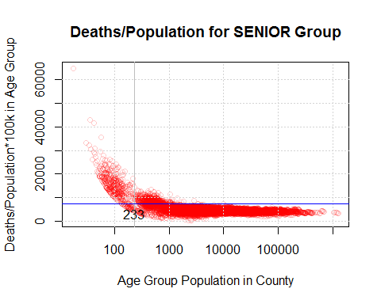
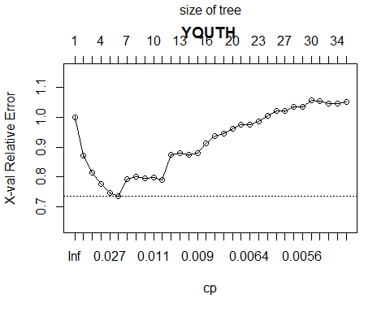

This does the modeling

Load libraries
==============

    ##regis\practicum2\test>pandoc -f docx -t markdown "Chris Busch - practicum2 proposal.docx" -o foo.md
    ##pandoc --extract-media ./myMediaFolder input.docx -o output.md

    rm(list = ls(all = TRUE)) #clear memory
    library(stringr)

    setwd("~/../practicum2")
    source("common.R")
    require(ggplot2)

    ## Loading required package: ggplot2

    ###############load all the data

    bigdata=NULL
    for(year in 2010:2015){
      filenames=c(Sys.glob(paste0('data/county/',year,'*.csv')),
                  Sys.glob(paste0('data/irsclean/',year,'*.csv')),
                  Sys.glob(paste0('data/wonderclean/',year,'*.csv')))
      yeardata=NULL
      for(f in filenames){# f=filenames[2]
        ##gotta go by year
        message(year,' ',f)
        fn=str_match(f, '/(\\d+)')[,2]
        d=read.csv(f,stringsAsFactors = T)
        
        if(!is.null(yeardata)){
          message('merging')
          yeardata=(merge(yeardata,d,by=c('fips','Year')))
        }else{
          yeardata=d
        }
      }
      message('storing')
      if(is.null(bigdata)){
        bigdata=yeardata
      }else{
        bigdata=dplyr::bind_rows(bigdata,yeardata)
      }
    }

    ## 2010 data/county/2010Ranked Measure Data.csv

    ## 2010 data/irsclean/2010-irs-soi.csv

    ## merging

    ## 2010 data/wonderclean/2010cdc.csv

    ## merging

    ## storing

    ## 2011 data/county/2011Additional Measure Data.csv

    ## 2011 data/county/2011Ranked Measure Data.csv

    ## merging

    ## 2011 data/irsclean/2011-irs-soi.csv

    ## merging

    ## 2011 data/wonderclean/2011cdc.csv

    ## merging

    ## storing

    ## Warning in bind_rows_(x, .id): Unequal factor levels: coercing to character

    ## Warning in bind_rows_(x, .id): binding character and factor vector,
    ## coercing into character vector

    ## Warning in bind_rows_(x, .id): binding character and factor vector,
    ## coercing into character vector

    ## Warning in bind_rows_(x, .id): Unequal factor levels: coercing to character

    ## Warning in bind_rows_(x, .id): binding character and factor vector,
    ## coercing into character vector

    ## Warning in bind_rows_(x, .id): binding character and factor vector,
    ## coercing into character vector

    ## 2012 data/county/2012Additional Measure Data.csv

    ## 2012 data/county/2012Ranked Measure Data.csv

    ## merging

    ## 2012 data/irsclean/2012-irs-soi.csv

    ## merging

    ## 2012 data/wonderclean/2012cdc.csv

    ## merging

    ## storing

    ## Warning in bind_rows_(x, .id): binding character and factor vector,
    ## coercing into character vector

    ## Warning in bind_rows_(x, .id): binding character and factor vector,
    ## coercing into character vector

    ## 2013 data/county/2013Additional Measure Data.csv

    ## 2013 data/county/2013Ranked Measure Data.csv

    ## merging

    ## 2013 data/irsclean/2013-irs-soi.csv

    ## merging

    ## 2013 data/wonderclean/2013cdc.csv

    ## merging

    ## storing

    ## Warning in bind_rows_(x, .id): binding character and factor vector,
    ## coercing into character vector

    ## Warning in bind_rows_(x, .id): binding character and factor vector,
    ## coercing into character vector

    ## 2014 data/county/2014Additional Measure Data.csv

    ## 2014 data/county/2014Ranked Measure Data.csv

    ## merging

    ## 2014 data/irsclean/2014-irs-soi.csv

    ## merging

    ## 2014 data/wonderclean/2014cdc.csv

    ## merging

    ## storing

    ## Warning in bind_rows_(x, .id): binding character and factor vector,
    ## coercing into character vector

    ## Warning in bind_rows_(x, .id): binding character and factor vector,
    ## coercing into character vector

    ## 2015 data/county/2015Additional Measure Data.csv

    ## 2015 data/county/2015Ranked Measure Data.csv

    ## merging

    ## 2015 data/irsclean/2015-irs-soi.csv

    ## merging

    ## 2015 data/wonderclean/2015cdc.csv

    ## merging

    ## storing

    ## Warning in bind_rows_(x, .id): binding character and factor vector,
    ## coercing into character vector

    ## Warning in bind_rows_(x, .id): binding character and factor vector,
    ## coercing into character vector

    rm(yeardata)
    rm(d)

    ###done loading

    checkVar=function(var1){
      message(var1,'not na=',length(which(!is.na(bigdata[[var1]]))))
      print(table(!is.na(bigdata[[ var1  ]]),bigdata$Year,dnn=c(var1,'Year')))
      summary(bigdata[[ var1  ]])
    }

    ##              #thisVar becomes thatVar
    varsToCombine=
      c(some_college_post_secondary_education.psed='some_college_post_secondary_education.pct',
        some_college_post_secondary_education.pct_psed='some_college_post_secondary_education.pct',
        access_to_healthy_foods.pct.x='access_to_healthy_foods.pct_food',
        access_to_recreational_facilities.rec_facility_rate='access_to_recreational_facilities.rec_fac_rate',
        air_pollution_particulate_matter.average_daily_pm2_5='daily_fine_particulate_matter.average_pm25',
        air_pollution_particulate_matter.average_daily_pm25='daily_fine_particulate_matter.average_pm25',
        diabetic_monitoring.pct_receiving_hba1c='diabetic_screening.pct_hba1c'
      )
    for(n in names(varsToCombine)){
      print(table(sign(bigdata[[ varsToCombine[n]  ]]),bigdata$Year,dnn=c(varsToCombine[n],'Year (before)')))
      bigdata[[ varsToCombine[n]  ]]  = ifelse(is.na(bigdata[[ varsToCombine[n]  ]]),bigdata[[ n  ]],bigdata[[ varsToCombine[n]  ]])
      bigdata[[ n  ]]=NULL
      print(table(sign(bigdata[[ varsToCombine[n]  ]]),bigdata$Year,dnn=c(varsToCombine[n],'Year (after)')))
    }

    ##                                          Year (before)
    ## some_college_post_secondary_education.pct 2010 2011 2012 2013 2014 2015
    ##                                         1    0    0    0 6120 6157    0
    ##                                          Year (after)
    ## some_college_post_secondary_education.pct 2010 2011 2012 2013 2014 2015
    ##                                         1    0 6120    0 6120 6157    0
    ##                                          Year (before)
    ## some_college_post_secondary_education.pct 2010 2011 2012 2013 2014 2015
    ##                                         1    0 6120    0 6120 6157    0
    ##                                          Year (after)
    ## some_college_post_secondary_education.pct 2010 2011 2012 2013 2014 2015
    ##                                         1    0 6120 6114 6120 6157    0
    ##                                 Year (before)
    ## access_to_healthy_foods.pct_food 2010 2011 2012 2013 2014 2015
    ##                                0   68   33    0    0    0    0
    ##                                1 6057 6078    0    0    0    0
    ##                                 Year (after)
    ## access_to_healthy_foods.pct_food 2010 2011 2012 2013 2014 2015
    ##                                0   68   33   35    0    0    0
    ##                                1 6057 6078 6069    0    0    0
    ##                                               Year (before)
    ## access_to_recreational_facilities.rec_fac_rate 2010 2011 2012 2013 2014
    ##                                              0    0 1180 1269    0    0
    ##                                              1    0 4940 4845    0    0
    ##                                               Year (before)
    ## access_to_recreational_facilities.rec_fac_rate 2015
    ##                                              0    0
    ##                                              1    0
    ##                                               Year (after)
    ## access_to_recreational_facilities.rec_fac_rate 2010 2011 2012 2013 2014
    ##                                              0    0 1180 1269 1320    0
    ##                                              1    0 4940 4845 4800    0
    ##                                               Year (after)
    ## access_to_recreational_facilities.rec_fac_rate 2015
    ##                                              0    0
    ##                                              1    0
    ##                                           Year (before)
    ## daily_fine_particulate_matter.average_pm25 2010 2011 2012 2013 2014 2015
    ##                                          1    0    0    0 6079    0    0
    ##                                           Year (after)
    ## daily_fine_particulate_matter.average_pm25 2010 2011 2012 2013 2014 2015
    ##                                          1    0    0    0 6079    0 6134
    ##                                           Year (before)
    ## daily_fine_particulate_matter.average_pm25 2010 2011 2012 2013 2014 2015
    ##                                          1    0    0    0 6079    0 6134
    ##                                           Year (after)
    ## daily_fine_particulate_matter.average_pm25 2010 2011 2012 2013 2014 2015
    ##                                          1    0    0    0 6079 6119 6134
    ##                             Year (before)
    ## diabetic_screening.pct_hba1c 2010 2011 2012 2013 2014 2015
    ##                            1 6084 6045 6107 6110 6154    0
    ##                             Year (after)
    ## diabetic_screening.pct_hba1c 2010 2011 2012 2013 2014 2015
    ##                            1 6084 6045 6107 6110 6154 6163

    #################  define the predictors under consideration
    yvar='Death.per.100k'
    predictors=read.csv('data/predictors.csv',stringsAsFactors = F,na.strings = "")
    predictors$column=coalesce(predictors$shorter,predictors$origcolumn)
    ##rename those pesky long column names
    changelist=list()
    for(i in 1:nrow(predictors)){
      if(!is.na(predictors$shorter[i])){
        changelist[[ predictors$origcolumn[i] ]]= predictors$shorter[i]
      }
    }
    predictors[!is.na(predictors$shorter),c('shorter','origcolumn')]

    ##                       shorter
    ## 219   mentally_unhealthy_days
    ## 223 physically_unhealthy_days
    ##                                         origcolumn
    ## 219     poor_mental_health_days.mentally_unhealthy
    ## 223 poor_physical_health_days.physically_unhealthy

    bigdata=rename.columns(bigdata,changelist)

    ## poor_physical_health_days.physically_unhealthy renamed columns to physically_unhealthy_days

    ## poor_mental_health_days.mentally_unhealthy renamed columns to mentally_unhealthy_days

    setdiff(names(bigdata),predictors$column) ##what is missing in the first compared to second

    ## [1] "Death.per.100k"

    setdiff(predictors$column,names(bigdata)) ##what is missing in the first compared to second

    ## [1] "access_to_healthy_foods.pct.x"                       
    ## [2] "access_to_recreational_facilities.rec_facility_rate" 
    ## [3] "air_pollution_particulate_matter.average_daily_pm2_5"
    ## [4] "air_pollution_particulate_matter.average_daily_pm25" 
    ## [5] "diabetic_monitoring.pct_receiving_hba1c"             
    ## [6] "some_college_post_secondary_education.pct_psed"      
    ## [7] "some_college_post_secondary_education.psed"

    ignore=unique(predictors$column[predictors$predictor==0])
    discardVars=c(ignore)
    predictorVarsRaw=unique(predictors$column[predictors$predictor==1 & predictors$column!=yvar])

    sapply(qw('other_primary_care_providers.pcp_rate
    previous_other_primary_care_providers_data.pcp_rate
              previous_primary_care_physician_data_used_to_calculate_rankings.pcp_rate
              primary_care_physicians.pcp_rate
              '),checkVar)

    ## other_primary_care_providers.pcp_ratenot na=6093

    ##                                      Year
    ## other_primary_care_providers.pcp_rate 2010 2011 2012 2013 2014 2015
    ##                                 FALSE 6125 6120 6114 6120 6157   82
    ##                                 TRUE     0    0    0    0    0 6093

    ## previous_other_primary_care_providers_data.pcp_ratenot na=12152

    ##                                                    Year
    ## previous_other_primary_care_providers_data.pcp_rate 2010 2011 2012 2013
    ##                                               FALSE 6125 6120 6114 6120
    ##                                               TRUE     0    0    0    0
    ##                                                    Year
    ## previous_other_primary_care_providers_data.pcp_rate 2014 2015
    ##                                               FALSE  105   75
    ##                                               TRUE  6052 6100

    ## previous_primary_care_physician_data_used_to_calculate_rankings.pcp_ratenot na=12068

    ##                                                                         Year
    ## previous_primary_care_physician_data_used_to_calculate_rankings.pcp_rate 2010
    ##                                                                    FALSE 6125
    ##                                                                    TRUE     0
    ##                                                                         Year
    ## previous_primary_care_physician_data_used_to_calculate_rankings.pcp_rate 2011
    ##                                                                    FALSE    0
    ##                                                                    TRUE  6120
    ##                                                                         Year
    ## previous_primary_care_physician_data_used_to_calculate_rankings.pcp_rate 2012
    ##                                                                    FALSE  166
    ##                                                                    TRUE  5948
    ##                                                                         Year
    ## previous_primary_care_physician_data_used_to_calculate_rankings.pcp_rate 2013
    ##                                                                    FALSE 6120
    ##                                                                    TRUE     0
    ##                                                                         Year
    ## previous_primary_care_physician_data_used_to_calculate_rankings.pcp_rate 2014
    ##                                                                    FALSE 6157
    ##                                                                    TRUE     0
    ##                                                                         Year
    ## previous_primary_care_physician_data_used_to_calculate_rankings.pcp_rate 2015
    ##                                                                    FALSE 6175
    ##                                                                    TRUE     0

    ## primary_care_physicians.pcp_ratenot na=30073

    ##                                 Year
    ## primary_care_physicians.pcp_rate 2010 2011 2012 2013 2014 2015
    ##                            FALSE 6125    0  166  132  160  155
    ##                            TRUE     0 6120 5948 5988 5997 6020

    ##         other_primary_care_providers.pcp_rate
    ## Min.                                  0.00000
    ## 1st Qu.                              31.53828
    ## Median                               47.44958
    ## Mean                                 56.16747
    ## 3rd Qu.                              69.98600
    ## Max.                               1245.88749
    ## NA's                              30718.00000
    ##         previous_other_primary_care_providers_data.pcp_rate
    ## Min.                                                0.00000
    ## 1st Qu.                                            31.91699
    ## Median                                             48.63715
    ## Mean                                               57.29750
    ## 3rd Qu.                                            72.25067
    ## Max.                                             1348.36309
    ## NA's                                            24659.00000
    ##         previous_primary_care_physician_data_used_to_calculate_rankings.pcp_rate
    ## Min.                                                                     0.00000
    ## 1st Qu.                                                                 52.90000
    ## Median                                                                  79.95000
    ## Mean                                                                    90.16054
    ## 3rd Qu.                                                                116.00000
    ## Max.                                                                   793.00000
    ## NA's                                                                 24743.00000
    ##         primary_care_physicians.pcp_rate
    ## Min.                             0.00000
    ## 1st Qu.                         35.48784
    ## Median                          53.22924
    ## Mean                            59.47338
    ## 3rd Qu.                         75.62539
    ## Max.                           631.93810
    ## NA's                          6738.00000

    average.out=function(bigdata){
      shush({
        bigdata=bigdata[!is.na(bigdata$Death.per.100k),] ##only data with Death.per.100k
        impute.df=as.data.frame(aggregate(bigdata,list(fips=bigdata$fips),FUN=function(x) mean(x,na.rm=T)))
      })
      impute.df
    }

    median.out=function(bigdata){
      shush({
        bigdata=bigdata[!is.na(bigdata$Death.per.100k),] ##only data with Death.per.100k
        impute.df=as.data.frame(aggregate(bigdata,list(fips=bigdata$fips),FUN=function(x) median(x,na.rm=T)))
      })
      impute.df
    }

    impute.df=average.out(bigdata);

    cor(bigdata[,qw('other_primary_care_providers.pcp_rate
    previous_other_primary_care_providers_data.pcp_rate
                    previous_primary_care_physician_data_used_to_calculate_rankings.pcp_rate
                    primary_care_physicians.pcp_rate
                    ')],use = "pairwise.complete.obs")

    ##                                                                          other_primary_care_providers.pcp_rate
    ## other_primary_care_providers.pcp_rate                                                                1.0000000
    ## previous_other_primary_care_providers_data.pcp_rate                                                  0.9917949
    ## previous_primary_care_physician_data_used_to_calculate_rankings.pcp_rate                                    NA
    ## primary_care_physicians.pcp_rate                                                                     0.5299042
    ##                                                                          previous_other_primary_care_providers_data.pcp_rate
    ## other_primary_care_providers.pcp_rate                                                                              0.9917949
    ## previous_other_primary_care_providers_data.pcp_rate                                                                1.0000000
    ## previous_primary_care_physician_data_used_to_calculate_rankings.pcp_rate                                                  NA
    ## primary_care_physicians.pcp_rate                                                                                   0.5243828
    ##                                                                          previous_primary_care_physician_data_used_to_calculate_rankings.pcp_rate
    ## other_primary_care_providers.pcp_rate                                                                                                          NA
    ## previous_other_primary_care_providers_data.pcp_rate                                                                                            NA
    ## previous_primary_care_physician_data_used_to_calculate_rankings.pcp_rate                                                                1.0000000
    ## primary_care_physicians.pcp_rate                                                                                                        0.9614487
    ##                                                                          primary_care_physicians.pcp_rate
    ## other_primary_care_providers.pcp_rate                                                           0.5299042
    ## previous_other_primary_care_providers_data.pcp_rate                                             0.5243828
    ## previous_primary_care_physician_data_used_to_calculate_rankings.pcp_rate                        0.9614487
    ## primary_care_physicians.pcp_rate                                                                1.0000000

What years hold what data
=========================

    fullness=function() {
      years=c()
      for(y in unique(bigdata$Year)){
        years[[as.character(y)]]=0
        for(n in names(bigdata)){
          #catln(y,n,mean(!is.na(bigdata[[n]][bigdata$Year==y])))
          years[[as.character(y)]]=years[[as.character(y)]]+mean(!is.na(bigdata[[n]][bigdata$Year==y]))
        }
      }
      years
    }
    fullness()

    ##      2010      2011      2012      2013      2014      2015 
    ##  68.32180  99.32582 115.05806 150.32745 126.24395 142.90623

bigdata hotdeck mean imputation to only impute those measures for the
same fips county

    for(n in names(bigdata)){
      if(is.numeric(bigdata[[n]]) && any(is.na(bigdata[[n]]) )){
        
        lookup=impute.df[[n]]
        names(lookup)=as.character(impute.df$fips)
        
        bigdata[[n]]=ifelse(is.na(bigdata[[n]]), lookup[as.character(bigdata$fips)] ,bigdata[[n]])
      }
    }
    fullness()

    ##     2010     2011     2012     2013     2014     2015 
    ## 295.1571 297.1160 297.0833 296.9588 296.9251 297.0322

    require(usmap)

    ## Loading required package: usmap

    ## Warning: package 'usmap' was built under R version 3.4.2

    for(age in unique(bigdata$Age.Grouping)){
      # plot_counties(bigdata[bigdata$Age.Grouping==age,c('fips','Deaths')],
      #               yvar='Deaths',low='green',high='red',main=paste(age,"Deaths"))
      plot_counties(winsor1Df(
        median.out(bigdata[bigdata$Age.Grouping==age,c('fips','Death.per.100k')]),
                              ignore='fips',fraction=.05),
                    yvar='Death.per.100k',low='green',high='red',
                    main=paste(age,"Death Rates (Winsored)"),ylab='Deaths/\nPopulation\n*100k')
    }

    ## void winsor(){ //generated by winsor1Df 
    ## Death.per.100k =max( 3582.19444996898 ,min( 7819.82215733183 , Death.per.100k )); //limits are  518.116166354715 3582.19444996898 7819.82215733183 41463.4146341463 
    ## }

{width="5.833333333333333in"
height="4.166666666666667in"}

    ## void winsor(){ //generated by winsor1Df 
    ## Death.per.100k =max( 288.532980447823 ,min( 1355.51046017491 , Death.per.100k )); //limits are  137.962103908121 288.532980447823 1355.51046017491 3254.43786982249 
    ## }

{width="5.833333333333333in"
height="4.166666666666667in"}

    ## void winsor(){ //generated by winsor1Df 
    ## Death.per.100k =max( 67.1297848933185 ,min( 1515.55824885756 , Death.per.100k )); //limits are  31.5845054292382 67.1297848933185 1515.55824885756 3703.7037037037 
    ## }

{width="5.833333333333333in"
height="4.166666666666667in"}

    a100k=100000
    n='ADULT' #hand executing this line allows one to step into the loop to bypass the for loop
    for(n in unique(bigdata$Age.Grouping)){
      
      d=bigdata[bigdata$Age.Grouping==n,]
      d=d[!is.na(d$Deaths) & !is.na(d$Population),]
      #plot(density(log(d$Population)),main=paste(n,'log(Age Group Populations) Density'))
      m=sum(d$Deaths)/sum(d$Population)
      priori=sum(d$Deaths,na.rm = T)/sum(d$Population,na.rm = T)
      prioriweight=1/priori * 10
      catln(n,priori,prioriweight)
      priori=sum(d$Deaths[d$Population>prioriweight],na.rm = T)/sum(d$Population[d$Population>prioriweight],na.rm = T)
      prioriweight=1/priori * 10
      catln(n,priori,prioriweight)
      
      ##good
      plot(d$Population, (d$Deaths)/(d$Population)*a100k,
           col=rgb(1,0,0,0.2),log='x',main=paste('Deaths/Population for',n,'Group'),
           xlab='Age Group Population in County',
           ylab='Deaths/Population*100k in Age Group')
      # points(d$Population,
      #        (d$Deaths+10/2)/(d$Population+prioriweight/2), #*a100k,
      #        col='purple',pch='.')
      abline(v=10*1/priori,col='gray');
      grid()
      abline(h=quantile((d$Deaths)/(d$Population)*a100k,0.95),col='blue') #winsor
      text(10*1/priori,max((d$Deaths)/(d$Population)*a100k)*0.05,round(prioriweight))
      ##
      # plot(d$Population, 
      #      d$Deaths,pch=20,
      #      col=rgb(1,0,0,0.1),main=n,log='xy',xlab='Age Group Population',ylab='Deaths in Age Group');grid()
      # points(sort(d$Population),sort(d$Population)*priori,type='l')
      # abline(v=prioriweight,col='gray');grid()
      # text(prioriweight,800,round(10*1/priori))
      ###
      print(summary(d$Deaths))
      catln(n,'priori',priori,
            'prioriweight',prioriweight,
            'need at least a pop of this size',min(d$Deaths)*1/priori,
            " small counties ",      sum(d$Population<round(10*1/priori)),
            " big counties ",sum(d$Population>=round(10*1/priori) ))
    }

    ## SENIOR 0.04299791 232.5694 
    ## SENIOR 0.04298034 232.6645

{width="5.0526312335958in"
height="4.0421052055993in"}

    ##    Min. 1st Qu.  Median    Mean 3rd Qu.    Max. 
    ##    10.0   101.0   210.0   624.5   502.0 45604.0 
    ## SENIOR priori 0.04298034 prioriweight 232.6645 need at least a pop of this size 232.6645  small counties  461  big counties  17611 
    ## ADULT 0.003633879 2751.88 
    ## ADULT 0.003605117 2773.835

{width="5.0526312335958in"
height="4.0421052055993in"}

    ##    Min. 1st Qu.  Median    Mean 3rd Qu.    Max. 
    ##    10.0    35.0    77.0   236.4   197.0 15835.0 
    ## ADULT priori 0.003605117 prioriweight 2773.835 need at least a pop of this size 2773.835  small counties  2705  big counties  13128 
    ## YOUTH 0.0008552847 11692.01 
    ## YOUTH 0.000729517 13707.7

{width="5.0526312335958in"
height="4.0421052055993in"}

    ##    Min. 1st Qu.  Median    Mean 3rd Qu.    Max. 
    ##   10.00   14.00   24.00   54.51   57.00 1182.00 
    ## YOUTH priori 0.000729517 prioriweight 13707.7 need at least a pop of this size 13707.7  small counties  1605  big counties  1301

    age='SENIOR' #hand executing this line allows one to step into the loop to bypass the for loop
    age='ADULT'
    age='YOUTH'
    year=0
    importance=data.frame()
    trees=list()
    for(age in unique(bigdata$Age.Grouping)){
      shush({
        d=bigdata[bigdata$Age.Grouping==age & !is.na(bigdata$Death.per.100k),] 
        set.seed(7)
        trainset=runif(nrow(d))<0.8
        label=paste(age,ifelse(year==0,'',year))
        mean(is.na(d$Death.per.100k))
        
        d=winsor1Df(d,ignore = ignore) 
        
        #trees handle missing data
        #d=impute(d,ignore = ignore,missing.threshold = 0.25)
        
        require(MASS)
        
        predictorVars=intersect(names(d),predictorVarsRaw)
        predictorVars=predictorVarsRaw
        
        require(rpart)
        require(rpart.plot)
        library(partykit)
        require(dplyr)
        summary(d$Population)
      }) #end of shush output
      mtree=rpart(ezformula(c(yvar,predictorVars)),d[trainset,],weights = d$Population[trainset],
                  control = rpart.control(cp = 0.005))
      #printcp(mtree) # display the results 
      plotcp(mtree,main=label) # visualize cross-validation results 
      cp=mtree$cptable[which.min(mtree$cptable[,"xerror"]),"CP"] ##best CP
      message(label,'cp=',cp)
      mtree=prune(mtree,cp)

      catln(label,'tree depth is',max(rpart:::tree.depth(as.numeric(rownames(mtree$frame)))))
      
      
      agedata=bigdata[bigdata$Age.Grouping==age & !is.na(bigdata$Death.per.100k),] 
      if(nrow(agedata)!=nrow(d))stop('the winsored and not-winsored should be the same length')

      catln(age,'all data')
      cbind(agedata,node=round((predict(mtree,agedata,type='vector'))),
            response=(predict(mtree,agedata,type='vector'))) %>%
        dplyr::group_by(node) %>% 
        dplyr::summarise(counties=length(fips),
                         deaths.pred=round(sum(response/100000*Population)),
                         deaths.act=sum(Deaths),
                         age.pop=sum(Population),
                         #dr100k.mean=mean(Death.per.100k),
                         dr100k.fit=mean(response)) %>% 
        dplyr::mutate(dr100k.group=deaths.act*100000/age.pop) %>% as.data.frame %>% print
      
      catln(age,'test data')
      cbind(agedata[!trainset,],node=round((predict(mtree,agedata[!trainset,],type='vector'))),
            response=(predict(mtree,agedata[!trainset,],type='vector'))) %>%
        dplyr::group_by(node) %>% 
        dplyr::summarise(counties=length(fips),
                         deaths.pred=round(sum(response/100000*Population)),
                         deaths.act=sum(Deaths),
                         age.pop=sum(Population),
                         #dr100k.mean=mean(Death.per.100k),
                         dr100k.fit=mean(response)) %>% 
        dplyr::mutate(dr100k.group=deaths.act*100000/age.pop) %>% as.data.frame %>% print
      
      importance=dplyr::bind_rows(importance,
                                  cbind(data.frame(age=age,year=year),
                                        as.data.frame(t(as.data.frame(mtree$variable.importance)))))
      
      trees[[age]]=mtree;
      
      #plot(d$Deaths,(predict(mtree)/100000)*d$Population,col=rgb(0,0,0,0.2),main=label);grid()
      catln(label,'all',
            '\nrmse deaths=',rmse(d$Deaths,(predict(mtree,d)/100000)*d$Population),
            '\nrmse Deaths by priori=',rmse(d$Deaths,sum(d$Deaths)/sum(d$Population)*d$Population),
            '\ntree Deaths rsq=',rsq(d$Deaths,(predict(mtree,d)/100000)*d$Population),
            '\nprior Deaths rsq=',rsq(d$Deaths,sum(d$Deaths)/sum(d$Population)*d$Population),
            
            '\nfitted Death.per.100k rmse=',rmse(d$Death.per.100k,predict(mtree,d)),
            '\nweighted Death.per.100k rmse=',rmse(d$Death.per.100k,predict(mtree,d),weights = d$Population),
            '\nfitted Death.per.100k rsq=',rsq(d$Death.per.100k,(predict(mtree,d))))
      catln(label,'test',
            '\nrmse deaths=',rmse(d$Deaths[!trainset],((predict(mtree,d[!trainset,]))/100000)*d$Population[!trainset]),
            '\nrmse Deaths by priori=',rmse(d$Deaths[!trainset],sum(d$Deaths[!trainset])/sum(d$Population[!trainset])*d$Population[!trainset]),
            '\ntree Deaths rsq=',rsq(d$Deaths[!trainset],(predict(mtree,d[!trainset,])/100000)*d$Population[!trainset]),
            '\nprior Deaths rsq=',rsq(d$Deaths[!trainset],sum(d$Deaths[!trainset])/sum(d$Population[!trainset])*d$Population[!trainset]),
            
            '\nfitted Death.per.100k rmse=',rmse(d$Death.per.100k[!trainset],(predict(mtree,d[!trainset,]))),
            '\nweighted Death.per.100k rmse=',rmse(d$Death.per.100k[!trainset],predict(mtree,d[!trainset,]),weights = d$Population[!trainset]),
            '\nfitted Death.per.100k rsq=',rsq(d$Death.per.100k[!trainset],(predict(mtree,d[!trainset,]))))
      
      
    }  

    ## SENIOR cp=0.005

    ## SENIOR  tree depth is 6 
    ## SENIOR all data

    ## Warning: package 'bindrcpp' was built under R version 3.4.2

{width="5.0526312335958in"
height="4.0421052055993in"}

    ##    node counties deaths.pred deaths.act  age.pop dr100k.fit dr100k.group
    ## 1  2443       18        8331       8096   341083   2442.609     2373.616
    ## 2  3196       68      115344     115441  3609119   3195.912     3198.592
    ## 3  3263       91      161255     163354  4941412   3263.334     3305.816
    ## 4  3404       29       78373      78255  2302246   3404.182     3399.072
    ## 5  3689      488      804212     806502 21800523   3688.956     3699.462
    ## 6  3757      223      672525     674100 17901841   3756.736     3765.535
    ## 7  3780      270      246091     246583  6510895   3779.675     3787.237
    ## 8  3796       93      293166     291992  7722843   3796.091     3780.887
    ## 9  4083      437      341294     339971  8359615   4082.653     4066.826
    ## 10 4121      636      776557     778067 18843798   4121.023     4129.035
    ## 11 4148      779      992607     992122 23930410   4147.888     4145.863
    ## 12 4195      466      666555     669173 15889744   4194.878     4211.352
    ## 13 4233      579      331819     330757  7839300   4232.765     4219.216
    ## 14 4424     1566      456308     456279 10313613   4424.326     4424.046
    ## 15 4449     2038     1157043    1157498 26009674   4448.509     4450.260
    ## 16 4568      598      258440     258423  5657841   4567.829     4567.520
    ## 17 4586      197      325972     326373  7107596   4586.246     4591.890
    ## 18 4768      991      445676     446079  9347843   4767.685     4771.999
    ## 19 4818     3984      959949     959437 19922227   4818.483     4815.912
    ## 20 4960     4521     2188147    2186906 44112484   4960.380     4957.567
    ## SENIOR test data 
    ##    node counties deaths.pred deaths.act age.pop dr100k.fit dr100k.group
    ## 1  2443        5        1145       1294   46875   2442.609     2760.533
    ## 2  3196       14       26165      26361  818703   3195.912     3219.849
    ## 3  3263       21       54365      56478 1665945   3263.334     3390.148
    ## 4  3404        7       11472      11354  336987   3404.182     3369.269
    ## 5  3689      104      165680     168229 4491256   3688.956     3745.701
    ## 6  3757       40      121589     123175 3236555   3756.736     3805.744
    ## 7  3780       52       40410      40910 1069143   3779.675     3826.429
    ## 8  3796       16       36541      35372  962590   3796.091     3674.669
    ## 9  4083       76       57433      56305 1406756   4082.653     4002.471
    ## 10 4121      129      178252     179772 4325441   4121.023     4156.154
    ## 11 4148      154      210486     210036 5074530   4147.888     4139.024
    ## 12 4195       97      198648     201252 4735485   4194.878     4249.871
    ## 13 4233      110       65433      64371 1545873   4232.765     4164.055
    ## 14 4424      321       90473      90426 2044898   4424.326     4422.030
    ## 15 4449      452      248280     248736 5581190   4448.509     4456.684
    ## 16 4568      119       47256      47230 1034531   4567.829     4565.354
    ## 17 4586       33       49314      49715 1075255   4586.246     4623.554
    ## 18 4768      192       89167      89574 1870237   4767.685     4789.446
    ## 19 4818      804      191822     191275 3980966   4818.483     4804.738
    ## 20 4960      866      430585     429279 8680491   4960.380     4945.331
    ## SENIOR  all 
    ## rmse deaths= 100.9629 
    ## rmse Deaths by priori= 251.1529 
    ## tree Deaths rsq= 0.9960968 
    ## prior Deaths rsq= 0.984624 
    ## fitted Death.per.100k rmse= 1924.501 
    ## weighted Death.per.100k rmse= 438.0129 
    ## fitted Death.per.100k rsq= 0.04537871 
    ## SENIOR  test 
    ## rmse deaths= 109.1264 
    ## rmse Deaths by priori= 236.7213 
    ## tree Deaths rsq= 0.9958717 
    ## prior Deaths rsq= 0.9857348 
    ## fitted Death.per.100k rmse= 1912.41 
    ## weighted Death.per.100k rmse= 444.3723 
    ## fitted Death.per.100k rsq= 0.03661804

    ## ADULT cp=0.005

    ## ADULT  tree depth is 5 
    ## ADULT all data 
    ##    node counties deaths.pred deaths.act   age.pop dr100k.fit dr100k.group
    ## 1   229      394      368068     359954 160821853   228.8667     223.8216
    ## 2   253      279      250001     250189  99002162   252.5209     252.7106
    ## 3   307      818      564495     562305 183595110   307.4673     306.2745
    ## 4   309      699      322070     320320 104257201   308.9189     307.2402
    ## 5   341      290      120430     120678  35340468   340.7706     341.4726
    ## 6   357      592      292721     291970  81986902   357.0339     356.1179
    ## 7   373      485      150654     150114  40423618   372.6872     371.3522
    ## 8   416      919      359276     359233  86417573   415.7447     415.6944
    ## 9   480     1152      395272     395729  82419739   479.5840     480.1386
    ## 10  486      800       66539      66539  13678719   486.4424     486.4417
    ## 11  499     2277      355343     356459  71172707   499.2683     500.8366
    ## 12  621      848      114734     114954  18471374   621.1452     622.3359
    ## 13  650      632       42934      42128   6605965   649.9298     637.7267
    ## 14  653      368       38247      37722   5854339   653.3037     644.3426
    ## 15  714     1460       59280      59331   8303426   713.9179     714.5364
    ## 16  767     2141      192141     190801  25052181   766.9651     761.6143
    ## 17  975     1679       64271      64459   6593752   974.7333     977.5770
    ## ADULT test data 
    ##    node counties deaths.pred deaths.act  age.pop dr100k.fit dr100k.group
    ## 1   229       67       54115      49319 23644875   228.8667     208.5822
    ## 2   253       51       69879      70270 27672470   252.5209     253.9347
    ## 3   307      168      126375     124198 41102034   307.4673     302.1700
    ## 4   309      162       61823      60092 20012557   308.9189     300.2715
    ## 5   341       59       22672      22920  6653131   340.7706     344.4995
    ## 6   357      124       58857      58106 16484990   357.0339     352.4782
    ## 7   373       95       27546      27006  7391090   372.6872     365.3859
    ## 8   416      205       75328      75285 18118930   415.7447     415.5047
    ## 9   480      235       89485      89942 18658857   479.5840     482.0338
    ## 10  486      153       11908      11899  2448066   486.4424     486.0572
    ## 11  499      473       70386      71502 14097781   499.2683     507.1862
    ## 12  621      171       22225      22443  3578062   621.1452     627.2390
    ## 13  650      116        8625       7815  1327054   649.9298     588.8984
    ## 14  653       61        8294       7750  1269519   653.3037     610.4674
    ## 15  714      285       11498      11541  1610491   713.9179     716.6138
    ## 16  767      411       40411      39057  5268944   766.9651     741.2681
    ## 17  975      322       12365      12455  1268526   974.7333     981.8482

    ## Warning in bind_rows_(x, .id): Unequal factor levels: coercing to character

    ## Warning in bind_rows_(x, .id): binding character and factor vector,
    ## coercing into character vector

    ## Warning in bind_rows_(x, .id): binding character and factor vector,
    ## coercing into character vector

{width="5.0526312335958in"
height="4.0421052055993in"}

    ## ADULT  all 
    ## rmse deaths= 74.8 
    ## rmse Deaths by priori= 233.1597 
    ## tree Deaths rsq= 0.9853134 
    ## prior Deaths rsq= 0.9451815 
    ## fitted Death.per.100k rmse= 259.8712 
    ## weighted Death.per.100k rmse= 78.97165 
    ## fitted Death.per.100k rsq= 0.5058604 
    ## ADULT  test 
    ## rmse deaths= 84.64957 
    ## rmse Deaths by priori= 242.0419 
    ## tree Deaths rsq= 0.9839259 
    ## prior Deaths rsq= 0.9433995 
    ## fitted Death.per.100k rmse= 251.6016 
    ## weighted Death.per.100k rmse= 78.71772 
    ## fitted Death.per.100k rsq= 0.5119184

    ## YOUTH cp=0.0173159759897631

    ## YOUTH  tree depth is 3 
    ## YOUTH all data 
    ##   node counties deaths.pred deaths.act   age.pop dr100k.fit dr100k.group
    ## 1   57      467       64214      63811 112330034   57.16540     56.80671
    ## 2   93      434       33492      32970  36033472   92.94713     91.49826
    ## 3  122      512       29466      28751  24187179  121.82282    118.86876
    ## 4  224      747       18960      18743   8446910  224.46242    221.89179
    ## 5  237      228        5606       5519   2365179  237.00361    233.34386
    ## 6  459      518        8473       8612   1845729  459.06937    466.59071
    ## YOUTH test data 
    ##   node counties deaths.pred deaths.act  age.pop dr100k.fit dr100k.group
    ## 1   57       97       12046      12001 21072618   57.16540     56.95068
    ## 2   93       74        5928       5417  6377396   92.94713     84.94062
    ## 3  122      104        7079       6358  5810586  121.82282    109.42098
    ## 4  224      153        4440       4223  1978192  224.46242    213.47776
    ## 5  237       50        1240       1153   523013  237.00361    220.45341
    ## 6  459      115        1790       1910   389905  459.06937    489.86292

    ## Warning in bind_rows_(x, .id): binding character and factor vector,
    ## coercing into character vector

{width="5.0526312335958in"
height="4.0421052055993in"}

    ## YOUTH  all 
    ## rmse deaths= 39.99027 
    ## rmse Deaths by priori= 78.00859 
    ## tree Deaths rsq= 0.9072014 
    ## prior Deaths rsq= 0.9117817 
    ## fitted Death.per.100k rmse= 446.975 
    ## weighted Death.per.100k rmse= 85.34004 
    ## fitted Death.per.100k rsq= 0.3502687 
    ## YOUTH  test 
    ## rmse deaths= 42.4409 
    ## rmse Deaths by priori= 76.01757 
    ## tree Deaths rsq= 0.9084195 
    ## prior Deaths rsq= 0.909443 
    ## fitted Death.per.100k rmse= 464.2714 
    ## weighted Death.per.100k rmse= 90.60464 
    ## fitted Death.per.100k rsq= 0.3094672

    for(age in unique(bigdata$Age.Grouping)){
      mtree=trees[[age]]
      data=mtree$variable.importance
      names(data)=abbreviate(names.arg = names(data),
                             minlength = floor(mean(nchar(names(data)))+sd(nchar(names(data)))))
      print(lattice::barchart( rev(data/sum(data)*100),main=age,
                               xlab='Variable Importance'))
      catln(age,'very important vars:',names(mtree$variable.importance)[(mtree$variable.importance/max(mtree$variable.importance)*100)>50])
    }

{width="5.833333333333333in"
height="8.333333333333334in"}

    ## SENIOR very important vars: adult_obesity.pct_obese physical_inactivity.pct_physically_inactive high_housing_costs.pct college_degrees.pct diabetes.pct_diabetic

{width="5.833333333333333in"
height="8.333333333333334in"}

    ## ADULT very important vars: motor_vehicle_crash_deaths.mv_mortality_rate diabetes.pct_diabetic

{width="5.833333333333333in"
height="8.333333333333334in"}

    ## YOUTH very important vars: demographics.pct_not_proficient_in_english access_to_exercise_opportunities.pct_with

    for(age in unique(bigdata$Age.Grouping)){
      mtree=trees[[age]]
      prp(mtree,varlen=ceiling(max(nchar(names(mtree$variable.importance)))),cex=0.8,nn=F,main=age,box.palette="GnRd",fallen.leaves = F)
    }

{width="5.833333333333333in"
height="5.833333333333333in"}{width="5.833333333333333in"
height="5.833333333333333in"}{width="5.833333333333333in"
height="5.833333333333333in"}

    for(age in unique(bigdata$Age.Grouping)){
      mtree=trees[[age]]
      print(
        plot_counties(data.frame(Death.per.100k=(round(predict(mtree,impute.df,type='vector'))),
                                 fips=impute.df$fips),'Death.per.100k',low='green',high='red',
                      main=paste(age,'Fitted'),print = F)
      )
    }

{width="5.833333333333333in"
height="4.166666666666667in"}{width="5.833333333333333in"
height="4.166666666666667in"}{width="5.833333333333333in"
height="4.166666666666667in"}

    #importance
    #View(importance)
    ###################END OF TREE

    #https://stackoverflow.com/questions/23714052/ggplot-mapping-us-counties-problems-with-visualization-shapes-in-r

    #####################

Lantz (2015) suggests the elbow method for cluster size determination.

Compute and plot wss for k = 1 to k = 17:

    require(factoextra)

    ## Loading required package: factoextra

    ## Warning: package 'factoextra' was built under R version 3.4.2

    ## Welcome! Related Books: `Practical Guide To Cluster Analysis in R` at https://goo.gl/13EFCZ

    require(cluster)

    ## Loading required package: cluster

    ## Warning: package 'cluster' was built under R version 3.4.2

    age='SENIOR'
    age='YOUTH'
    allclusters=list()
    for(age in unique(bigdata$Age.Grouping)){
      shush({
        data=as.data.frame(aggregate(bigdata[,names(trees[[age]]$variable.importance)],
                                     list(fips=bigdata$fips),FUN=function(x) mean(x,na.rm=T)))
        fips=data$fips
        data$fips=NULL
        data=winsor1Df(data)
        data=impute(data,missing.threshold = 0.1)
        data=as.data.frame(scale(keepNumeric( data)))
      })
      set.seed(7)
      k.max <- 8 # Maximal number of clusters
      wss <- sapply(1:k.max, function(k){set.seed(17); kmeans(data, k, nstart=5 )$tot.withinss})
      plot(1:k.max, wss, type="b", pch = 19, frame = FALSE,    xlab="Number of clusters K",
           ylab="Total within-clusters sum of squares",main=paste(age,'elbow method'));grid()

      bestK=4
     
      set.seed(7)
      cl=kmeans(data, bestK, nstart=5 )
      print(fviz_cluster(cl, data=data,stand = FALSE, geom = "point",
                         pointsize = 1,main=paste(age,'Cluster Plot')))
      cl$clustering=cl$cluster
      allclusters[[age]]=cl
     
      data$fips=fips
      
      plot_counties(df = data.frame(fips=data$fips,cluster=as.factor(cl$clustering)),
                    main=age,yvar = 'cluster')
      for(i in sort(unique(cl$clustering))){
        w=impute.df$fips %in% data$fips[cl$clustering==i]
        catln(age,'cluster=',i,'deathRate per 100k:',sum(1.0*impute.df$Deaths[w])/
                sum(1.0*impute.df$Population[w])*100000,
              'counties:',length(unique(impute.df$fips[w])))
      }

      ######################
    }

{width="5.833333333333333in"
height="4.166666666666667in"}{width="5.833333333333333in"
height="4.166666666666667in"}{width="5.833333333333333in"
height="4.166666666666667in"}

    ## SENIOR cluster= 1 deathRate per 100k: 867.6311 counties: 554 
    ## SENIOR cluster= 2 deathRate per 100k: 1074.51 counties: 394 
    ## SENIOR cluster= 3 deathRate per 100k: 1675.77 counties: 1131 
    ## SENIOR cluster= 4 deathRate per 100k: 1727.55 counties: 989

{width="5.833333333333333in"
height="4.166666666666667in"}{width="5.833333333333333in"
height="4.166666666666667in"}{width="5.833333333333333in"
height="4.166666666666667in"}

    ## ADULT cluster= 1 deathRate per 100k: 1612.417 counties: 1285 
    ## ADULT cluster= 2 deathRate per 100k: 1939.683 counties: 856 
    ## ADULT cluster= 3 deathRate per 100k: 1139.201 counties: 429 
    ## ADULT cluster= 4 deathRate per 100k: 845.8497 counties: 498

{width="5.833333333333333in"
height="4.166666666666667in"}{width="5.833333333333333in"
height="4.166666666666667in"}{width="5.833333333333333in"
height="4.166666666666667in"}

    ## YOUTH cluster= 1 deathRate per 100k: 3473.614 counties: 433 
    ## YOUTH cluster= 2 deathRate per 100k: 1416.39 counties: 1040 
    ## YOUTH cluster= 3 deathRate per 100k: 1676.141 counties: 1139 
    ## YOUTH cluster= 4 deathRate per 100k: 838.4864 counties: 456

    for(age in unique(bigdata$Age.Grouping)){
      cl=allclusters[[age]]
      data=as.data.frame(cl$centers)
      names(data)=abbreviate(names.arg = names(data),
                             minlength = floor(mean(nchar(names(data)))+sd(nchar(names(data)))))
      ezplot2(data,xlab='cluster',col=darken(rainbow(1+ncol(data))),
              title = paste(age,'Cluster Centers'),type='bar')
    }

    ## Loading required package: reshape2

    ## Warning: package 'reshape2' was built under R version 3.4.1

    ## Loading required package: ggthemes

{width="5.833333333333333in"
height="2.7222211286089237in"}{width="5.833333333333333in"
height="2.7222211286089237in"}{width="5.833333333333333in"
height="2.7222211286089237in"}

    for(age in unique(bigdata$Age.Grouping)){
      cl=allclusters[[age]]
      mtree=trees[[age]]
      vip=names(mtree$variable.importance)[(
        mtree$variable.importance/max(mtree$variable.importance))>0.3]
      vip=base::intersect(colnames(cl$centers),vip)
      catln(age,vip)
      data=as.data.frame(cl$centers[,vip,drop=F])
      
      names(data)=abbreviate(names.arg = names(data),
                             minlength = floor(mean(nchar(names(data)))+sd(nchar(names(data)))))
      
      ezplot2(data,xlab='cluster',col=darken(rainbow(1+ncol(data))),
              title = paste(age,'Very Important Cluster Centers'),type='bar')
    }

    ## SENIOR adult_obesity.pct_obese physical_inactivity.pct_physically_inactive high_housing_costs.pct college_degrees.pct diabetes.pct_diabetic households_with_high_housing_costs.pct social_associations.association_rate

{width="5.833333333333333in"
height="4.166666666666667in"}

    ## ADULT diabetes.pct_diabetic physical_inactivity.pct_physically_inactive

{width="5.833333333333333in"
height="4.166666666666667in"}

    ## YOUTH demographics.pct_not_proficient_in_english access_to_exercise_opportunities.pct_with social_associations.association_rate

{width="5.833333333333333in"
height="4.166666666666667in"}

    #### end 

    #### end 
