    #

Load libraries
==============

    library(stringr)
    library(psych)
    setwd("~/../practicum2")
    source("common.R")

Process IRS data files
======================

    for(f in Sys.glob('data/irs/1*.csv')){
      message('processing ',f)
      fn=2000+as.numeric(str_match(f, '\\/(\\d+)')[,2])
      d=read.csv(f,stringsAsFactors = F)
      dt=read.csv(f,stringsAsFactors = F,colClasses = 'character')
      d$COUNTYFIPS=dt$COUNTYFIPS ##repair
      d$STATEFIPS=dt$STATEFIPS ##repair
      d$fips=paste0(d$STATEFIPS,d$COUNTYFIPS)
      rm(dt)
      str(d)
      d2=d[,c("STATE"  ,  "COUNTYNAME"  ,'fips'     )]
      d2$Year=fn
      d2$num.returns=d$N1
      d2$married.pct=d$MARS2/d$N1
      d2$dependents.ratio=d$NUMDEP/d$N1
      d2$adjusted.gross.income.avg=d$A00100/d$N1
      d2$wages.avg=d$A00200/d$N1
      d2$farming.ratio=d$SCHF/d$N1
      d2$unemployed.ratio=d$N02300/d$N1
      d2$dividends.ratio=d$N00600/d$N1
      d2$business.ratio=d$N00900/d$N1
      d2$realestate.ratio=d$N18500/d$N1  #indicator of ownership
      d2$mortgage.ratio=d$N19300/d$N1 #indicator of ownership
      d2$contributions.ratio=d$A19700/d$N1 #indicator of giving?
      d2$taxcredits.ratio = d$N07100/d$N1
      write.csv(d2,paste0("data/irsclean/",fn,"-irs-soi.csv"),row.names = F)
      #summary(d2) 
      #describe(d2)
    }

    ## processing data/irs/10incyallnoagi.csv

    ## 'data.frame':    3192 obs. of  75 variables:
    ##  $ STATEFIPS : chr  "01" "01" "01" "01" ...
    ##  $ STATE     : chr  "AL" "AL" "AL" "AL" ...
    ##  $ COUNTYFIPS: chr  "000" "001" "003" "005" ...
    ##  $ COUNTYNAME: chr  "Alabama" "Autauga County" "Baldwin County" "Barbour County" ...
    ##  $ AGI_STUB  : int  0 0 0 0 0 0 0 0 0 0 ...
    ##  $ N1        : num  2100274 24821 85312 10873 8639 ...
    ##  $ MARS2     : num  785681 10183 37613 3367 3517 ...
    ##  $ PREP      : num  1273772 11995 47626 7821 5068 ...
    ##  $ N2        : num  4389348 52230 175253 22943 18539 ...
    ##  $ NUMDEP    : num  1388578 17506 52276 7228 5921 ...
    ##  $ A00100    : num  97604671 1141741 4331432 368337 326695 ...
    ##  $ N00200    : num  1733560 21177 67180 9024 6801 ...
    ##  $ A00200    : num  72276379 898499 2944594 281232 256627 ...
    ##  $ N00300    : num  648344 7893 30721 2853 2115 ...
    ##  $ A00300    : num  1508016 10302 76050 6459 3496 ...
    ##  $ N00600    : num  280440 3179 16407 1184 619 ...
    ##  $ A00600    : num  1438543 6121 85725 4808 1376 ...
    ##  $ N00650    : num  246271 2739 14407 1087 507 ...
    ##  $ A00650    : num  1103934 4010 61562 3810 781 ...
    ##  $ N00900    : num  340738 3414 15786 1546 1268 ...
    ##  $ A00900    : num  2882806 25106 168253 6718 8843 ...
    ##  $ SCHF      : num  49990 419 1196 469 203 ...
    ##  $ N01000    : num  209185 2176 13113 890 494 ...
    ##  $ A01000    : num  2125463 12678 107779 15870 6719 ...
    ##  $ N01400    : num  155998 1624 9520 667 476 ...
    ##  $ A01400    : num  2239541 17829 155146 8912 6161 ...
    ##  $ N01700    : num  401412 4932 19457 1795 1417 ...
    ##  $ A01700    : num  8250377 112072 440869 34269 23387 ...
    ##  $ N02300    : num  177478 1641 6565 946 892 ...
    ##  $ A02300    : num  956278 8967 38951 4599 4003 ...
    ##  $ N02500    : num  239712 2823 13675 1199 897 ...
    ##  $ A02500    : num  2662189 30999 160280 12728 8880 ...
    ##  $ N03300    : num  7094 39 403 21 0 ...
    ##  $ A03300    : num  130896 594 6531 345 0 ...
    ##  $ N04470    : num  597252 7237 27586 2149 1774 ...
    ##  $ A04470    : num  12580721 139264 611052 42163 32550 ...
    ##  $ N18425    : num  472832 5747 19960 1587 1467 ...
    ##  $ A18425    : num  2009415 19954 83744 5600 4874 ...
    ##  $ N18450    : num  104431 1242 6595 473 253 ...
    ##  $ A18450    : num  139590 2461 8687 1559 302 ...
    ##  $ N18500    : num  502832 6212 23246 1748 1447 ...
    ##  $ A18500    : num  646669 4726 30650 1755 825 ...
    ##  $ N18300    : num  594024 7208 27422 2130 1763 ...
    ##  $ A18300    : num  2954116 28713 128949 9862 6383 ...
    ##  $ N19300    : num  470141 6091 21775 1522 1399 ...
    ##  $ A19300    : num  4048346 52925 218889 11659 9636 ...
    ##  $ N19700    : num  515552 6103 22828 1896 1507 ...
    ##  $ A19700    : num  2830060 28805 103703 9528 6988 ...
    ##  $ N04800    : num  1486268 18789 63304 6909 5659 ...
    ##  $ A04800    : num  63024651 718586 2909193 210867 193657 ...
    ##  $ N07100    : num  697410 9123 27176 3208 2642 ...
    ##  $ A07100    : num  870595 11827 35888 3108 3188 ...
    ##  $ N07220    : num  363507 5120 14516 1859 1710 ...
    ##  $ A07220    : num  415146 6709 17776 1764 2083 ...
    ##  $ N07180    : num  99047 1382 3900 372 344 ...
    ##  $ A07180    : num  51585 772 1960 186 157 ...
    ##  $ N07260    : num  112497 1163 3910 377 357 ...
    ##  $ A07260    : num  95026 953 3440 316 303 ...
    ##  $ N59660    : num  548773 5597 16531 3966 2416 ...
    ##  $ A59660    : num  1379125 13789 37710 10186 5997 ...
    ##  $ N59720    : num  500205 5130 14536 3682 2172 ...
    ##  $ A59720    : num  1233638 12497 32902 9389 5337 ...
    ##  $ N11070    : num  403905 3980 12531 2813 1676 ...
    ##  $ A11070    : num  529032 5075 15948 3543 2066 ...
    ##  $ N09600    : num  24706 129 1319 43 35 ...
    ##  $ A09600    : num  127111 486 6542 155 142 ...
    ##  $ N06500    : num  1253809 16201 55683 5455 4788 ...
    ##  $ A06500    : num  10336547 103549 482358 29634 26954 ...
    ##  $ N10300    : num  1403055 17539 61483 6199 5387 ...
    ##  $ A10300    : num  10948191 109480 517828 31857 28910 ...
    ##  $ N11901    : num  307476 3594 18120 1175 959 ...
    ##  $ A11901    : num  1190657 13210 82619 3508 3154 ...
    ##  $ N11902    : num  1724696 20634 63313 9366 7289 ...
    ##  $ A11902    : num  5602752 61798 186866 29558 22279 ...
    ##  $ fips      : chr  "01000" "01001" "01003" "01005" ...

    ## processing data/irs/11incyallnoagi.csv

    ## 'data.frame':    3193 obs. of  75 variables:
    ##  $ STATEFIPS : chr  "01" "01" "01" "01" ...
    ##  $ STATE     : chr  "AL" "AL" "AL" "AL" ...
    ##  $ COUNTYFIPS: chr  "000" "001" "003" "005" ...
    ##  $ COUNTYNAME: chr  "Alabama" "Autauga County" "Baldwin County" "Barbour County" ...
    ##  $ AGI_STUB  : int  0 0 0 0 0 0 0 0 0 0 ...
    ##  $ N1        : num  2091218 24315 87236 10648 8049 ...
    ##  $ MARS2     : num  778752 10151 37748 3322 3493 ...
    ##  $ PREP      : num  1253571 11900 46875 7410 5019 ...
    ##  $ N2        : num  4340121 51513 175844 22062 17756 ...
    ##  $ NUMDEP    : num  1589968 18770 55954 8680 6554 ...
    ##  $ A00100    : num  100308257 1149657 4556224 355824 331373 ...
    ##  $ N00200    : num  1740617 20830 68542 8735 6897 ...
    ##  $ A00200    : num  73819452 903517 3107119 279766 262943 ...
    ##  $ N00300    : num  613319 7289 30310 2765 1991 ...
    ##  $ A00300    : num  1234472 8125 67434 6774 2796 ...
    ##  $ N00600    : num  276153 3086 16368 1190 626 ...
    ##  $ A00600    : num  1377991 6940 87411 5860 1305 ...
    ##  $ N00650    : num  245570 2742 14548 1104 509 ...
    ##  $ A00650    : num  1010895 4612 60332 4677 773 ...
    ##  $ N00900    : num  346394 3440 15992 1597 1210 ...
    ##  $ A00900    : num  2933028 25228 172379 8609 8719 ...
    ##  $ SCHF      : num  48733 420 1188 444 217 ...
    ##  $ N01000    : num  212509 2147 13680 978 493 ...
    ##  $ A01000    : num  2332902 7992 147337 9364 2726 ...
    ##  $ N01400    : num  161089 1743 9841 692 511 ...
    ##  $ A01400    : num  2415698 21177 167777 8989 6445 ...
    ##  $ N01700    : num  404829 5031 19808 1811 1421 ...
    ##  $ A01700    : num  8606413 121079 462958 36437 24866 ...
    ##  $ N02300    : num  149514 1385 5350 736 640 ...
    ##  $ A02300    : num  714907 7093 27333 3382 2744 ...
    ##  $ N02500    : num  249259 2932 14265 1231 907 ...
    ##  $ A02500    : num  2827751 33493 173014 13411 9375 ...
    ##  $ N03300    : num  7097 40 385 21 0.0001 ...
    ##  $ A03300    : num  134294 721 6600 401 0.0001 ...
    ##  $ N04470    : num  599369 7167 27440 2250 1792 ...
    ##  $ A04470    : num  12769234 133814 616433 43331 39539 ...
    ##  $ N18425    : num  475821 5689 20241 1641 1476 ...
    ##  $ A18425    : num  2058790 20622 93223 7254 5239 ...
    ##  $ N18450    : num  104624 1250 6309 499 260 ...
    ##  $ A18450    : num  145563 1825 9988 1507 309 ...
    ##  $ N18500    : num  494579 6075 22796 1757 1426 ...
    ##  $ A18500    : num  636758 4682 28972 1791 805 ...
    ##  $ N18300    : num  595721 7121 27256 2227 1783 ...
    ##  $ A18300    : num  3006384 28418 137963 11129 6712 ...
    ##  $ N19300    : num  460387 5915 21172 1493 1354 ...
    ##  $ A19300    : num  3812392 49383 204268 11106 9024 ...
    ##  $ N19700    : num  517680 6079 22633 1907 1554 ...
    ##  $ A19700    : num  2941658 28738 107428 9558 7676 ...
    ##  $ N04800    : num  1487647 18374 64121 6892 5587 ...
    ##  $ A04800    : num  65015332 732202 3102762 208827 192542 ...
    ##  $ N07100    : num  664438 8428 26093 3068 2478 ...
    ##  $ A07100    : num  819378 10509 33627 2815 2874 ...
    ##  $ N07220    : num  348252 4896 14098 1704 1601 ...
    ##  $ A07220    : num  403951 6446 17391 1618 2009 ...
    ##  $ N07180    : num  97828 1337 4000 371 335 ...
    ##  $ A07180    : num  51303 734 1986 186 154 ...
    ##  $ N07260    : num  60239 590 2097 227 194 ...
    ##  $ A07260    : num  20955 168 806 88 57 ...
    ##  $ N59660    : num  550074 5587 17308 3771 2334 ...
    ##  $ A59660    : num  1413578 14050 40809 10059 6085 ...
    ##  $ N59720    : num  502046 5089 15271 3483 2132 ...
    ##  $ A59720    : num  1268146 12722 35832 9149 5522 ...
    ##  $ N11070    : num  397229 3948 12552 2757 1604 ...
    ##  $ A11070    : num  529531 4974 16256 3480 2009 ...
    ##  $ N09600    : num  25940 144 1423 41 29 ...
    ##  $ A09600    : num  137797 510 7144 336 124 ...
    ##  $ N06500    : num  1262374 15958 56650 5442 4792 ...
    ##  $ A06500    : num  10984677 107396 528715 29480 26998 ...
    ##  $ N10300    : num  1414359 17335 62594 6282 5355 ...
    ##  $ A10300    : num  11269687 112969 562341 31784 28678 ...
    ##  $ N11901    : num  298684 3530 17500 1183 929 ...
    ##  $ A11901    : num  1216196 11318 82124 3944 3220 ...
    ##  $ N11902    : num  1699576 20011 63658 8999 6800 ...
    ##  $ A11902    : num  5091418 56866 173706 28792 21033 ...
    ##  $ fips      : chr  "01000" "01001" "01003" "01005" ...

    ## processing data/irs/12cyallnoagi.csv

    ## 'data.frame':    3193 obs. of  78 variables:
    ##  $ STATEFIPS : chr  "01" "01" "01" "01" ...
    ##  $ STATE     : chr  "AL" "AL" "AL" "AL" ...
    ##  $ COUNTYFIPS: chr  "000" "001" "003" "005" ...
    ##  $ COUNTYNAME: chr  "Alabama" "Autauga County" "Baldwin County" "Barbour County" ...
    ##  $ AGI_STUB  : int  0 0 0 0 0 0 0 0 0 0 ...
    ##  $ N1        : num  2050090 23700 88490 10050 7900 ...
    ##  $ MARS1     : num  810190 8800 35520 3630 2680 ...
    ##  $ MARS2     : num  774210 10100 38380 3280 3430 ...
    ##  $ MARS4     : num  427560 4310 12620 2990 1650 ...
    ##  $ PREP      : num  1238940 11820 47190 7320 4990 ...
    ##  $ N2        : num  4241420 50580 177290 21110 17450 ...
    ##  $ NUMDEP    : num  1535340 18370 55770 8230 6450 ...
    ##  $ A00100    : num  104129915 1206063 4899665 371840 344287 ...
    ##  $ N00200    : num  1716600 20310 69690 8330 6790 ...
    ##  $ A00200    : num  75281821 913638 3252973 273242 273744 ...
    ##  $ N00300    : num  560890 7090 27940 2580 1940 ...
    ##  $ A00300    : num  996850 7153 55549 4016 2004 ...
    ##  $ N00600    : num  276830 3200 16800 1140 590 ...
    ##  $ A00600    : num  1733897 8099 101760 5641 1293 ...
    ##  $ N00650    : num  247730 2830 14990 1060 480 ...
    ##  $ A00650    : num  1347830 5798 75656 4569 920 ...
    ##  $ N00900    : num  337840 3330 16150 1630 1160 ...
    ##  $ A00900    : num  3018562 22301 178028 11472 8722 ...
    ##  $ SCHF      : num  46930 400 1200 450 200 ...
    ##  $ N01000    : num  216800 2340 14410 910 470 ...
    ##  $ A01000    : num  3587580 37005 250614 10034 3945 ...
    ##  $ N01400    : num  163370 1790 10260 720 510 ...
    ##  $ A01400    : num  2536921 23016 177059 10362 6175 ...
    ##  $ N01700    : num  416530 5410 20660 1900 1380 ...
    ##  $ A01700    : num  9019145 129498 488452 37073 25295 ...
    ##  $ N02300    : num  127030 1250 4500 690 540 ...
    ##  $ A02300    : num  500843 5278 19706 3364 1893 ...
    ##  $ N02500    : num  261270 3090 15120 1290 970 ...
    ##  $ A02500    : num  3110766 37258 191665 14787 10056 ...
    ##  $ N03300    : num  6860 50 460 20 0 30 0 0 100 0 ...
    ##  $ A03300    : num  134950 828 7980 430 0 ...
    ##  $ N04470    : num  581300 6840 27040 2120 1720 ...
    ##  $ A00101    : num  62386864 647822 3050674 173162 148838 ...
    ##  $ A04470    : num  12568349 130654 606077 40966 31820 ...
    ##  $ N18425    : num  460600 5390 20060 1510 1450 ...
    ##  $ A18425    : num  2124557 20716 98307 5205 4954 ...
    ##  $ N18450    : num  99330 1240 6130 530 230 ...
    ##  $ A18450    : num  139306 1952 9083 1182 304 ...
    ##  $ N18500    : num  473110 5760 22170 1690 1330 ...
    ##  $ A18500    : num  614945 4496 28169 1656 772 ...
    ##  $ N18300    : num  574510 6780 26830 2080 1710 ...
    ##  $ A18300    : num  3056384 28491 143288 8723 6494 ...
    ##  $ N19300    : num  436640 5550 20480 1430 1300 ...
    ##  $ A19300    : num  3471625 44415 186202 10103 8289 ...
    ##  $ N19700    : num  502050 5830 22480 1820 1500 ...
    ##  $ A19700    : num  3039256 29536 113195 9738 7662 ...
    ##  $ N04800    : num  1469630 17810 65390 6430 5680 ...
    ##  $ A04800    : num  68597241 778737 3398744 212157 208835 ...
    ##  $ N09600    : num  25280 150 1510 40 30 ...
    ##  $ A09600    : num  136128 582 7980 270 148 ...
    ##  $ N07100    : num  620410 7910 25590 2690 2420 ...
    ##  $ A07100    : num  837113 9870 32423 2454 2783 ...
    ##  $ N07180    : num  98270 1390 4090 370 350 ...
    ##  $ A07180    : num  51870 755 1988 179 147 ...
    ##  $ N07220    : num  346650 4930 14140 1590 1650 ...
    ##  $ A07220    : num  400518 6429 17364 1547 2021 ...
    ##  $ N07260    : num  34150 340 1330 110 130 ...
    ##  $ A07260    : num  13001 105 549 30 59 ...
    ##  $ N59660    : num  537300 5440 17780 3560 2250 ...
    ##  $ A59660    : num  1417546 13813 43075 9638 6022 ...
    ##  $ N59720    : num  488680 4940 15630 3280 2060 ...
    ##  $ A59720    : num  1275498 12544 37963 8750 5492 ...
    ##  $ N11070    : num  381510 3900 12360 2610 1550 ...
    ##  $ A11070    : num  505877 4922 15931 3354 1987 ...
    ##  $ N06500    : num  1268390 15610 58160 5260 4910 ...
    ##  $ A06500    : num  11586119 116291 587167 31173 28396 ...
    ##  $ N10300    : num  1413690 16960 64080 6090 5410 ...
    ##  $ A10300    : num  12209093 121963 621440 33556 30233 ...
    ##  $ N11901    : num  310220 3510 17630 1180 1000 ...
    ##  $ A11901    : num  1418852 11151 92499 4628 4104 ...
    ##  $ N11902    : num  1651260 19460 64920 8390 6620 ...
    ##  $ A11902    : num  4838708 54297 175887 25548 19610 ...
    ##  $ fips      : chr  "01000" "01001" "01003" "01005" ...

    ## processing data/irs/13incyallnoagi.csv

    ## 'data.frame':    3193 obs. of  116 variables:
    ##  $ STATEFIPS : chr  "01" "01" "01" "01" ...
    ##  $ STATE     : chr  "AL" "AL" "AL" "AL" ...
    ##  $ COUNTYFIPS: chr  "000" "001" "003" "005" ...
    ##  $ COUNTYNAME: chr  "Alabama" "Autauga County" "Baldwin County" "Barbour County" ...
    ##  $ AGI_STUB  : int  0 0 0 0 0 0 0 0 0 0 ...
    ##  $ N1        : num  2048400 23690 89970 10070 8000 ...
    ##  $ MARS1     : num  816130 8940 36320 3740 2820 ...
    ##  $ MARS2     : num  770530 10000 38880 3160 3370 ...
    ##  $ MARS4     : num  422330 4250 12720 3030 1700 ...
    ##  $ PREP      : num  1212800 11400 47180 7190 4880 ...
    ##  $ N2        : num  4214440 50190 179450 20910 17470 ...
    ##  $ NUMDEP    : num  1510500 18080 56120 8100 6490 ...
    ##  $ A00100    : num  103760136 1199480 4965837 404981 361441 ...
    ##  $ N02650    : num  2042960 23640 89740 10040 7990 ...
    ##  $ A02650    : num  105120016 1211914 5045468 409272 365867 ...
    ##  $ N00200    : num  1716020 20240 70630 8280 6890 ...
    ##  $ A00200    : num  76117842 917228 3352604 271105 274279 ...
    ##  $ N00300    : num  519400 6790 26200 2370 1730 ...
    ##  $ A00300    : num  847210 7349 48498 3112 1793 ...
    ##  $ N00600    : num  271980 3020 16670 1100 560 ...
    ##  $ A00600    : num  1530363 8042 91176 5123 1209 ...
    ##  $ N00650    : num  245780 2730 15080 1030 480 ...
    ##  $ A00650    : num  1139480 5717 65822 4128 822 ...
    ##  $ N00700    : num  338400 4080 14030 1030 1050 ...
    ##  $ A00700    : num  322653 3197 14228 840 720 ...
    ##  $ N00900    : num  336170 3330 16540 1690 1180 ...
    ##  $ A00900    : num  2963959 23660 184406 11092 7281 ...
    ##  $ N01000    : num  227670 2410 15130 950 510 ...
    ##  $ A01000    : num  2688098 12469 171239 12138 4440 ...
    ##  $ N01400    : num  165080 1840 10470 680 500 ...
    ##  $ A01400    : num  2477109 23249 179460 9259 6847 ...
    ##  $ N01700    : num  420490 5410 21030 1850 1460 ...
    ##  $ A01700    : num  9385128 134988 514678 37295 26854 ...
    ##  $ SCHF      : num  46330 390 1170 450 200 ...
    ##  $ N02300    : num  98280 960 3550 560 410 ...
    ##  $ A02300    : num  371772 3950 14509 1970 1404 ...
    ##  $ N02500    : num  273260 3240 15990 1370 1010 ...
    ##  $ A02500    : num  3377504 40104 211482 16431 10871 ...
    ##  $ N26270    : num  95110 790 7050 430 220 ...
    ##  $ A26270    : num  5593449 29639 360124 9355 14936 ...
    ##  $ N02900    : num  464170 5320 23420 1950 1470 ...
    ##  $ A02900    : num  1356174 12440 79631 4292 3536 ...
    ##  $ N03220    : num  51160 650 2300 270 190 ...
    ##  $ A03220    : num  12914 156 582 73 43 ...
    ##  $ N03300    : num  6790 40 470 0 0 30 0 0 90 0 ...
    ##  $ A03300    : num  140440 746 8674 0 0 ...
    ##  $ N03270    : num  44950 400 3340 180 140 ...
    ##  $ A03270    : num  276085 2287 18820 997 698 ...
    ##  $ N03150    : num  28470 400 1600 100 70 ...
    ##  $ A03150    : num  125439 1642 7872 474 242 ...
    ##  $ N03210    : num  124300 1690 5990 310 280 ...
    ##  $ A03210    : num  123921 1708 5800 320 267 ...
    ##  $ N03230    : num  20510 300 780 50 50 ...
    ##  $ A03230    : num  51378 768 1899 117 117 ...
    ##  $ N03240    : num  5310 50 360 20 0 40 0 0 60 0 ...
    ##  $ A03240    : num  101917 604 4394 208 0 ...
    ##  $ N04470    : num  551130 6370 25900 1940 1580 ...
    ##  $ A04470    : num  11831485 122386 579820 38538 29723 ...
    ##  $ A00101    : num  58630796 590637 2925893 160346 152852 ...
    ##  $ N18425    : num  439590 5050 19320 1340 1320 ...
    ##  $ A18425    : num  2134434 19391 100903 4641 5219 ...
    ##  $ N18450    : num  92830 1100 5710 530 220 ...
    ##  $ A18450    : num  134110 1680 8663 1301 282 ...
    ##  $ N18500    : num  446380 5320 21270 1520 1220 ...
    ##  $ A18500    : num  603613 4212 27581 1562 750 ...
    ##  $ N18300    : num  546150 6320 25650 1930 1570 ...
    ##  $ A18300    : num  3040635 26610 144306 8075 6652 ...
    ##  $ N19300    : num  408500 5070 19330 1270 1120 ...
    ##  $ A19300    : num  3055891 37494 166216 8677 7013 ...
    ##  $ N19700    : num  479270 5480 21710 1700 1370 ...
    ##  $ A19700    : num  3027746 29051 114541 9683 8199 ...
    ##  $ N04800    : num  1469200 17900 66560 6410 5760 ...
    ##  $ A04800    : num  68235339 767841 3474916 226102 218728 ...
    ##  $ N05800    : num  1460520 17820 65960 6350 5730 ...
    ##  $ A05800    : num  12446559 123444 644059 39894 33107 ...
    ##  $ N09600    : num  20540 100 1300 40 20 ...
    ##  $ A09600    : num  94010 397 5496 134 54 ...
    ##  $ N07100    : num  630220 7870 26140 2720 2450 ...
    ##  $ A07100    : num  773132 9844 33670 2471 2821 ...
    ##  $ N07300    : num  59670 590 3950 200 70 ...
    ##  $ A07300    : num  77671 197 4352 24 5 ...
    ##  $ N07180    : num  97240 1380 4090 360 320 ...
    ##  $ A07180    : num  51440 756 2088 173 145 ...
    ##  $ N07230    : num  146340 1810 4930 560 420 ...
    ##  $ A07230    : num  153140 2051 5164 566 461 ...
    ##  $ N07240    : num  111670 1290 3810 530 460 ...
    ##  $ A07240    : num  19897 229 691 102 85 ...
    ##  $ N07220    : num  337120 4830 14010 1510 1640 ...
    ##  $ A07220    : num  392472 6257 17278 1481 2017 ...
    ##  $ N07260    : num  47910 490 1920 170 160 ...
    ##  $ A07260    : num  18455 166 812 73 52 ...
    ##  $ N09400    : num  246630 2400 12770 1220 890 ...
    ##  $ A09400    : num  601842 5373 34711 2375 1644 ...
    ##  $ N10600    : num  1955660 22890 83910 9550 7640 ...
    ##  $ A10600    : num  16222622 164698 745980 57613 47162 ...
    ##  $ N59660    : num  535970 5400 17880 3420 2280 ...
    ##  $ A59660    : num  1437610 14108 44330 9718 6148 ...
    ##  $ N59720    : num  486010 4840 15590 3190 2080 ...
    ##  $ A59720    : num  1285256 12736 38478 8774 5592 ...
    ##   [list output truncated]

    ## processing data/irs/14incyallnoagi.csv

    ## 'data.frame':    3192 obs. of  129 variables:
    ##  $ STATEFIPS : chr  "01" "01" "01" "01" ...
    ##  $ STATE     : chr  "AL" "AL" "AL" "AL" ...
    ##  $ COUNTYFIPS: chr  "000" "001" "003" "005" ...
    ##  $ COUNTYNAME: chr  "Alabama" "Autauga County" "Baldwin County" "Barbour County" ...
    ##  $ AGI_STUB  : int  0 0 0 0 0 0 0 0 0 0 ...
    ##  $ N1        : num  2046400 23820 90890 9730 7980 ...
    ##  $ MARS1     : num  822280 9100 37140 3540 2760 ...
    ##  $ MARS2     : num  765870 9960 38890 3090 3350 ...
    ##  $ MARS4     : num  418380 4230 12790 2980 1720 ...
    ##  $ PREP      : num  1196960 11260 47460 6940 4880 ...
    ##  $ N2        : num  4183470 50060 179880 20300 17320 ...
    ##  $ NUMDEP    : num  1486080 17910 55660 7860 6340 ...
    ##  $ TOTAL_VITA: num  45780 510 1620 40 30 ...
    ##  $ VITA      : num  29720 150 400 40 30 ...
    ##  $ TCE       : num  16050 350 1240 0 0 ...
    ##  $ A00100    : num  107890713 1237474 5245901 374572 365681 ...
    ##  $ N02650    : num  2040290 23760 90590 9690 7960 ...
    ##  $ A02650    : num  109294525 1250116 5331680 378961 369326 ...
    ##  $ N00200    : num  1708600 20330 70750 8080 6880 ...
    ##  $ A00200    : num  77903018 944288 3432927 271548 280863 ...
    ##  $ N00300    : num  504910 7420 25420 2220 1610 ...
    ##  $ A00300    : num  778755 6447 45680 2859 1571 ...
    ##  $ N00600    : num  270770 3060 16840 1090 500 ...
    ##  $ A00600    : num  1731839 9362 107181 5688 1514 ...
    ##  $ N00650    : num  247470 2750 15360 1010 450 ...
    ##  $ A00650    : num  1304289 6617 78506 4560 1011 ...
    ##  $ N00700    : num  323820 3880 13550 900 1010 ...
    ##  $ A00700    : num  337538 3237 14846 872 750 ...
    ##  $ N00900    : num  340020 3430 16910 1600 1180 ...
    ##  $ A00900    : num  2979940 24817 188235 10234 8071 ...
    ##  $ N01000    : num  229150 2420 15400 940 480 ...
    ##  $ A01000    : num  3986748 21361 277215 7473 4972 ...
    ##  $ N01400    : num  168750 1890 10850 700 520 ...
    ##  $ A01400    : num  2679053 23765 194892 10450 6764 ...
    ##  $ N01700    : num  423450 5510 21410 1830 1430 ...
    ##  $ A01700    : num  9828189 140991 536510 39021 27576 ...
    ##  $ SCHF      : num  45800 410 1180 440 190 1110 200 410 720 280 ...
    ##  $ N02300    : num  72370 660 2620 440 280 ...
    ##  $ A02300    : num  217367 2122 8242 1683 965 ...
    ##  $ N02500    : num  282850 3320 16620 1360 1040 ...
    ##  $ A02500    : num  3635563 43004 229345 16754 11494 ...
    ##  $ N26270    : num  95500 830 7100 400 210 770 110 230 1410 370 ...
    ##  $ A26270    : num  5608287 29244 352679 10425 16664 ...
    ##  $ N02900    : num  466170 5310 23820 1980 1480 ...
    ##  $ A02900    : num  1403812 12642 85779 4389 3645 ...
    ##  $ N03220    : num  49010 620 2270 280 180 ...
    ##  $ A03220    : num  12402 151 571 69 44 ...
    ##  $ N03300    : num  6540 50 450 0 0 30 0 0 90 0 ...
    ##  $ A03300    : num  140594 750 9255 0 0 ...
    ##  $ N03270    : num  45450 410 3370 170 150 ...
    ##  $ A03270    : num  297208 2426 21082 1007 732 ...
    ##  $ N03150    : num  28370 380 1590 90 80 ...
    ##  $ A03150    : num  127723 1551 7806 464 271 ...
    ##  $ N03210    : num  129120 1750 6260 350 300 ...
    ##  $ A03210    : num  135346 1821 6366 375 293 ...
    ##  $ N03230    : num  19300 250 710 60 40 160 20 50 400 70 ...
    ##  $ A03230    : num  48835 605 1674 138 115 ...
    ##  $ N03240    : num  5230 50 330 0 0 40 0 0 60 0 ...
    ##  $ A03240    : num  107084 445 5105 0 0 ...
    ##  $ N04470    : num  532720 6100 25230 1870 1540 ...
    ##  $ A04470    : num  11601502 119624 578400 36858 29938 ...
    ##  $ A00101    : num  60271119 591641 3031140 158195 151734 ...
    ##  $ N18425    : num  429440 4920 19150 1320 1280 ...
    ##  $ A18425    : num  2092769 19013 99206 4805 4855 ...
    ##  $ N18450    : num  87110 990 5380 510 220 ...
    ##  $ A18450    : num  123708 1463 8263 1211 304 ...
    ##  $ N18500    : num  430800 5090 20680 1440 1170 ...
    ##  $ A18500    : num  598983 4049 27465 1499 725 ...
    ##  $ N18300    : num  529360 6070 25090 1840 1530 ...
    ##  $ A18300    : num  2977934 25839 140874 8062 6810 ...
    ##  $ N19300    : num  390510 4850 18580 1150 1100 ...
    ##  $ A19300    : num  2846999 34957 154805 7441 6574 ...
    ##  $ N19700    : num  467050 5280 21340 1650 1340 ...
    ##  $ A19700    : num  3124370 29509 121362 9391 7480 ...
    ##  $ N04800    : num  1477890 18120 67540 6260 5720 ...
    ##  $ A04800    : num  71936625 802296 3682828 215438 224461 ...
    ##  $ N05800    : num  1473560 18110 67150 6250 5730 ...
    ##  $ A05800    : num  13181728 129008 678871 34112 38221 ...
    ##  $ N09600    : num  21240 100 1310 40 30 ...
    ##  $ A09600    : num  98238 298 5623 141 86 ...
    ##  $ N05780    : num  20430 210 1230 100 70 ...
    ##  $ A05780    : num  15371 176 1082 86 52 ...
    ##  $ N07100    : num  627820 7880 26320 2660 2450 ...
    ##  $ A07100    : num  740106 9841 32966 2410 2824 ...
    ##  $ N07300    : num  63560 640 4330 200 80 ...
    ##  $ A07300    : num  48996 152 4657 28 5 ...
    ##  $ N07180    : num  96890 1370 4160 350 320 ...
    ##  $ A07180    : num  51448 755 2143 165 143 ...
    ##  $ N07230    : num  145740 1770 4900 560 420 ...
    ##  $ A07230    : num  153197 2026 5278 566 444 ...
    ##  $ N07240    : num  118660 1360 4120 560 490 ...
    ##  $ A07240    : num  21050 245 714 104 84 ...
    ##  $ N07220    : num  332960 4760 13860 1490 1630 ...
    ##  $ A07220    : num  388503 6122 17065 1458 2001 ...
    ##  $ N07260    : num  41000 420 1620 140 170 430 70 100 970 450 ...
    ##  $ A07260    : num  17894 133 756 50 63 ...
    ##  $ N09400    : num  249710 2510 13210 1220 870 ...
    ##  $ A09400    : num  615307 5572 36403 2449 1672 ...
    ##  $ N85770    : num  41160 390 2260 190 130 ...
    ##   [list output truncated]

    ## processing data/irs/15incyallnoagi.csv

    ## 'data.frame':    3192 obs. of  133 variables:
    ##  $ STATEFIPS : chr  "01" "01" "01" "01" ...
    ##  $ STATE     : chr  "AL" "AL" "AL" "AL" ...
    ##  $ COUNTYFIPS: chr  "000" "001" "003" "005" ...
    ##  $ COUNTYNAME: chr  "Alabama" "Autauga County" "Baldwin County" "Barbour County" ...
    ##  $ AGI_STUB  : int  0 0 0 0 0 0 0 0 0 0 ...
    ##  $ N1        : num  2053620 23960 93140 9590 7960 ...
    ##  $ MARS1     : num  834300 9130 38310 3560 2760 ...
    ##  $ MARS2     : num  763210 10020 39800 3020 3360 ...
    ##  $ MARS4     : num  415730 4290 12900 2860 1750 ...
    ##  $ PREP      : num  1172420 10960 46970 6590 4670 ...
    ##  $ N2        : num  4166050 50220 183680 19710 17270 ...
    ##  $ NUMDEP    : num  1467040 17800 56550 7540 6300 ...
    ##  $ TOTAL_VITA: num  45580 510 1700 30 50 ...
    ##  $ VITA      : num  28830 130 350 30 50 ...
    ##  $ TCE       : num  16740 370 1350 0 0 ...
    ##  $ VITA_EIC  : num  7720 0 90 0 0 40 0 40 360 0 ...
    ##  $ RAL       : num  15400 70 300 240 20 40 130 200 780 170 ...
    ##  $ RAC       : num  457090 5150 15100 2860 2110 ...
    ##  $ ELDERLY   : num  477220 5160 27460 2410 1640 ...
    ##  $ A00100    : num  111789331 1291011 5585227 376661 379445 ...
    ##  $ N02650    : num  2046690 23880 92800 9540 7940 ...
    ##  $ A02650    : num  113236900 1304385 5671834 381264 383693 ...
    ##  $ N00200    : num  1710160 20360 72260 7860 6900 ...
    ##  $ A00200    : num  80323944 979232 3646995 271680 289194 ...
    ##  $ N00300    : num  502130 7210 25980 2110 1600 ...
    ##  $ A00300    : num  763242 5850 45974 2548 1509 ...
    ##  $ N00600    : num  268410 3030 17040 1040 520 ...
    ##  $ A00600    : num  1724024 9391 105811 5639 1643 ...
    ##  $ N00650    : num  246340 2740 15600 950 440 ...
    ##  $ A00650    : num  1351071 7109 79788 4741 1073 ...
    ##  $ N00700    : num  318950 3770 13570 910 1030 ...
    ##  $ A00700    : num  340193 3235 15614 805 843 ...
    ##  $ N00900    : num  345310 3490 17480 1650 1210 ...
    ##  $ A00900    : num  3128573 28135 208501 9281 7614 ...
    ##  $ N01000    : num  228720 2520 15770 890 440 ...
    ##  $ A01000    : num  4203762 17134 243919 8629 3829 ...
    ##  $ N01400    : num  171560 1930 11320 720 480 ...
    ##  $ A01400    : num  2797936 25374 211185 10959 6800 ...
    ##  $ N01700    : num  421830 5520 21820 1790 1370 ...
    ##  $ A01700    : num  10091228 147466 563755 38421 28038 ...
    ##  $ SCHF      : num  45220 380 1140 430 210 ...
    ##  $ N02300    : num  58030 480 2090 290 290 ...
    ##  $ A02300    : num  174080 1545 6902 928 776 ...
    ##  $ N02500    : num  290730 3480 17480 1390 1040 ...
    ##  $ A02500    : num  3860827 46432 248600 17714 11776 ...
    ##  $ N26270    : num  95770 800 7290 400 210 ...
    ##  $ A26270    : num  6243919 33397 426752 10712 21667 ...
    ##  $ N02900    : num  467340 5420 24400 2000 1480 ...
    ##  $ A02900    : num  1447569 13374 86607 4603 4248 ...
    ##  $ N03220    : num  47860 580 2200 260 160 ...
    ##  $ A03220    : num  12168 150 553 67 42 ...
    ##  $ N03300    : num  6490 30 430 0 0 40 0 0 80 0 ...
    ##  $ A03300    : num  148557 771 9048 0 0 ...
    ##  $ N03270    : num  45600 400 3570 160 130 530 50 210 670 130 ...
    ##  $ A03270    : num  310419 2549 22257 1137 759 ...
    ##  $ N03150    : num  27310 340 1550 90 80 ...
    ##  $ A03150    : num  124317 1426 7754 480 272 ...
    ##  $ N03210    : num  132870 1830 6550 330 320 ...
    ##  $ A03210    : num  141658 1987 6715 360 342 ...
    ##  $ N03230    : num  19400 240 700 70 50 150 30 40 360 70 ...
    ##  $ A03230    : num  49224 617 1742 155 148 ...
    ##  $ N03240    : num  5460 50 350 0 0 40 0 0 60 0 ...
    ##  $ A03240    : num  116127 554 5254 0 0 ...
    ##  $ N04470    : num  532830 6140 26000 1780 1500 ...
    ##  $ A04470    : num  12016758 122492 594750 37082 29067 ...
    ##  $ A00101    : num  62810906 611108 3235385 158386 155807 ...
    ##  $ N18425    : num  430430 4950 20050 1230 1240 ...
    ##  $ A18425    : num  2224129 19859 109052 4517 5415 ...
    ##  $ N18450    : num  86540 990 5200 480 220 ...
    ##  $ A18450    : num  124298 1491 7865 1237 266 ...
    ##  $ N18500    : num  428350 5090 21040 1380 1130 ...
    ##  $ A18500    : num  617767 4178 29281 1398 696 ...
    ##  $ N18300    : num  529720 6110 25830 1770 1510 ...
    ##  $ A18300    : num  3132011 27065 152430 7653 6709 ...
    ##  $ N19300    : num  385610 4830 18880 1120 1020 ...
    ##  $ A19300    : num  2772904 34062 155403 7166 6010 ...
    ##  $ N19700    : num  465790 5290 21830 1570 1320 ...
    ##  $ A19700    : num  3379436 30270 126880 9454 8624 ...
    ##  $ N04800    : num  1492170 18380 69680 6110 5760 ...
    ##  $ A04800    : num  75074369 841758 3957754 218839 235282 ...
    ##  $ N05800    : num  1492870 18380 69550 6120 5790 ...
    ##  $ A05800    : num  13898089 136829 746462 34616 41302 ...
    ##  $ N09600    : num  22380 120 1450 40 30 ...
    ##  $ A09600    : num  104881 400 6511 171 105 ...
    ##  $ N05780    : num  41550 420 2450 190 130 ...
    ##  $ A05780    : num  29586 295 2063 127 63 ...
    ##  $ N07100    : num  631420 7980 27020 2560 2490 ...
    ##  $ A07100    : num  738700 9773 34642 2353 2895 ...
    ##  $ N07300    : num  63450 670 4400 230 80 ...
    ##  $ A07300    : num  42234 84 4665 24 9 ...
    ##  $ N07180    : num  97460 1400 4250 320 320 ...
    ##  $ A07180    : num  52777 783 2242 155 152 ...
    ##  $ N07230    : num  145890 1790 5100 500 430 ...
    ##  $ A07230    : num  154923 2078 5504 524 467 ...
    ##  $ N07240    : num  122430 1380 4280 550 540 ...
    ##  $ A07240    : num  22009 245 787 98 105 ...
    ##  $ N07220    : num  331830 4780 14220 1480 1660 ...
    ##  $ A07220    : num  386740 6155 17377 1431 2055 ...
    ##  $ N07260    : num  39130 410 1410 130 130 ...
    ##   [list output truncated]

Noticed a lot of skew

    summary(d2)

    ##     STATE            COUNTYNAME            fips                Year     
    ##  Length:3192        Length:3192        Length:3192        Min.   :2015  
    ##  Class :character   Class :character   Class :character   1st Qu.:2015  
    ##  Mode  :character   Mode  :character   Mode  :character   Median :2015  
    ##                                                           Mean   :2015  
    ##                                                           3rd Qu.:2015  
    ##                                                           Max.   :2015  
    ##   num.returns        married.pct     dependents.ratio
    ##  Min.   :      30   Min.   :0.0000   Min.   :0.0000  
    ##  1st Qu.:    4660   1st Qu.:0.3764   1st Qu.:0.5466  
    ##  Median :   11410   Median :0.4203   Median :0.6211  
    ##  Mean   :   93341   Mean   :0.4117   Mean   :0.6400  
    ##  3rd Qu.:   32005   3rd Qu.:0.4573   3rd Qu.:0.7191  
    ##  Max.   :17758580   Max.   :0.6667   Max.   :1.4472  
    ##  adjusted.gross.income.avg   wages.avg      farming.ratio    
    ##  Min.   : 21.60            Min.   :  0.00   Min.   :0.00000  
    ##  1st Qu.: 43.45            1st Qu.: 30.34   1st Qu.:0.01384  
    ##  Median : 49.14            Median : 34.01   Median :0.03870  
    ##  Mean   : 52.33            Mean   : 36.04   Mean   :0.06390  
    ##  3rd Qu.: 57.34            3rd Qu.: 39.32   3rd Qu.:0.08882  
    ##  Max.   :248.35            Max.   :109.81   Max.   :0.51429  
    ##  unemployed.ratio  dividends.ratio  business.ratio   realestate.ratio
    ##  Min.   :0.00000   Min.   :0.0000   Min.   :0.0000   Min.   :0.0000  
    ##  1st Qu.:0.02683   1st Qu.:0.1115   1st Qu.:0.1384   1st Qu.:0.1192  
    ##  Median :0.03981   Median :0.1595   Median :0.1609   Median :0.1636  
    ##  Mean   :0.04585   Mean   :0.1631   Mean   :0.1646   Mean   :0.1799  
    ##  3rd Qu.:0.05743   3rd Qu.:0.2062   3rd Qu.:0.1856   3rd Qu.:0.2305  
    ##  Max.   :0.35802   Max.   :0.7207   Max.   :0.4074   Max.   :0.5252  
    ##  mortgage.ratio    contributions.ratio taxcredits.ratio
    ##  Min.   :0.00000   Min.   : 0.0000     Min.   :0.0000  
    ##  1st Qu.:0.09054   1st Qu.: 0.5955     1st Qu.:0.2779  
    ##  Median :0.12955   Median : 0.8292     Median :0.2965  
    ##  Mean   :0.14659   Mean   : 0.9504     Mean   :0.2965  
    ##  3rd Qu.:0.19115   3rd Qu.: 1.1439     3rd Qu.:0.3158  
    ##  Max.   :0.46486   Max.   :19.6464     Max.   :0.4129

    hist(d2$unemployed.ratio)

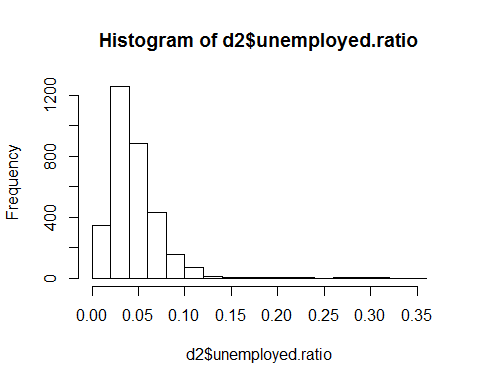

    plot(density(asinh(d2$contributions.ratio)))

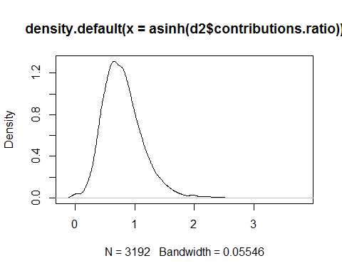

May need to transform or winsor data With outliers:

    moments::skewness(d2[,-1*(1:5)])

    ##               married.pct          dependents.ratio 
    ##                -0.8448543                 0.8036882 
    ## adjusted.gross.income.avg                 wages.avg 
    ##                 3.1765319                 2.0793214 
    ##             farming.ratio          unemployed.ratio 
    ##                 1.9453960                 3.3453933 
    ##           dividends.ratio            business.ratio 
    ##                 1.0053472                 0.9410124 
    ##          realestate.ratio            mortgage.ratio 
    ##                 0.8189409                 0.8572887 
    ##       contributions.ratio          taxcredits.ratio 
    ##                 9.0811802                -0.3123149

Without outliers via winsoring:

    moments::skewness(winsor(d2[,-1*(1:5)]))

    ##               married.pct          dependents.ratio 
    ##              -0.125195422               0.195697991 
    ## adjusted.gross.income.avg                 wages.avg 
    ##               0.229422439               0.255601066 
    ##             farming.ratio          unemployed.ratio 
    ##               0.430669260               0.182699028 
    ##           dividends.ratio            business.ratio 
    ##              -0.011278442               0.082777416 
    ##          realestate.ratio            mortgage.ratio 
    ##               0.244112009               0.264294342 
    ##       contributions.ratio          taxcredits.ratio 
    ##               0.202489986               0.008845928

De-leveraged outliers via transformation:

    moments::skewness(apply(d2[,-1*(1:5)],2,asinh))

    ##               married.pct          dependents.ratio 
    ##                -0.9379107                 0.5404818 
    ## adjusted.gross.income.avg                 wages.avg 
    ##                 1.0638145                -0.9786635 
    ##             farming.ratio          unemployed.ratio 
    ##                 1.8941685                 3.2748984 
    ##           dividends.ratio            business.ratio 
    ##                 0.8650462                 0.8991994 
    ##          realestate.ratio            mortgage.ratio 
    ##                 0.7669676                 0.8165621 
    ##       contributions.ratio          taxcredits.ratio 
    ##                 1.1165750                -0.3647279

    library(dplyr)

    ## Warning: package 'dplyr' was built under R version 3.4.2

    ## 
    ## Attaching package: 'dplyr'

    ## The following object is masked _by_ '.GlobalEnv':
    ## 
    ##     coalesce

    ## The following objects are masked from 'package:stats':
    ## 
    ##     filter, lag

    ## The following objects are masked from 'package:base':
    ## 
    ##     intersect, setdiff, setequal, union

    library(choroplethr)

    ## Warning: package 'choroplethr' was built under R version 3.4.2

    ## Loading required package: acs

    ## Warning: package 'acs' was built under R version 3.4.2

    ## Loading required package: XML

    ## 
    ## Attaching package: 'acs'

    ## The following object is masked from 'package:dplyr':
    ## 
    ##     combine

    ## The following object is masked from 'package:base':
    ## 
    ##     apply

    library(choroplethrMaps)

    ## Warning: package 'choroplethrMaps' was built under R version 3.4.2

Helpful text:
<https://www.gislounge.com/mapping-county-demographic-data-in-r/>

County Plots of Derived Data
============================

    for(n in names(d2[,-1*(1:5)])){
      print(county_choropleth(title=paste0('  ',n),data.frame(region=as.numeric(d2$fips),
                                                 value=d2[[n]])))
    }

    ## Warning in super$initialize(map.df, user.df): Your data.frame contains the
    ## following regions which are not mappable: 1000, 2000, 2158, 4000, 5000,
    ## 6000, 8000, 9000, 10000, 11000, 12000, 13000, 15000, 16000, 17000, 18000,
    ## 19000, 20000, 21000, 22000, 23000, 24000, 25000, 26000, 27000, 28000,
    ## 29000, 30000, 31000, 32000, 33000, 34000, 35000, 36000, 37000, 38000,
    ## 39000, 40000, 41000, 42000, 44000, 45000, 46000, 46102, 47000, 48000,
    ## 49000, 50000, 51000, 53000, 54000, 55000, 56000

    ## Warning in self$bind(): The following regions were missing and are being
    ## set to NA: 46113, 15005, 51515, 2270

    ## Warning in super$initialize(map.df, user.df): Your data.frame contains the
    ## following regions which are not mappable: 1000, 2000, 2158, 4000, 5000,
    ## 6000, 8000, 9000, 10000, 11000, 12000, 13000, 15000, 16000, 17000, 18000,
    ## 19000, 20000, 21000, 22000, 23000, 24000, 25000, 26000, 27000, 28000,
    ## 29000, 30000, 31000, 32000, 33000, 34000, 35000, 36000, 37000, 38000,
    ## 39000, 40000, 41000, 42000, 44000, 45000, 46000, 46102, 47000, 48000,
    ## 49000, 50000, 51000, 53000, 54000, 55000, 56000

    ## Warning in self$bind(): The following regions were missing and are being
    ## set to NA: 46113, 15005, 51515, 2270

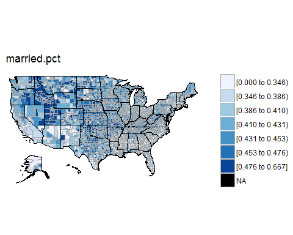

    ## Warning in super$initialize(map.df, user.df): Your data.frame contains the
    ## following regions which are not mappable: 1000, 2000, 2158, 4000, 5000,
    ## 6000, 8000, 9000, 10000, 11000, 12000, 13000, 15000, 16000, 17000, 18000,
    ## 19000, 20000, 21000, 22000, 23000, 24000, 25000, 26000, 27000, 28000,
    ## 29000, 30000, 31000, 32000, 33000, 34000, 35000, 36000, 37000, 38000,
    ## 39000, 40000, 41000, 42000, 44000, 45000, 46000, 46102, 47000, 48000,
    ## 49000, 50000, 51000, 53000, 54000, 55000, 56000

    ## Warning in super$initialize(map.df, user.df): The following regions were
    ## missing and are being set to NA: 46113, 15005, 51515, 2270

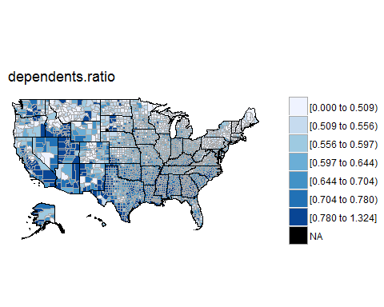

    ## Warning in super$initialize(map.df, user.df): Your data.frame contains the
    ## following regions which are not mappable: 1000, 2000, 2158, 4000, 5000,
    ## 6000, 8000, 9000, 10000, 11000, 12000, 13000, 15000, 16000, 17000, 18000,
    ## 19000, 20000, 21000, 22000, 23000, 24000, 25000, 26000, 27000, 28000,
    ## 29000, 30000, 31000, 32000, 33000, 34000, 35000, 36000, 37000, 38000,
    ## 39000, 40000, 41000, 42000, 44000, 45000, 46000, 46102, 47000, 48000,
    ## 49000, 50000, 51000, 53000, 54000, 55000, 56000

    ## Warning in super$initialize(map.df, user.df): The following regions were
    ## missing and are being set to NA: 46113, 15005, 51515, 2270

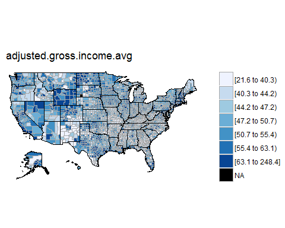

    ## Warning in super$initialize(map.df, user.df): Your data.frame contains the
    ## following regions which are not mappable: 1000, 2000, 2158, 4000, 5000,
    ## 6000, 8000, 9000, 10000, 11000, 12000, 13000, 15000, 16000, 17000, 18000,
    ## 19000, 20000, 21000, 22000, 23000, 24000, 25000, 26000, 27000, 28000,
    ## 29000, 30000, 31000, 32000, 33000, 34000, 35000, 36000, 37000, 38000,
    ## 39000, 40000, 41000, 42000, 44000, 45000, 46000, 46102, 47000, 48000,
    ## 49000, 50000, 51000, 53000, 54000, 55000, 56000

    ## Warning in super$initialize(map.df, user.df): The following regions were
    ## missing and are being set to NA: 46113, 15005, 51515, 2270

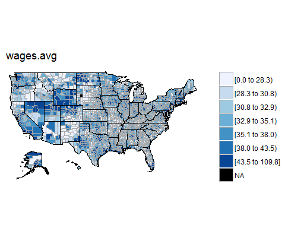

    ## Warning in super$initialize(map.df, user.df): Your data.frame contains the
    ## following regions which are not mappable: 1000, 2000, 2158, 4000, 5000,
    ## 6000, 8000, 9000, 10000, 11000, 12000, 13000, 15000, 16000, 17000, 18000,
    ## 19000, 20000, 21000, 22000, 23000, 24000, 25000, 26000, 27000, 28000,
    ## 29000, 30000, 31000, 32000, 33000, 34000, 35000, 36000, 37000, 38000,
    ## 39000, 40000, 41000, 42000, 44000, 45000, 46000, 46102, 47000, 48000,
    ## 49000, 50000, 51000, 53000, 54000, 55000, 56000

    ## Warning in super$initialize(map.df, user.df): The following regions were
    ## missing and are being set to NA: 46113, 15005, 51515, 2270

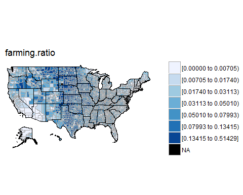

    ## Warning in super$initialize(map.df, user.df): Your data.frame contains the
    ## following regions which are not mappable: 1000, 2000, 2158, 4000, 5000,
    ## 6000, 8000, 9000, 10000, 11000, 12000, 13000, 15000, 16000, 17000, 18000,
    ## 19000, 20000, 21000, 22000, 23000, 24000, 25000, 26000, 27000, 28000,
    ## 29000, 30000, 31000, 32000, 33000, 34000, 35000, 36000, 37000, 38000,
    ## 39000, 40000, 41000, 42000, 44000, 45000, 46000, 46102, 47000, 48000,
    ## 49000, 50000, 51000, 53000, 54000, 55000, 56000

    ## Warning in super$initialize(map.df, user.df): The following regions were
    ## missing and are being set to NA: 46113, 15005, 51515, 2270

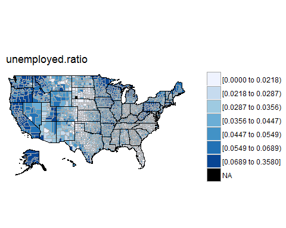

    ## Warning in super$initialize(map.df, user.df): Your data.frame contains the
    ## following regions which are not mappable: 1000, 2000, 2158, 4000, 5000,
    ## 6000, 8000, 9000, 10000, 11000, 12000, 13000, 15000, 16000, 17000, 18000,
    ## 19000, 20000, 21000, 22000, 23000, 24000, 25000, 26000, 27000, 28000,
    ## 29000, 30000, 31000, 32000, 33000, 34000, 35000, 36000, 37000, 38000,
    ## 39000, 40000, 41000, 42000, 44000, 45000, 46000, 46102, 47000, 48000,
    ## 49000, 50000, 51000, 53000, 54000, 55000, 56000

    ## Warning in super$initialize(map.df, user.df): The following regions were
    ## missing and are being set to NA: 46113, 15005, 51515, 2270

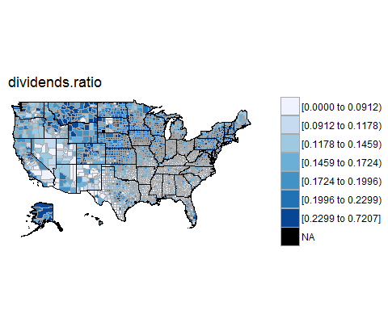

    ## Warning in super$initialize(map.df, user.df): Your data.frame contains the
    ## following regions which are not mappable: 1000, 2000, 2158, 4000, 5000,
    ## 6000, 8000, 9000, 10000, 11000, 12000, 13000, 15000, 16000, 17000, 18000,
    ## 19000, 20000, 21000, 22000, 23000, 24000, 25000, 26000, 27000, 28000,
    ## 29000, 30000, 31000, 32000, 33000, 34000, 35000, 36000, 37000, 38000,
    ## 39000, 40000, 41000, 42000, 44000, 45000, 46000, 46102, 47000, 48000,
    ## 49000, 50000, 51000, 53000, 54000, 55000, 56000

    ## Warning in super$initialize(map.df, user.df): The following regions were
    ## missing and are being set to NA: 46113, 15005, 51515, 2270

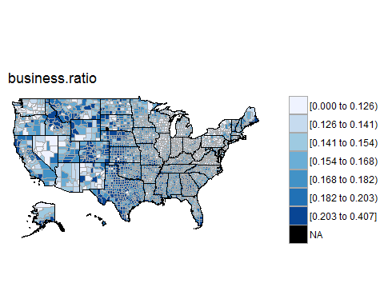

    ## Warning in super$initialize(map.df, user.df): Your data.frame contains the
    ## following regions which are not mappable: 1000, 2000, 2158, 4000, 5000,
    ## 6000, 8000, 9000, 10000, 11000, 12000, 13000, 15000, 16000, 17000, 18000,
    ## 19000, 20000, 21000, 22000, 23000, 24000, 25000, 26000, 27000, 28000,
    ## 29000, 30000, 31000, 32000, 33000, 34000, 35000, 36000, 37000, 38000,
    ## 39000, 40000, 41000, 42000, 44000, 45000, 46000, 46102, 47000, 48000,
    ## 49000, 50000, 51000, 53000, 54000, 55000, 56000

    ## Warning in super$initialize(map.df, user.df): The following regions were
    ## missing and are being set to NA: 46113, 15005, 51515, 2270

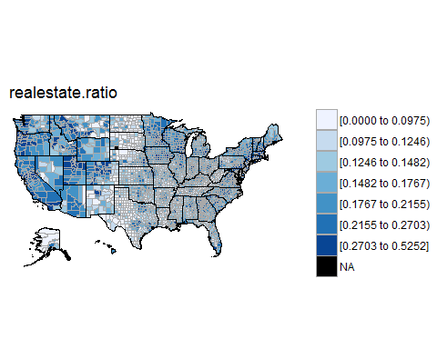

    ## Warning in super$initialize(map.df, user.df): Your data.frame contains the
    ## following regions which are not mappable: 1000, 2000, 2158, 4000, 5000,
    ## 6000, 8000, 9000, 10000, 11000, 12000, 13000, 15000, 16000, 17000, 18000,
    ## 19000, 20000, 21000, 22000, 23000, 24000, 25000, 26000, 27000, 28000,
    ## 29000, 30000, 31000, 32000, 33000, 34000, 35000, 36000, 37000, 38000,
    ## 39000, 40000, 41000, 42000, 44000, 45000, 46000, 46102, 47000, 48000,
    ## 49000, 50000, 51000, 53000, 54000, 55000, 56000

    ## Warning in super$initialize(map.df, user.df): The following regions were
    ## missing and are being set to NA: 46113, 15005, 51515, 2270

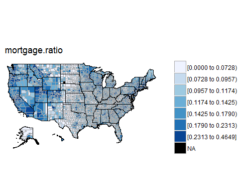

    ## Warning in super$initialize(map.df, user.df): Your data.frame contains the
    ## following regions which are not mappable: 1000, 2000, 2158, 4000, 5000,
    ## 6000, 8000, 9000, 10000, 11000, 12000, 13000, 15000, 16000, 17000, 18000,
    ## 19000, 20000, 21000, 22000, 23000, 24000, 25000, 26000, 27000, 28000,
    ## 29000, 30000, 31000, 32000, 33000, 34000, 35000, 36000, 37000, 38000,
    ## 39000, 40000, 41000, 42000, 44000, 45000, 46000, 46102, 47000, 48000,
    ## 49000, 50000, 51000, 53000, 54000, 55000, 56000

    ## Warning in super$initialize(map.df, user.df): The following regions were
    ## missing and are being set to NA: 46113, 15005, 51515, 2270

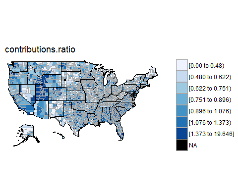
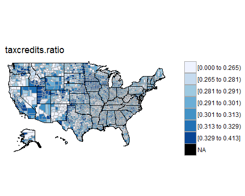

Another option for county maps:
<https://stackoverflow.com/questions/25875877/remove-border-lines-in-ggplot-map-choropleth>
<https://www.arilamstein.com/blog/2015/07/02/exploring-the-demographics-of-ferguson-missouri/>

    # end of file
