    #

Load libraries
==============

    rm(list = ls(all = TRUE)) #clear memory
    library(stringr)
    library(psych)
    setwd("../practicum2")
    source("common.R")
    require(dplyr)

    ## Loading required package: dplyr

    ## Warning: package 'dplyr' was built under R version 3.4.2

    ## 
    ## Attaching package: 'dplyr'

    ## The following object is masked _by_ '.GlobalEnv':
    ## 
    ##     coalesce

    ## The following objects are masked from 'package:stats':
    ## 
    ##     filter, lag

    ## The following objects are masked from 'package:base':
    ## 
    ##     intersect, setdiff, setequal, union

Process SAHIE files
===================

    allSahie=NULL
    for(f in Sys.glob('data/sahie/*.csv')){
      message('processing ',f)
      fn=as.numeric(str_match(f, '(\\d+)')[,2])
      d=read.csv(f,stringsAsFactors = F,sep=",",na.strings = c('','Not Applicable',"   . "),skip=79,
                 colClasses = 'character')
      d=d[d$geocat==50 & d$agecat %in% c(4,1) & d$racecat==0 & d$sexcat==0 & d$iprcat==0,
          qw('year agecat statefips countyfips PCTUI')]
      names(d)[1]='Year'
      d$fips=paste0(d$statefips,d$countyfips)
      d$statefips=NULL
      d$countyfips=NULL
      d$Age.Grouping=ifelse(d$agecat==4,'YOUTH',ifelse(d$agecat==5,'ADULT',ifelse(d$agecat==1,'ADULT',NA)))
      d$agecat=NULL
      d$sahie.pct.uninsured=as.numeric(d$PCTUI)
      d$PCTUI=NULL
      allSahie=rbind(allSahie,d)
    }

    ## processing data/sahie/sahie_2010.csv

    ## processing data/sahie/sahie_2011.csv

    ## processing data/sahie/sahie_2012.csv

    ## processing data/sahie/sahie_2013.csv

    ## processing data/sahie/sahie_2014.csv

    ## processing data/sahie/sahie_2015.csv

    rm(d)

Process IRS data files
======================

    #Header:
    #
    # "Notes" "County"        "County Code"   "Age Group"     "Age Group Code"   
    #     "Year"   "Year Code"     Deaths  Population      Crude Rate

    condensedGroups=c("1"='YOUTH',
                      "1-4"='YOUTH',
                      "5-9"='YOUTH',
                      "10-14"='YOUTH',
                      "15-19"='YOUTH',
                      "20-24"='ADULT', "25-34"='ADULT', "35-44"='ADULT', "45-54"='ADULT', 
                      "55-64"='ADULT', 
                      "65-74"='SENIOR',
                      "75-84"='SENIOR', "85+"='SENIOR')
    alld=NULL
    for(f in Sys.glob('data/wonder/2*.txt')){
      message('processing ',f)
      fn=as.numeric(str_match(f, '\\/(\\d+)')[,2])
      d=read.csv(f,stringsAsFactors = F,sep="\t",na.strings = c('','Not Applicable'))
      dt=read.csv(f,stringsAsFactors = F,colClasses = 'character',sep="\t",na.strings = c('','Not Applicable'))
      d$Year=fn
      d$County.Code=NULL
      d$fips=dt$County.Code ##repair
      d$Age.Group=NULL
      d$Notes=NULL
      d$Unreliable=as.numeric(regexpr("Unreliable",d$Crude.Rate)>0)
      d$Crude.Rate=as.numeric(gsub("\\s*\\(Unreliable\\)","",d$Crude.Rate))
      d$X..of.Total.Deaths=NULL
      d$Age.Grouping=condensedGroups[d$Age.Group.Code]
      
      sum(is.na(d$Age.Grouping))
      sum(is.na(d$Age.Group.Code))
      
      catln(f,"Incomplete cases:",sum(!complete.cases(d)))
      d=d[complete.cases(d),]
      names(d)
      d %>% group_by(Year,fips,Age.Grouping) %>%
        summarise(
          Unreliable=sum(Unreliable*Population)/sum(Population),
          County=min(County),
          Deaths=sum(Deaths),
          Population=sum(Population)) %>% 
        mutate(Death.per.100k=Deaths/Population*100000) %>% as.data.frame -> d
      d=merge(d,allSahie,by=qw('fips Age.Grouping Year'),all.x = T)

      alld=rbind(alld,d)
      #Crude Rate = Count / Population * 100,000
      summary(d)
      print(table(d$Age.Grouping))
      rm(dt)
      describe(d)
      write.csv(d,paste0("data/wonderclean/",fn,"cdc.csv"),row.names = F)
    }

    ## processing data/wonder/2010 county death cm.txt

    ## data/wonder/2010 county death cm.txt Incomplete cases: 76

    ## Warning: package 'bindrcpp' was built under R version 3.4.2

    ## 
    ##  ADULT SENIOR  YOUTH 
    ##   2627   3006    495

    ## Warning: NAs introduced by coercion

    ## Warning: NAs introduced by coercion

    ## Warning in FUN(newX[, i], ...): no non-missing arguments to min; returning
    ## Inf

    ## Warning in FUN(newX[, i], ...): no non-missing arguments to min; returning
    ## Inf

    ## Warning in FUN(newX[, i], ...): no non-missing arguments to max; returning
    ## -Inf

    ## Warning in FUN(newX[, i], ...): no non-missing arguments to max; returning
    ## -Inf

    ## processing data/wonder/2011 county death cm.txt

    ## data/wonder/2011 county death cm.txt Incomplete cases: 82 
    ## 
    ##  ADULT SENIOR  YOUTH 
    ##   2625   3016    482

    ## Warning in describe(d): NAs introduced by coercion

    ## Warning in describe(d): NAs introduced by coercion

    ## Warning in FUN(newX[, i], ...): no non-missing arguments to min; returning
    ## Inf

    ## Warning in FUN(newX[, i], ...): no non-missing arguments to min; returning
    ## Inf

    ## Warning in FUN(newX[, i], ...): no non-missing arguments to max; returning
    ## -Inf

    ## Warning in FUN(newX[, i], ...): no non-missing arguments to max; returning
    ## -Inf

    ## processing data/wonder/2012 county death cm.txt

    ## data/wonder/2012 county death cm.txt Incomplete cases: 83 
    ## 
    ##  ADULT SENIOR  YOUTH 
    ##   2614   3011    491

    ## Warning in describe(d): NAs introduced by coercion

    ## Warning in describe(d): NAs introduced by coercion

    ## Warning in FUN(newX[, i], ...): no non-missing arguments to min; returning
    ## Inf

    ## Warning in FUN(newX[, i], ...): no non-missing arguments to min; returning
    ## Inf

    ## Warning in FUN(newX[, i], ...): no non-missing arguments to max; returning
    ## -Inf

    ## Warning in FUN(newX[, i], ...): no non-missing arguments to max; returning
    ## -Inf

    ## processing data/wonder/2013 county death cm.txt

    ## data/wonder/2013 county death cm.txt Incomplete cases: 84 
    ## 
    ##  ADULT SENIOR  YOUTH 
    ##   2638   3016    468

    ## Warning in describe(d): NAs introduced by coercion

    ## Warning in describe(d): NAs introduced by coercion

    ## Warning in FUN(newX[, i], ...): no non-missing arguments to min; returning
    ## Inf

    ## Warning in FUN(newX[, i], ...): no non-missing arguments to min; returning
    ## Inf

    ## Warning in FUN(newX[, i], ...): no non-missing arguments to max; returning
    ## -Inf

    ## Warning in FUN(newX[, i], ...): no non-missing arguments to max; returning
    ## -Inf

    ## processing data/wonder/2014 county death cm.txt

    ## data/wonder/2014 county death cm.txt Incomplete cases: 82 
    ## 
    ##  ADULT SENIOR  YOUTH 
    ##   2666   3015    480

    ## Warning in describe(d): NAs introduced by coercion

    ## Warning in describe(d): NAs introduced by coercion

    ## Warning in FUN(newX[, i], ...): no non-missing arguments to min; returning
    ## Inf

    ## Warning in FUN(newX[, i], ...): no non-missing arguments to min; returning
    ## Inf

    ## Warning in FUN(newX[, i], ...): no non-missing arguments to max; returning
    ## -Inf

    ## Warning in FUN(newX[, i], ...): no non-missing arguments to max; returning
    ## -Inf

    ## processing data/wonder/2015 county death cm.txt

    ## data/wonder/2015 county death cm.txt Incomplete cases: 79 
    ## 
    ##  ADULT SENIOR  YOUTH 
    ##   2669   3021    490

    ## Warning in describe(d): NAs introduced by coercion

    ## Warning in describe(d): NAs introduced by coercion

    ## Warning in FUN(newX[, i], ...): no non-missing arguments to min; returning
    ## Inf

    ## Warning in FUN(newX[, i], ...): no non-missing arguments to min; returning
    ## Inf

    ## Warning in FUN(newX[, i], ...): no non-missing arguments to max; returning
    ## -Inf

    ## Warning in FUN(newX[, i], ...): no non-missing arguments to max; returning
    ## -Inf

    d=alld
    sort(unique(d$Age.Grouping))

    ## [1] "ADULT"  "SENIOR" "YOUTH"

    barplot(table(d$fips,sort(d$Age.Grouping)),main='Counties with >=10 mortality',col=2:4)

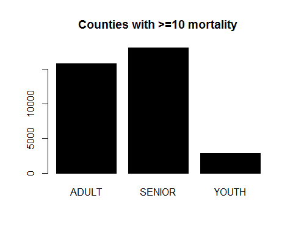{width="5.0526312335958in"
height="4.0421052055993in"}

    local({
      .=round((apply(table(d$fips,sort(d$Age.Grouping)),2,FUN=function(x) sum(x>0))/3142)*100  )
      b=barplot(.,col='lightblue')
      text(b[,1],./2,paste(.,'%'))
      title('Data Completeness by Age Group')
      .
    })

{width="5.0526312335958in"
height="4.0421052055993in"}

    ##  ADULT SENIOR  YOUTH 
    ##     97     97     46

Noticed a lot of skew

    summary(d)

    ##      fips           Age.Grouping            Year        Unreliable    
    ##  Length:36830       Length:36830       Min.   :2010   Min.   :0.0000  
    ##  Class :character   Class :character   1st Qu.:2011   1st Qu.:0.0000  
    ##  Mode  :character   Mode  :character   Median :2013   Median :0.0000  
    ##                                        Mean   :2013   Mean   :0.2899  
    ##                                        3rd Qu.:2014   3rd Qu.:0.5170  
    ##                                        Max.   :2015   Max.   :1.0000  
    ##                                                                       
    ##     County              Deaths          Population      Death.per.100k   
    ##  Length:36830       Min.   :   10.0   Min.   :     17   Min.   :   28.9  
    ##  Class :character   1st Qu.:   48.0   1st Qu.:   2680   1st Qu.:  609.5  
    ##  Mode  :character   Median :  124.0   Median :   6526   Median : 1582.4  
    ##                     Mean   :  412.4   Mean   :  40122   Mean   : 2801.0  
    ##                     3rd Qu.:  318.0   3rd Qu.:  22211   3rd Qu.: 4659.3  
    ##                     Max.   :45604.0   Max.   :6338759   Max.   :64705.9  
    ##                                                                          
    ##  sahie.pct.uninsured
    ##  Min.   : 0.80      
    ##  1st Qu.:11.30      
    ##  Median :17.60      
    ##  Mean   :17.44      
    ##  3rd Qu.:23.20      
    ##  Max.   :52.50      
    ##  NA's   :18089

    summary(d[d$Age.Grouping=='SENIOR',])

    ##      fips           Age.Grouping            Year        Unreliable    
    ##  Length:18085       Length:18085       Min.   :2010   Min.   :0.0000  
    ##  Class :character   Class :character   1st Qu.:2011   1st Qu.:0.0000  
    ##  Mode  :character   Mode  :character   Median :2013   Median :0.0000  
    ##                                        Mean   :2013   Mean   :0.1401  
    ##                                        3rd Qu.:2014   3rd Qu.:0.0000  
    ##                                        Max.   :2015   Max.   :1.0000  
    ##                                                                       
    ##     County              Deaths        Population      Death.per.100k   
    ##  Length:18085       Min.   :   10   Min.   :     17   Min.   :  445.2  
    ##  Class :character   1st Qu.:  101   1st Qu.:   2177   1st Qu.: 4190.5  
    ##  Mode  :character   Median :  210   Median :   4534   Median : 4675.8  
    ##                     Mean   :  624   Mean   :  14513   Mean   : 5016.7  
    ##                     3rd Qu.:  501   3rd Qu.:  11145   3rd Qu.: 5178.3  
    ##                     Max.   :45604   Max.   :1277335   Max.   :64705.9  
    ##                                                                        
    ##  sahie.pct.uninsured
    ##  Min.   : NA        
    ##  1st Qu.: NA        
    ##  Median : NA        
    ##  Mean   :NaN        
    ##  3rd Qu.: NA        
    ##  Max.   : NA        
    ##  NA's   :18085

    summary(d[d$Age.Grouping=='YOUTH',])

    ##      fips           Age.Grouping            Year        Unreliable    
    ##  Length:2906        Length:2906        Min.   :2010   Min.   :0.0000  
    ##  Class :character   Class :character   1st Qu.:2011   1st Qu.:0.4245  
    ##  Mode  :character   Mode  :character   Median :2012   Median :0.8780  
    ##                                        Mean   :2012   Mean   :0.7061  
    ##                                        3rd Qu.:2014   3rd Qu.:1.0000  
    ##                                        Max.   :2015   Max.   :1.0000  
    ##     County              Deaths          Population      Death.per.100k  
    ##  Length:2906        Min.   :  10.00   Min.   :    270   Min.   :  28.9  
    ##  Class :character   1st Qu.:  14.00   1st Qu.:   2032   1st Qu.: 116.6  
    ##  Mode  :character   Median :  24.00   Median :   4554   Median : 407.3  
    ##                     Mean   :  54.51   Mean   :  63733   Mean   : 483.4  
    ##                     3rd Qu.:  57.00   3rd Qu.:  43598   3rd Qu.: 759.9  
    ##                     Max.   :1182.00   Max.   :2711958   Max.   :3703.7  
    ##  sahie.pct.uninsured
    ##  Min.   : 0.800     
    ##  1st Qu.: 4.400     
    ##  Median : 5.900     
    ##  Mean   : 6.674     
    ##  3rd Qu.: 8.400     
    ##  Max.   :30.700

    summary(d[d$Age.Grouping=='ADULT',])

    ##      fips           Age.Grouping            Year        Unreliable    
    ##  Length:15839       Length:15839       Min.   :2010   Min.   :0.0000  
    ##  Class :character   Class :character   1st Qu.:2011   1st Qu.:0.0000  
    ##  Mode  :character   Mode  :character   Median :2013   Median :0.3119  
    ##                                        Mean   :2013   Mean   :0.3847  
    ##                                        3rd Qu.:2014   3rd Qu.:0.5291  
    ##                                        Max.   :2015   Max.   :1.0000  
    ##                                                                       
    ##     County              Deaths          Population      Death.per.100k  
    ##  Length:15839       Min.   :   10.0   Min.   :    338   Min.   : 128.9  
    ##  Class :character   1st Qu.:   35.0   1st Qu.:   4376   1st Qu.: 450.6  
    ##  Mode  :character   Median :   77.0   Median :  11142   Median : 635.1  
    ##                     Mean   :  236.3   Mean   :  65030   Mean   : 696.4  
    ##                     3rd Qu.:  197.0   3rd Qu.:  42134   3rd Qu.: 877.6  
    ##                     Max.   :15835.0   Max.   :6338759   Max.   :3385.4  
    ##                                                                         
    ##  sahie.pct.uninsured
    ##  Min.   : 2.60      
    ##  1st Qu.:14.20      
    ##  Median :19.40      
    ##  Mean   :19.41      
    ##  3rd Qu.:24.20      
    ##  Max.   :52.50      
    ##  NA's   :4

    plot(density(log(d$Population)),main='log(Age Group Populations) Density')

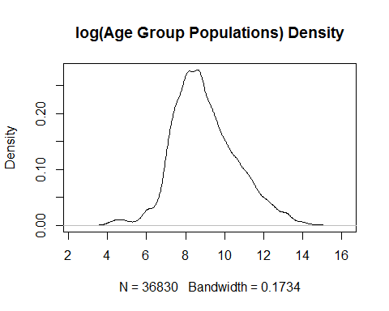{width="5.0526312335958in"
height="4.0421052055993in"}

    require(binom)

    ## Loading required package: binom

    ## Warning: package 'binom' was built under R version 3.4.1

    a100k=100000
    n='ADULT'

    for(n in unique(d$Age.Grouping)){
      ##perhaps smooth the data to reduce leverage or just let winsor handle it?
      ##or weight the training by ceiling(log(population size))
      d=alld
      d=d[d$Age.Grouping==n,]
      d=d[!is.na(d$Deaths) & !is.na(d$Population),]
      plot(density(log(d$Population)),main=paste(n,'log(Age Group Populations) Density'))
      Unreliable=d$Unreliable
      Unreliable[is.na(Unreliable)]=1
      m=sum(d$Deaths)/sum(d$Population)
      priori=sum(d$Deaths,na.rm = T)/sum(d$Population,na.rm = T)
      prioriweight=1/priori * 10
      catln(n,priori,prioriweight)
      priori=sum(d$Deaths[d$Population>prioriweight],na.rm = T)/sum(d$Population[d$Population>prioriweight],na.rm = T)
      prioriweight=1/priori * 10
      catln(n,priori,prioriweight)
      
      ##good
      plot(d$Population, (d$Deaths)/(d$Population)*a100k,
           col=rgb(1,0,0,0.2),log='x',main=paste('Deaths/Population for',n,'Group'),
           xlab='Age Group Population in County',
           ylab='Deaths/Population*100k in Age Group')
      # points(d$Population,
      #        (d$Deaths+10/2)/(d$Population+prioriweight/2), #*a100k,
      #        col='purple',pch='.')
      abline(v=10*1/priori,col='gray');
      grid()
      abline(h=quantile((d$Deaths)/(d$Population)*a100k,0.95),col='blue') #winsor
      text(10*1/priori,max((d$Deaths)/(d$Population)*a100k)*0.05,round(prioriweight))
      ##
      # plot(d$Population, 
      #      d$Deaths,pch=20,
      #      col=rgb(1,0,0,0.1),main=n,log='xy',xlab='Age Group Population',ylab='Deaths in Age Group');grid()
      # points(sort(d$Population),sort(d$Population)*priori,type='l')
      # abline(v=prioriweight,col='gray');grid()
      # text(prioriweight,800,round(10*1/priori))
      ###
      print(summary(d$Deaths))
      catln(n,'priori',priori,
            'prioriweight',prioriweight,
            'need at least a pop of this size',min(d$Deaths)*1/priori,
            " small counties ",      sum(d$Population<round(10*1/priori)),
            " big counties ",sum(d$Population>=round(10*1/priori) ))
    }

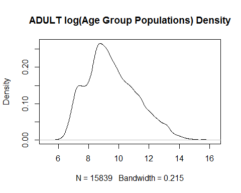{width="5.0526312335958in"
height="4.0421052055993in"}

    ## ADULT 0.003633996 2751.792 
    ## ADULT 0.00360521 2773.764

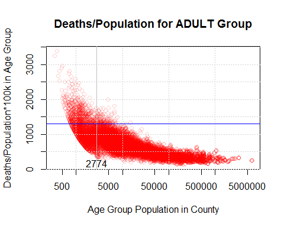{width="5.0526312335958in"
height="4.0421052055993in"}

    ##    Min. 1st Qu.  Median    Mean 3rd Qu.    Max. 
    ##    10.0    35.0    77.0   236.3   197.0 15835.0 
    ## ADULT priori 0.00360521 prioriweight 2773.764 need at least a pop of this size 2773.764  small counties  2709  big counties  13130

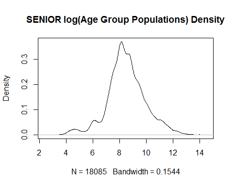{width="5.0526312335958in"
height="4.0421052055993in"}

    ## SENIOR 0.04299806 232.5686 
    ## SENIOR 0.04298043 232.664

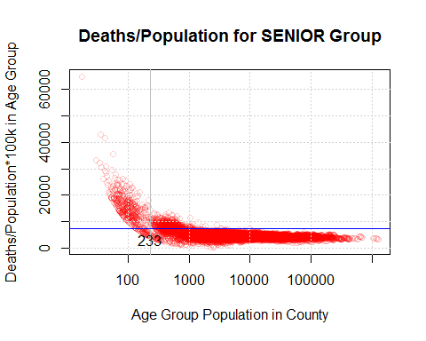{width="5.0526312335958in"
height="4.0421052055993in"}

    ##    Min. 1st Qu.  Median    Mean 3rd Qu.    Max. 
    ##      10     101     210     624     501   45604 
    ## SENIOR priori 0.04298043 prioriweight 232.664 need at least a pop of this size 232.664  small counties  465  big counties  17620

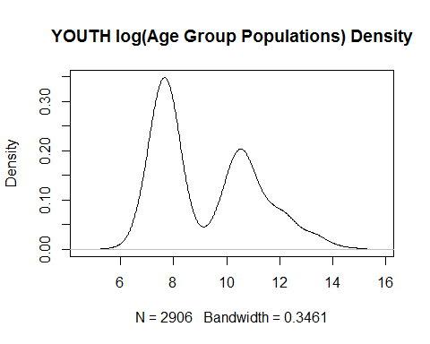{width="5.0526312335958in"
height="4.0421052055993in"}

    ## YOUTH 0.0008552847 11692.01 
    ## YOUTH 0.000729517 13707.7

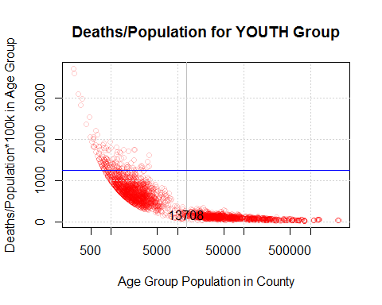{width="5.0526312335958in"
height="4.0421052055993in"}

    ##    Min. 1st Qu.  Median    Mean 3rd Qu.    Max. 
    ##   10.00   14.00   24.00   54.51   57.00 1182.00 
    ## YOUTH priori 0.000729517 prioriweight 13707.7 need at least a pop of this size 13707.7  small counties  1605  big counties  1301

    summary(d$Deaths)

    ##    Min. 1st Qu.  Median    Mean 3rd Qu.    Max. 
    ##   10.00   14.00   24.00   54.51   57.00 1182.00

    ###graph of overall by population
    d=alld
    plot(d$Population, 
         d$Deaths,pch='.',
         col=rgb(as.numeric(d$Age.Grouping=='SENIOR'),as.numeric(d$Age.Grouping=='ADULT'),
                 as.numeric(d$Age.Grouping=='YOUTH'),0.5),
      xlab='Age Group Population in County',
      ylab='Deaths in Age Group',
         main='Senior, Adult, Youth Deaths',log='xy');grid() 
    for(n in unique(d$Age.Grouping)){
      local({
        d=d[d$Age.Grouping==n,]
        d=d[!is.na(d$Deaths) & !is.na(d$Population),]
        priori=sum(d$Deaths,na.rm = T)/sum(d$Population,na.rm = T)
        prioriweight=1/priori * 10
        points(sort(d$Population),sort(d$Population)*priori,type='l',col='black')
        #abline(v=10*1/priori,col='gray');
        text(10*1/priori,5,round(prioriweight))
      })
    }
    legend("topleft",legend = c('SENIOR','ADULT','YOUTH','Overall'),col=c('red','green','blue','black'),pch=c(20,20,20,NA),lty=c(NA,NA,NA,1))

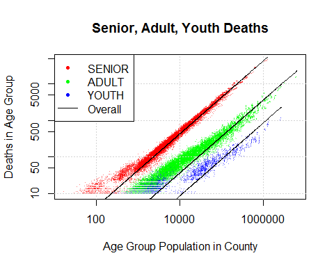{width="5.0526312335958in"
height="4.0421052055993in"}

    ###done with graph of overall by population

    ###graph of overall by population
    d=alld
    plot(d$Population, 
         d$Deaths/d$Population*a100k,pch='.',
         col=rgb(as.numeric(d$Age.Grouping=='SENIOR'),as.numeric(d$Age.Grouping=='ADULT'),
                 as.numeric(d$Age.Grouping=='YOUTH'),0.5),
         xlab='Age Group Population in County',
         ylab='Deaths per Capita in Age Group * 100k',
         main='Senior, Adult, Youth Death Rates',log='xy');grid() 
    for(n in unique(d$Age.Grouping)){
      local({
        d=d[d$Age.Grouping==n,]
        d=d[!is.na(d$Deaths) & !is.na(d$Population),]
        priori=sum(d$Deaths,na.rm = T)/sum(d$Population,na.rm = T)
        prioriweight=1/priori * 10
        points(sort(d$Population),sort(d$Population)*priori/sort(d$Population)*a100k,type='l',col='black')
        #abline(v=10*1/priori,col='gray');
        text(1000000,priori*a100k*1.2,round(priori*a100k))
      })
    }
    legend("bottomleft",legend = c('SENIOR','ADULT','YOUTH','Overall'),col=c('red','green','blue','black'),pch=c(20,20,20,NA),lty=c(NA,NA,NA,1))

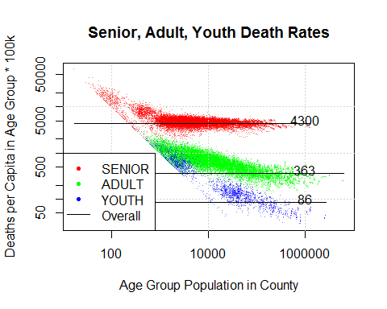{width="5.0526312335958in"
height="4.0421052055993in"}

    ###done with graph of overall by population

    #death rates higher in rural ares
    #https://ruralhealth.und.edu/projects/health-reform-policy-research-center/pdf/mapping-rural-urban-mortality-differences-hhs-regions.pdf

May need to transform or winsor data With outliers:

    moments::skewness(keepNumeric(d))

    ## fips removed

    ## Age.Grouping removed

    ## County removed

    ##                Year          Unreliable              Deaths 
    ##        -0.003936049         0.918309162        13.450273813 
    ##          Population      Death.per.100k sahie.pct.uninsured 
    ##        16.768434349         2.525722538                  NA

Without outliers via winsoring:

    moments::skewness(winsor(keepNumeric(d)))

    ## fips removed

    ## Age.Grouping removed

    ## County removed

    ##                Year          Unreliable              Deaths 
    ##        -0.004785846         0.513609100         0.601894260 
    ##          Population      Death.per.100k sahie.pct.uninsured 
    ##         0.810862321         0.091450403                  NA

De-leveraged outliers via transformation:

    moments::skewness(apply(keepNumeric(d),2,asinh))

    ## fips removed

    ## Age.Grouping removed

    ## County removed

    ##                Year          Unreliable              Deaths 
    ##        -0.004864779         0.825929888         0.362879314 
    ##          Population      Death.per.100k sahie.pct.uninsured 
    ##         0.396930232        -0.405558545                  NA

    require(ggplot2)

    ## Loading required package: ggplot2

    ## 
    ## Attaching package: 'ggplot2'

    ## The following objects are masked from 'package:psych':
    ## 
    ##     %+%, alpha

    ggplot(winsor1Df(d))+
      geom_density(aes(Death.per.100k))+facet_wrap(~Age.Grouping)

    ## void winsor(){ //generated by winsor1Df 
    ## Year =max( 2010 ,min( 2015 , Year )); //limits are  2010 2010 2015 2015 
    ## Unreliable =max( 0 ,min( 1 , Unreliable )); //limits are  0 0 1 1 
    ## Deaths =max( 10 ,min( 7522.40500000004 , Deaths )); //limits are  10 10 7522.40500000004 45604 
    ## Population =max( 94 ,min( 835384.070000026 , Population )); //limits are  17 94 835384.070000026 6338759 
    ## Death.per.100k =max( 61.7001432231937 ,min( 15810.4039167687 , Death.per.100k )); //limits are  28.8982992537734 61.7001432231937 15810.4039167687 64705.8823529412 
    ## sahie.pct.uninsured =max( 2.6 ,min( 38.2299999999999 , sahie.pct.uninsured )); //limits are  0.8 2.6 38.2299999999999 52.5 
    ## }

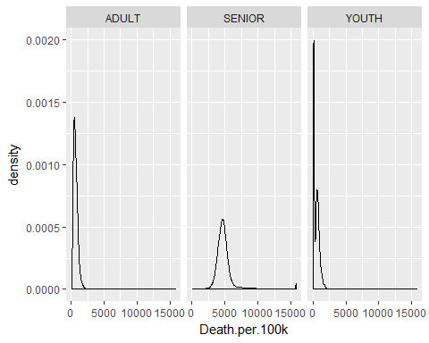{width="5.0526312335958in"
height="4.0421052055993in"}

    library(dplyr)
    library(choroplethr)

    ## Warning: package 'choroplethr' was built under R version 3.4.2

    ## Loading required package: acs

    ## Warning: package 'acs' was built under R version 3.4.2

    ## Loading required package: XML

    ## 
    ## Attaching package: 'acs'

    ## The following object is masked from 'package:dplyr':
    ## 
    ##     combine

    ## The following object is masked from 'package:base':
    ## 
    ##     apply

    library(choroplethrMaps)

    ## Warning: package 'choroplethrMaps' was built under R version 3.4.2

Helpful text:
<https://www.gislounge.com/mapping-county-demographic-data-in-r/>

County Plots of Derived Data
============================

    for(ag in unique(d$Age.Grouping)){
      for(n in names(d)){
        if(is.numeric(d[[n]])){
          user.df= d %>% 
            mutate(region=as.numeric(fips)) %>% rename_('value'=n) %>% 
            group_by_('region')  %>% summarise(value=mean(value)) 
          names(user.df)
          print(county_choropleth(title=paste('  ',n,ag),user.df))
        }
      }
    }

    ## Warning in super$initialize(map.df, user.df): Your data.frame contains the
    ## following regions which are not mappable: 2201, 2280

    ## Warning in self$bind(): The following regions were missing and are being
    ## set to NA: 38043, 38065, 48431, 31007, 31075, 35021, 31115, 2105, 49009,
    ## 48033, 46063, 46075, 2164, 48301, 38087, 13007, 8079, 46119, 13307, 15005,
    ## 32011, 31005, 2100, 48173, 48269, 8033, 2016, 2060, 48109, 48345, 48235,
    ## 48243, 28055, 31165, 30103, 41055, 48443, 46021, 30011, 30045, 31103,
    ## 2282, 26083, 48311, 48261, 48229, 31113, 38083, 30037, 31171, 31183, 32009,
    ## 30069, 31009, 31085, 31117, 38007, 46017, 46137, 41069, 48359, 48393, 8053,
    ## 8057, 8111, 49031, 2195, 2230, 6003, 2068, 2013, 16025, 16033

    ## Warning in super$initialize(map.df, user.df): Your data.frame contains the
    ## following regions which are not mappable: 2201, 2280

    ## Warning in self$bind(): The following regions were missing and are being
    ## set to NA: 38043, 38065, 48431, 31007, 31075, 35021, 31115, 2105, 49009,
    ## 48033, 46063, 46075, 2164, 48301, 38087, 13007, 8079, 46119, 13307, 15005,
    ## 32011, 31005, 2100, 48173, 48269, 8033, 2016, 2060, 48109, 48345, 48235,
    ## 48243, 28055, 31165, 30103, 41055, 48443, 46021, 30011, 30045, 31103,
    ## 2282, 26083, 48311, 48261, 48229, 31113, 38083, 30037, 31171, 31183, 32009,
    ## 30069, 31009, 31085, 31117, 38007, 46017, 46137, 41069, 48359, 48393, 8053,
    ## 8057, 8111, 49031, 2195, 2230, 6003, 2068, 2013, 16025, 16033

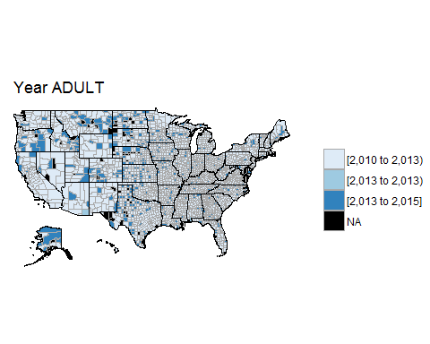{width="5.0526312335958in"
height="4.0421052055993in"}

    ## Warning in super$initialize(map.df, user.df): Your data.frame contains the
    ## following regions which are not mappable: 2201, 2280

    ## Warning in super$initialize(map.df, user.df): The following regions were
    ## missing and are being set to NA: 38043, 38065, 48431, 31007, 31075, 35021,
    ## 31115, 2105, 49009, 48033, 46063, 46075, 2164, 48301, 38087, 13007, 8079,
    ## 46119, 13307, 15005, 32011, 31005, 2100, 48173, 48269, 8033, 2016, 2060,
    ## 48109, 48345, 48235, 48243, 28055, 31165, 30103, 41055, 48443, 46021,
    ## 30011, 30045, 31103, 2282, 26083, 48311, 48261, 48229, 31113, 38083, 30037,
    ## 31171, 31183, 32009, 30069, 31009, 31085, 31117, 38007, 46017, 46137,
    ## 41069, 48359, 48393, 8053, 8057, 8111, 49031, 2195, 2230, 6003, 2068, 2013,
    ## 16025, 16033

{width="5.0526312335958in"
height="4.0421052055993in"}

    ## Warning in super$initialize(map.df, user.df): Your data.frame contains the
    ## following regions which are not mappable: 2201, 2280

    ## Warning in super$initialize(map.df, user.df): The following regions were
    ## missing and are being set to NA: 38043, 38065, 48431, 31007, 31075, 35021,
    ## 31115, 2105, 49009, 48033, 46063, 46075, 2164, 48301, 38087, 13007, 8079,
    ## 46119, 13307, 15005, 32011, 31005, 2100, 48173, 48269, 8033, 2016, 2060,
    ## 48109, 48345, 48235, 48243, 28055, 31165, 30103, 41055, 48443, 46021,
    ## 30011, 30045, 31103, 2282, 26083, 48311, 48261, 48229, 31113, 38083, 30037,
    ## 31171, 31183, 32009, 30069, 31009, 31085, 31117, 38007, 46017, 46137,
    ## 41069, 48359, 48393, 8053, 8057, 8111, 49031, 2195, 2230, 6003, 2068, 2013,
    ## 16025, 16033

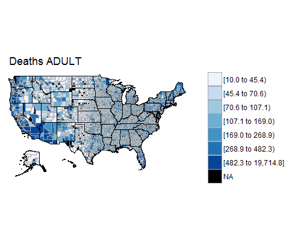{width="5.0526312335958in"
height="4.0421052055993in"}

    ## Warning in super$initialize(map.df, user.df): Your data.frame contains the
    ## following regions which are not mappable: 2201, 2280

    ## Warning in super$initialize(map.df, user.df): The following regions were
    ## missing and are being set to NA: 38043, 38065, 48431, 31007, 31075, 35021,
    ## 31115, 2105, 49009, 48033, 46063, 46075, 2164, 48301, 38087, 13007, 8079,
    ## 46119, 13307, 15005, 32011, 31005, 2100, 48173, 48269, 8033, 2016, 2060,
    ## 48109, 48345, 48235, 48243, 28055, 31165, 30103, 41055, 48443, 46021,
    ## 30011, 30045, 31103, 2282, 26083, 48311, 48261, 48229, 31113, 38083, 30037,
    ## 31171, 31183, 32009, 30069, 31009, 31085, 31117, 38007, 46017, 46137,
    ## 41069, 48359, 48393, 8053, 8057, 8111, 49031, 2195, 2230, 6003, 2068, 2013,
    ## 16025, 16033

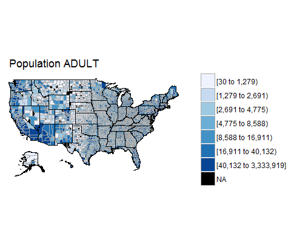{width="5.0526312335958in"
height="4.0421052055993in"}

    ## Warning in super$initialize(map.df, user.df): Your data.frame contains the
    ## following regions which are not mappable: 2201, 2280

    ## Warning in min(xx[xx > upper]): no non-missing arguments to min; returning
    ## Inf

    ## Warning in self$bind(): The following regions were missing and are being
    ## set to NA: 1001, 1009, 1099, 16067, 27091, 27095, 27097, 27099, 27105,
    ## 27109, 27111, 27115, 27117, 27119, 16081, 27129, 27133, 19059, 27141,
    ## 27145, 27149, 27157, 27163, 27171, 28005, 17005, 28009, 28011, 28015,
    ## 28021, 28031, 28039, 19149, 28045, 28051, 28053, 17009, 28059, 28067,
    ## 28073, 23007, 13215, 13239, 27077, 45031, 45035, 45037, 17019, 47011,
    ## 47017, 47021, 47025, 47033, 47035, 47041, 47047, 47049, 47059, 17029,
    ## 47061, 27137, 23015, 23021, 23023, 23031, 28041, 31149, 31151, 31155,
    ## 17035, 31161, 31169, 31173, 31181, 32005, 32007, 32013, 32017, 32023,
    ## 23011, 17049, 39105, 39107, 39117, 39119, 39125, 39129, 39133, 39135,
    ## 39139, 39141, 17055, 39149, 39151, 39157, 39161, 47065, 47067, 47071,
    ## 47077, 47083, 47087, 17065, 47095, 47101, 47107, 47109, 47111, 47119,
    ## 47125, 47135, 47137, 24011, 1107, 18051, 24013, 24021, 24023, 24031, 24033,
    ## 24043, 32031, 32510, 33003, 33009, 18059, 33015, 33019, 34003, 34009,
    ## 34013, 39167, 39171, 39175, 40003, 40011, 18069, 40013, 40017, 40025,
    ## 40029, 40035, 40039, 40045, 40049, 40055, 37193, 18079, 47141, 48045,
    ## 48049, 48055, 48061, 48065, 48067, 48073, 48077, 48081, 18085, 48085,
    ## 48087, 48091, 24047, 25007, 25013, 25015, 25017, 34017, 34019, 18095,
    ## 34021, 34029, 34033, 34035, 34041, 35007, 30055, 30057, 37195, 37199,
    ## 18105, 38005, 38009, 38017, 38027, 38029, 38037, 38039, 38043, 38047,
    ## 38053, 18115, 38059, 38063, 47001, 47003, 40065, 40071, 40083, 40085,
    ## 40091, 40099, 18125, 40101, 40107, 40111, 40117, 40119, 40125, 25021,
    ## 25023, 26003, 26005, 18131, 26007, 30063, 30065, 30071, 30077, 30083,
    ## 30087, 30091, 30097, 30101, 1121, 18139, 38065, 38067, 38071, 38075, 38081,
    ## 38089, 38093, 38097, 38101, 39001, 18153, 39005, 39011, 39013, 39017,
    ## 39019, 42003, 42007, 48361, 48369, 48383, 18173, 48385, 48387, 48395,
    ## 48399, 48403, 48415, 48417, 48419, 48423, 48427, 18179, 48431, 26017,
    ## 26019, 26021, 26027, 26031, 26033, 30109, 31007, 31011, 18183, 31013,
    ## 31019, 31025, 31029, 31033, 31039, 31045, 31051, 31057, 31071, 19009,
    ## 31075, 39023, 39025, 39029, 39033, 39037, 39041, 39043, 39049, 35019,
    ## 19017, 35021, 35025, 35033, 35039, 47143, 47147, 47149, 47155, 47161,
    ## 47167, 19021, 47175, 47177, 45055, 45061, 45065, 45071, 45073, 26041,
    ## 26043, 26047, 19031, 26051, 26065, 26069, 17131, 13191, 31079, 31081,
    ## 31083, 31087, 31099, 19039, 31101, 31105, 31109, 31115, 31119, 28091,
    ## 28097, 28101, 28109, 28119, 2050, 17073, 28121, 28129, 35041, 35043, 35049,
    ## 35057, 35061, 36007, 36011, 36013, 17077, 36019, 36027, 36033, 36035,
    ## 36039, 40131, 40135, 40137, 40143, 40145, 17079, 40149, 41003, 41005,
    ## 41011, 41013, 41021, 41027, 26075, 26079, 26081, 17089, 26087, 26093,
    ## 26095, 26099, 26101, 26115, 28137, 28141, 28143, 28153, 17103, 28155,
    ## 28157, 28163, 29007, 29017, 29023, 29029, 29035, 29041, 29045, 17107,
    ## 36041, 36045, 36051, 36055, 36059, 36063, 36071, 36073, 36075, 48435,
    ## 17121, 48437, 48441, 48447, 48451, 48453, 48457, 48467, 48469, 48477,
    ## 48483, 17129, 48485, 48489, 48499, 49001, 49007, 26071, 26125, 26131,
    ## 26135, 26145, 17139, 26147, 26157, 29047, 29051, 29055, 29057, 29061,
    ## 29067, 29073, 29077, 17145, 29079, 29087, 37011, 37013, 37019, 37025,
    ## 13223, 36081, 36087, 36089, 2105, 17155, 36093, 36099, 36103, 36107, 36117,
    ## 42017, 42023, 45079, 45083, 45085, 17169, 45089, 46005, 46011, 46019,
    ## 46023, 46033, 46039, 46041, 46045, 46051, 17175, 46059, 26159, 26163,
    ## 27001, 27003, 27011, 27017, 27025, 27035, 27037, 17179, 27041, 27043,
    ## 27045, 27053, 27059, 37035, 37037, 37039, 37041, 37047, 17189, 37059,
    ## 37061, 37065, 37069, 37071, 37075, 37077, 37083, 37087, 42027, 17203,
    ## 42029, 42033, 42039, 42045, 42049, 42051, 42055, 42061, 42067, 42073,
    ## 18009, 42079, 41029, 41033, 41039, 41043, 41049, 41051, 41059, 41065,
    ## 41071, 18011, 27063, 27065, 27069, 29105, 29111, 29119, 29125, 29129,
    ## 29139, 29141, 18021, 29147, 29153, 29157, 29161, 29167, 37095, 37099,
    ## 37105, 37111, 37115, 18033, 37121, 37129, 37135, 37139, 37143, 37147,
    ## 37153, 42085, 42089, 42095, 2122, 13125, 42101, 42109, 42111, 42115, 42119,
    ## 42121, 42125, 42133, 49009, 49013, 13129, 49019, 49023, 48001, 48013,
    ## 48015, 48017, 48023, 48025, 48029, 48033, 13131, 48035, 48039, 29171,
    ## 29175, 29177, 29181, 29186, 29187, 29197, 29203, 13139, 29207, 29213,
    ## 29219, 29225, 29510, 30003, 37159, 37163, 37169, 37175, 13157, 39061,
    ## 39071, 39077, 39081, 39087, 39093, 39099, 39101, 44001, 44003, 13169,
    ## 44005, 45001, 45003, 45007, 45017, 45023, 45025, 46063, 46065, 46069,
    ## 13175, 46075, 46079, 46085, 46093, 46097, 46101, 46113, 46115, 46117,
    ## 46121, 13187, 46127, 30005, 30009, 30015, 30019, 30023, 30029, 30035,
    ## 30041, 31129, 13197, 31133, 31141, 19007, 19011, 19015, 19019, 19023,
    ## 19027, 19033, 17081, 13201, 17091, 17093, 17099, 17101, 17105, 17109,
    ## 17111, 17117, 17125, 17127, 2150, 13217, 13185, 13189, 13195, 13199, 13205,
    ## 13209, 13213, 13221, 13229, 13231, 13225, 13235, 13241, 13247, 13255,
    ## 13257, 13267, 13269, 20183, 20187, 20189, 13233, 20197, 20207, 21191,
    ## 21193, 21201, 21205, 21207, 21217, 21221, 21231, 13243, 21233, 21237,
    ## 21239, 22005, 22091, 22093, 22097, 22099, 22103, 22113, 13253, 22117,
    ## 21011, 21013, 21015, 21027, 21029, 17133, 17137, 17141, 17143, 13265,
    ## 17147, 17153, 17159, 17165, 17167, 17177, 17183, 17191, 17195, 17197,
    ## 13277, 18001, 13275, 13279, 13281, 13289, 13295, 13301, 20035, 20041,
    ## 20047, 13285, 20051, 20053, 20057, 20063, 20073, 20077, 20079, 20087,
    ## 22011, 22015, 13293, 22017, 22023, 22031, 22035, 22041, 22043, 22049,
    ## 22051, 22055, 21035, 13303, 21039, 21041, 21045, 21057, 21065, 21067,
    ## 21071, 21079, 21083, 21085, 2164, 20027, 21091, 21097, 21101, 21107, 48267,
    ## 48271, 48277, 48281, 48285, 48287, 20029, 48291, 48293, 48295, 48301,
    ## 48305, 48307, 48317, 48323, 48327, 48331, 20039, 48333, 51800, 51810,
    ## 51840, 53001, 53003, 53005, 53015, 53017, 53019, 20049, 53023, 53025,
    ## 51600, 55101, 55107, 55111, 55113, 55119, 55123, 55125, 20065, 55133,
    ## 55139, 56003, 56009, 56017, 56019, 54023, 54025, 54027, 54033, 20075,
    ## 54037, 54045, 54051, 54053, 54059, 54065, 54069, 54075, 48341, 54083,
    ## 20085, 54087, 54091, 54093, 54097, 54099, 54103, 54105, 54107, 55011,
    ## 55013, 20095, 55019, 55021, 55023, 53029, 49039, 49043, 49045, 49049,
    ## 49057, 50003, 20105, 50007, 50011, 50015, 50021, 56023, 51005, 51011,
    ## 51013, 51015, 51019, 20115, 51025, 51031, 51033, 51036, 51045, 51049,
    ## 51051, 54081, 51061, 51067, 2180, 20127, 51069, 51073, 51081, 51085, 51091,
    ## 51095, 51103, 49037, 51119, 50025, 20135, 53037, 53039, 53059, 53075,
    ## 54017, 54029, 54043, 54055, 54073, 54085, 20145, 54095, 51057, 51115,
    ## 22095, 22111, 21001, 21005, 21007, 21019, 21037, 20155, 21049, 21061,
    ## 21069, 21081, 21093, 21109, 21125, 21131, 40037, 40047, 20163, 37183,
    ## 37187, 38003, 38013, 38025, 38041, 38055, 38069, 38087, 38095, 20173,
    ## 39009, 39021, 54109, 55015, 55027, 49027, 49033, 49041, 49055, 50013,
    ## 20185, 51003, 51009, 51023, 51035, 51053, 51065, 1003, 1027, 1041, 1057,
    ## 20195, 1073, 1091, 1103, 1115, 1129, 21147, 21165, 21181, 19041, 19043,
    ## 20203, 19049, 19057, 19073, 19081, 19091, 19099, 19115, 19131, 19147,
    ## 19157, 20205, 19165, 19179, 19187, 19197, 39031, 39045, 35013, 35017,
    ## 35037, 35059, 2188, 21183, 36017, 36031, 36049, 36065, 36077, 51079, 12129,
    ## 13011, 13019, 13027, 21187, 13033, 13039, 13051, 13061, 2240, 5149, 6011,
    ## 6027, 6047, 6063, 21189, 6077, 6091, 6107, 8011, 8019, 8027, 20013, 20023,
    ## 27071, 27079, 21199, 27087, 27101, 27107, 27125, 27131, 27143, 27159,
    ## 27169, 28007, 28023, 21209, 28035, 28043, 36091, 36101, 36113, 42011,
    ## 42019, 42025, 42037, 42053, 21219, 42057, 42075, 42081, 42099, 42117,
    ## 42131, 1005, 1013, 1019, 6041, 21229, 6053, 6061, 2090, 8041, 8049, 12085,
    ## 12093, 12105, 12121, 12133, 22001, 13007, 13021, 13035, 13047, 13065,
    ## 13075, 28057, 28069, 22119, 22125, 22013, 23017, 24015, 24027, 25001,
    ## 25003, 25027, 26025, 26039, 26049, 44007, 22033, 45021, 45033, 45045,
    ## 47009, 47019, 47037, 47051, 47063, 47075, 47085, 1017, 2198, 22053, 47099,
    ## 47113, 47127, 6019, 6023, 6035, 6037, 13085, 13099, 13117, 22073, 8051,
    ## 8055, 8065, 8079, 8089, 8101, 8117, 9005, 12007, 12019, 22077, 12027,
    ## 12035, 26059, 26063, 26113, 26119, 26129, 26137, 26149, 27005, 22089,
    ## 27013, 27023, 27033, 27047, 27061, 29095, 47133, 47145, 47159, 47165,
    ## 22105, 45047, 45051, 45059, 45069, 45087, 46015, 46025, 46037, 46049,
    ## 46057, 221

{width="5.0526312335958in"
height="4.0421052055993in"}

    ## Warning in super$initialize(map.df, user.df): Your data.frame contains the
    ## following regions which are not mappable: 2201, 2280

    ## Warning in self$bind(): The following regions were missing and are being
    ## set to NA: 38043, 38065, 48431, 31007, 31075, 35021, 31115, 2105, 49009,
    ## 48033, 46063, 46075, 2164, 48301, 38087, 13007, 8079, 46119, 13307, 15005,
    ## 32011, 31005, 2100, 48173, 48269, 8033, 2016, 2060, 48109, 48345, 48235,
    ## 48243, 28055, 31165, 30103, 41055, 48443, 46021, 30011, 30045, 31103,
    ## 2282, 26083, 48311, 48261, 48229, 31113, 38083, 30037, 31171, 31183, 32009,
    ## 30069, 31009, 31085, 31117, 38007, 46017, 46137, 41069, 48359, 48393, 8053,
    ## 8057, 8111, 49031, 2195, 2230, 6003, 2068, 2013, 16025, 16033

{width="5.0526312335958in"
height="4.0421052055993in"}

    ## Warning in super$initialize(map.df, user.df): Your data.frame contains the
    ## following regions which are not mappable: 2201, 2280

    ## Warning in super$initialize(map.df, user.df): The following regions were
    ## missing and are being set to NA: 38043, 38065, 48431, 31007, 31075, 35021,
    ## 31115, 2105, 49009, 48033, 46063, 46075, 2164, 48301, 38087, 13007, 8079,
    ## 46119, 13307, 15005, 32011, 31005, 2100, 48173, 48269, 8033, 2016, 2060,
    ## 48109, 48345, 48235, 48243, 28055, 31165, 30103, 41055, 48443, 46021,
    ## 30011, 30045, 31103, 2282, 26083, 48311, 48261, 48229, 31113, 38083, 30037,
    ## 31171, 31183, 32009, 30069, 31009, 31085, 31117, 38007, 46017, 46137,
    ## 41069, 48359, 48393, 8053, 8057, 8111, 49031, 2195, 2230, 6003, 2068, 2013,
    ## 16025, 16033

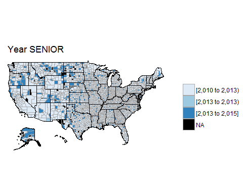{width="5.0526312335958in"
height="4.0421052055993in"}

    ## Warning in super$initialize(map.df, user.df): Your data.frame contains the
    ## following regions which are not mappable: 2201, 2280

    ## Warning in super$initialize(map.df, user.df): The following regions were
    ## missing and are being set to NA: 38043, 38065, 48431, 31007, 31075, 35021,
    ## 31115, 2105, 49009, 48033, 46063, 46075, 2164, 48301, 38087, 13007, 8079,
    ## 46119, 13307, 15005, 32011, 31005, 2100, 48173, 48269, 8033, 2016, 2060,
    ## 48109, 48345, 48235, 48243, 28055, 31165, 30103, 41055, 48443, 46021,
    ## 30011, 30045, 31103, 2282, 26083, 48311, 48261, 48229, 31113, 38083, 30037,
    ## 31171, 31183, 32009, 30069, 31009, 31085, 31117, 38007, 46017, 46137,
    ## 41069, 48359, 48393, 8053, 8057, 8111, 49031, 2195, 2230, 6003, 2068, 2013,
    ## 16025, 16033

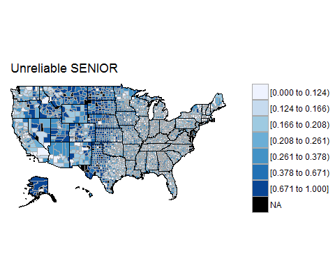{width="5.0526312335958in"
height="4.0421052055993in"}

    ## Warning in super$initialize(map.df, user.df): Your data.frame contains the
    ## following regions which are not mappable: 2201, 2280

    ## Warning in super$initialize(map.df, user.df): The following regions were
    ## missing and are being set to NA: 38043, 38065, 48431, 31007, 31075, 35021,
    ## 31115, 2105, 49009, 48033, 46063, 46075, 2164, 48301, 38087, 13007, 8079,
    ## 46119, 13307, 15005, 32011, 31005, 2100, 48173, 48269, 8033, 2016, 2060,
    ## 48109, 48345, 48235, 48243, 28055, 31165, 30103, 41055, 48443, 46021,
    ## 30011, 30045, 31103, 2282, 26083, 48311, 48261, 48229, 31113, 38083, 30037,
    ## 31171, 31183, 32009, 30069, 31009, 31085, 31117, 38007, 46017, 46137,
    ## 41069, 48359, 48393, 8053, 8057, 8111, 49031, 2195, 2230, 6003, 2068, 2013,
    ## 16025, 16033

{width="5.0526312335958in"
height="4.0421052055993in"}

    ## Warning in super$initialize(map.df, user.df): Your data.frame contains the
    ## following regions which are not mappable: 2201, 2280

    ## Warning in super$initialize(map.df, user.df): The following regions were
    ## missing and are being set to NA: 38043, 38065, 48431, 31007, 31075, 35021,
    ## 31115, 2105, 49009, 48033, 46063, 46075, 2164, 48301, 38087, 13007, 8079,
    ## 46119, 13307, 15005, 32011, 31005, 2100, 48173, 48269, 8033, 2016, 2060,
    ## 48109, 48345, 48235, 48243, 28055, 31165, 30103, 41055, 48443, 46021,
    ## 30011, 30045, 31103, 2282, 26083, 48311, 48261, 48229, 31113, 38083, 30037,
    ## 31171, 31183, 32009, 30069, 31009, 31085, 31117, 38007, 46017, 46137,
    ## 41069, 48359, 48393, 8053, 8057, 8111, 49031, 2195, 2230, 6003, 2068, 2013,
    ## 16025, 16033

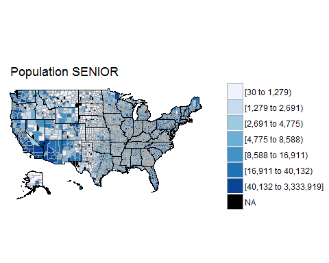{width="5.0526312335958in"
height="4.0421052055993in"}

    ## Warning in super$initialize(map.df, user.df): Your data.frame contains the
    ## following regions which are not mappable: 2201, 2280

    ## Warning in min(xx[xx > upper]): no non-missing arguments to min; returning
    ## Inf

    ## Warning in self$bind(): The following regions were missing and are being
    ## set to NA: 1001, 1009, 1099, 16067, 27091, 27095, 27097, 27099, 27105,
    ## 27109, 27111, 27115, 27117, 27119, 16081, 27129, 27133, 19059, 27141,
    ## 27145, 27149, 27157, 27163, 27171, 28005, 17005, 28009, 28011, 28015,
    ## 28021, 28031, 28039, 19149, 28045, 28051, 28053, 17009, 28059, 28067,
    ## 28073, 23007, 13215, 13239, 27077, 45031, 45035, 45037, 17019, 47011,
    ## 47017, 47021, 47025, 47033, 47035, 47041, 47047, 47049, 47059, 17029,
    ## 47061, 27137, 23015, 23021, 23023, 23031, 28041, 31149, 31151, 31155,
    ## 17035, 31161, 31169, 31173, 31181, 32005, 32007, 32013, 32017, 32023,
    ## 23011, 17049, 39105, 39107, 39117, 39119, 39125, 39129, 39133, 39135,
    ## 39139, 39141, 17055, 39149, 39151, 39157, 39161, 47065, 47067, 47071,
    ## 47077, 47083, 47087, 17065, 47095, 47101, 47107, 47109, 47111, 47119,
    ## 47125, 47135, 47137, 24011, 1107, 18051, 24013, 24021, 24023, 24031, 24033,
    ## 24043, 32031, 32510, 33003, 33009, 18059, 33015, 33019, 34003, 34009,
    ## 34013, 39167, 39171, 39175, 40003, 40011, 18069, 40013, 40017, 40025,
    ## 40029, 40035, 40039, 40045, 40049, 40055, 37193, 18079, 47141, 48045,
    ## 48049, 48055, 48061, 48065, 48067, 48073, 48077, 48081, 18085, 48085,
    ## 48087, 48091, 24047, 25007, 25013, 25015, 25017, 34017, 34019, 18095,
    ## 34021, 34029, 34033, 34035, 34041, 35007, 30055, 30057, 37195, 37199,
    ## 18105, 38005, 38009, 38017, 38027, 38029, 38037, 38039, 38043, 38047,
    ## 38053, 18115, 38059, 38063, 47001, 47003, 40065, 40071, 40083, 40085,
    ## 40091, 40099, 18125, 40101, 40107, 40111, 40117, 40119, 40125, 25021,
    ## 25023, 26003, 26005, 18131, 26007, 30063, 30065, 30071, 30077, 30083,
    ## 30087, 30091, 30097, 30101, 1121, 18139, 38065, 38067, 38071, 38075, 38081,
    ## 38089, 38093, 38097, 38101, 39001, 18153, 39005, 39011, 39013, 39017,
    ## 39019, 42003, 42007, 48361, 48369, 48383, 18173, 48385, 48387, 48395,
    ## 48399, 48403, 48415, 48417, 48419, 48423, 48427, 18179, 48431, 26017,
    ## 26019, 26021, 26027, 26031, 26033, 30109, 31007, 31011, 18183, 31013,
    ## 31019, 31025, 31029, 31033, 31039, 31045, 31051, 31057, 31071, 19009,
    ## 31075, 39023, 39025, 39029, 39033, 39037, 39041, 39043, 39049, 35019,
    ## 19017, 35021, 35025, 35033, 35039, 47143, 47147, 47149, 47155, 47161,
    ## 47167, 19021, 47175, 47177, 45055, 45061, 45065, 45071, 45073, 26041,
    ## 26043, 26047, 19031, 26051, 26065, 26069, 17131, 13191, 31079, 31081,
    ## 31083, 31087, 31099, 19039, 31101, 31105, 31109, 31115, 31119, 28091,
    ## 28097, 28101, 28109, 28119, 2050, 17073, 28121, 28129, 35041, 35043, 35049,
    ## 35057, 35061, 36007, 36011, 36013, 17077, 36019, 36027, 36033, 36035,
    ## 36039, 40131, 40135, 40137, 40143, 40145, 17079, 40149, 41003, 41005,
    ## 41011, 41013, 41021, 41027, 26075, 26079, 26081, 17089, 26087, 26093,
    ## 26095, 26099, 26101, 26115, 28137, 28141, 28143, 28153, 17103, 28155,
    ## 28157, 28163, 29007, 29017, 29023, 29029, 29035, 29041, 29045, 17107,
    ## 36041, 36045, 36051, 36055, 36059, 36063, 36071, 36073, 36075, 48435,
    ## 17121, 48437, 48441, 48447, 48451, 48453, 48457, 48467, 48469, 48477,
    ## 48483, 17129, 48485, 48489, 48499, 49001, 49007, 26071, 26125, 26131,
    ## 26135, 26145, 17139, 26147, 26157, 29047, 29051, 29055, 29057, 29061,
    ## 29067, 29073, 29077, 17145, 29079, 29087, 37011, 37013, 37019, 37025,
    ## 13223, 36081, 36087, 36089, 2105, 17155, 36093, 36099, 36103, 36107, 36117,
    ## 42017, 42023, 45079, 45083, 45085, 17169, 45089, 46005, 46011, 46019,
    ## 46023, 46033, 46039, 46041, 46045, 46051, 17175, 46059, 26159, 26163,
    ## 27001, 27003, 27011, 27017, 27025, 27035, 27037, 17179, 27041, 27043,
    ## 27045, 27053, 27059, 37035, 37037, 37039, 37041, 37047, 17189, 37059,
    ## 37061, 37065, 37069, 37071, 37075, 37077, 37083, 37087, 42027, 17203,
    ## 42029, 42033, 42039, 42045, 42049, 42051, 42055, 42061, 42067, 42073,
    ## 18009, 42079, 41029, 41033, 41039, 41043, 41049, 41051, 41059, 41065,
    ## 41071, 18011, 27063, 27065, 27069, 29105, 29111, 29119, 29125, 29129,
    ## 29139, 29141, 18021, 29147, 29153, 29157, 29161, 29167, 37095, 37099,
    ## 37105, 37111, 37115, 18033, 37121, 37129, 37135, 37139, 37143, 37147,
    ## 37153, 42085, 42089, 42095, 2122, 13125, 42101, 42109, 42111, 42115, 42119,
    ## 42121, 42125, 42133, 49009, 49013, 13129, 49019, 49023, 48001, 48013,
    ## 48015, 48017, 48023, 48025, 48029, 48033, 13131, 48035, 48039, 29171,
    ## 29175, 29177, 29181, 29186, 29187, 29197, 29203, 13139, 29207, 29213,
    ## 29219, 29225, 29510, 30003, 37159, 37163, 37169, 37175, 13157, 39061,
    ## 39071, 39077, 39081, 39087, 39093, 39099, 39101, 44001, 44003, 13169,
    ## 44005, 45001, 45003, 45007, 45017, 45023, 45025, 46063, 46065, 46069,
    ## 13175, 46075, 46079, 46085, 46093, 46097, 46101, 46113, 46115, 46117,
    ## 46121, 13187, 46127, 30005, 30009, 30015, 30019, 30023, 30029, 30035,
    ## 30041, 31129, 13197, 31133, 31141, 19007, 19011, 19015, 19019, 19023,
    ## 19027, 19033, 17081, 13201, 17091, 17093, 17099, 17101, 17105, 17109,
    ## 17111, 17117, 17125, 17127, 2150, 13217, 13185, 13189, 13195, 13199, 13205,
    ## 13209, 13213, 13221, 13229, 13231, 13225, 13235, 13241, 13247, 13255,
    ## 13257, 13267, 13269, 20183, 20187, 20189, 13233, 20197, 20207, 21191,
    ## 21193, 21201, 21205, 21207, 21217, 21221, 21231, 13243, 21233, 21237,
    ## 21239, 22005, 22091, 22093, 22097, 22099, 22103, 22113, 13253, 22117,
    ## 21011, 21013, 21015, 21027, 21029, 17133, 17137, 17141, 17143, 13265,
    ## 17147, 17153, 17159, 17165, 17167, 17177, 17183, 17191, 17195, 17197,
    ## 13277, 18001, 13275, 13279, 13281, 13289, 13295, 13301, 20035, 20041,
    ## 20047, 13285, 20051, 20053, 20057, 20063, 20073, 20077, 20079, 20087,
    ## 22011, 22015, 13293, 22017, 22023, 22031, 22035, 22041, 22043, 22049,
    ## 22051, 22055, 21035, 13303, 21039, 21041, 21045, 21057, 21065, 21067,
    ## 21071, 21079, 21083, 21085, 2164, 20027, 21091, 21097, 21101, 21107, 48267,
    ## 48271, 48277, 48281, 48285, 48287, 20029, 48291, 48293, 48295, 48301,
    ## 48305, 48307, 48317, 48323, 48327, 48331, 20039, 48333, 51800, 51810,
    ## 51840, 53001, 53003, 53005, 53015, 53017, 53019, 20049, 53023, 53025,
    ## 51600, 55101, 55107, 55111, 55113, 55119, 55123, 55125, 20065, 55133,
    ## 55139, 56003, 56009, 56017, 56019, 54023, 54025, 54027, 54033, 20075,
    ## 54037, 54045, 54051, 54053, 54059, 54065, 54069, 54075, 48341, 54083,
    ## 20085, 54087, 54091, 54093, 54097, 54099, 54103, 54105, 54107, 55011,
    ## 55013, 20095, 55019, 55021, 55023, 53029, 49039, 49043, 49045, 49049,
    ## 49057, 50003, 20105, 50007, 50011, 50015, 50021, 56023, 51005, 51011,
    ## 51013, 51015, 51019, 20115, 51025, 51031, 51033, 51036, 51045, 51049,
    ## 51051, 54081, 51061, 51067, 2180, 20127, 51069, 51073, 51081, 51085, 51091,
    ## 51095, 51103, 49037, 51119, 50025, 20135, 53037, 53039, 53059, 53075,
    ## 54017, 54029, 54043, 54055, 54073, 54085, 20145, 54095, 51057, 51115,
    ## 22095, 22111, 21001, 21005, 21007, 21019, 21037, 20155, 21049, 21061,
    ## 21069, 21081, 21093, 21109, 21125, 21131, 40037, 40047, 20163, 37183,
    ## 37187, 38003, 38013, 38025, 38041, 38055, 38069, 38087, 38095, 20173,
    ## 39009, 39021, 54109, 55015, 55027, 49027, 49033, 49041, 49055, 50013,
    ## 20185, 51003, 51009, 51023, 51035, 51053, 51065, 1003, 1027, 1041, 1057,
    ## 20195, 1073, 1091, 1103, 1115, 1129, 21147, 21165, 21181, 19041, 19043,
    ## 20203, 19049, 19057, 19073, 19081, 19091, 19099, 19115, 19131, 19147,
    ## 19157, 20205, 19165, 19179, 19187, 19197, 39031, 39045, 35013, 35017,
    ## 35037, 35059, 2188, 21183, 36017, 36031, 36049, 36065, 36077, 51079, 12129,
    ## 13011, 13019, 13027, 21187, 13033, 13039, 13051, 13061, 2240, 5149, 6011,
    ## 6027, 6047, 6063, 21189, 6077, 6091, 6107, 8011, 8019, 8027, 20013, 20023,
    ## 27071, 27079, 21199, 27087, 27101, 27107, 27125, 27131, 27143, 27159,
    ## 27169, 28007, 28023, 21209, 28035, 28043, 36091, 36101, 36113, 42011,
    ## 42019, 42025, 42037, 42053, 21219, 42057, 42075, 42081, 42099, 42117,
    ## 42131, 1005, 1013, 1019, 6041, 21229, 6053, 6061, 2090, 8041, 8049, 12085,
    ## 12093, 12105, 12121, 12133, 22001, 13007, 13021, 13035, 13047, 13065,
    ## 13075, 28057, 28069, 22119, 22125, 22013, 23017, 24015, 24027, 25001,
    ## 25003, 25027, 26025, 26039, 26049, 44007, 22033, 45021, 45033, 45045,
    ## 47009, 47019, 47037, 47051, 47063, 47075, 47085, 1017, 2198, 22053, 47099,
    ## 47113, 47127, 6019, 6023, 6035, 6037, 13085, 13099, 13117, 22073, 8051,
    ## 8055, 8065, 8079, 8089, 8101, 8117, 9005, 12007, 12019, 22077, 12027,
    ## 12035, 26059, 26063, 26113, 26119, 26129, 26137, 26149, 27005, 22089,
    ## 27013, 27023, 27033, 27047, 27061, 29095, 47133, 47145, 47159, 47165,
    ## 22105, 45047, 45051, 45059, 45069, 45087, 46015, 46025, 46037, 46049,
    ## 46057, 221

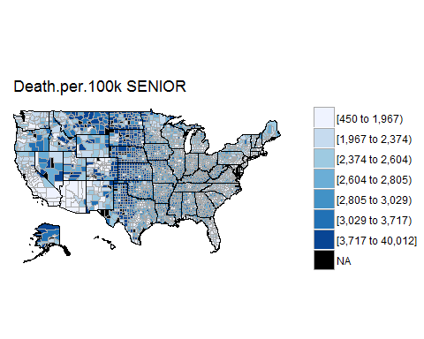{width="5.0526312335958in"
height="4.0421052055993in"}

    ## Warning in super$initialize(map.df, user.df): Your data.frame contains the
    ## following regions which are not mappable: 2201, 2280

    ## Warning in self$bind(): The following regions were missing and are being
    ## set to NA: 38043, 38065, 48431, 31007, 31075, 35021, 31115, 2105, 49009,
    ## 48033, 46063, 46075, 2164, 48301, 38087, 13007, 8079, 46119, 13307, 15005,
    ## 32011, 31005, 2100, 48173, 48269, 8033, 2016, 2060, 48109, 48345, 48235,
    ## 48243, 28055, 31165, 30103, 41055, 48443, 46021, 30011, 30045, 31103,
    ## 2282, 26083, 48311, 48261, 48229, 31113, 38083, 30037, 31171, 31183, 32009,
    ## 30069, 31009, 31085, 31117, 38007, 46017, 46137, 41069, 48359, 48393, 8053,
    ## 8057, 8111, 49031, 2195, 2230, 6003, 2068, 2013, 16025, 16033

{width="5.0526312335958in"
height="4.0421052055993in"}

    ## Warning in super$initialize(map.df, user.df): Your data.frame contains the
    ## following regions which are not mappable: 2201, 2280

    ## Warning in super$initialize(map.df, user.df): The following regions were
    ## missing and are being set to NA: 38043, 38065, 48431, 31007, 31075, 35021,
    ## 31115, 2105, 49009, 48033, 46063, 46075, 2164, 48301, 38087, 13007, 8079,
    ## 46119, 13307, 15005, 32011, 31005, 2100, 48173, 48269, 8033, 2016, 2060,
    ## 48109, 48345, 48235, 48243, 28055, 31165, 30103, 41055, 48443, 46021,
    ## 30011, 30045, 31103, 2282, 26083, 48311, 48261, 48229, 31113, 38083, 30037,
    ## 31171, 31183, 32009, 30069, 31009, 31085, 31117, 38007, 46017, 46137,
    ## 41069, 48359, 48393, 8053, 8057, 8111, 49031, 2195, 2230, 6003, 2068, 2013,
    ## 16025, 16033

{width="5.0526312335958in"
height="4.0421052055993in"}

    ## Warning in super$initialize(map.df, user.df): Your data.frame contains the
    ## following regions which are not mappable: 2201, 2280

    ## Warning in super$initialize(map.df, user.df): The following regions were
    ## missing and are being set to NA: 38043, 38065, 48431, 31007, 31075, 35021,
    ## 31115, 2105, 49009, 48033, 46063, 46075, 2164, 48301, 38087, 13007, 8079,
    ## 46119, 13307, 15005, 32011, 31005, 2100, 48173, 48269, 8033, 2016, 2060,
    ## 48109, 48345, 48235, 48243, 28055, 31165, 30103, 41055, 48443, 46021,
    ## 30011, 30045, 31103, 2282, 26083, 48311, 48261, 48229, 31113, 38083, 30037,
    ## 31171, 31183, 32009, 30069, 31009, 31085, 31117, 38007, 46017, 46137,
    ## 41069, 48359, 48393, 8053, 8057, 8111, 49031, 2195, 2230, 6003, 2068, 2013,
    ## 16025, 16033

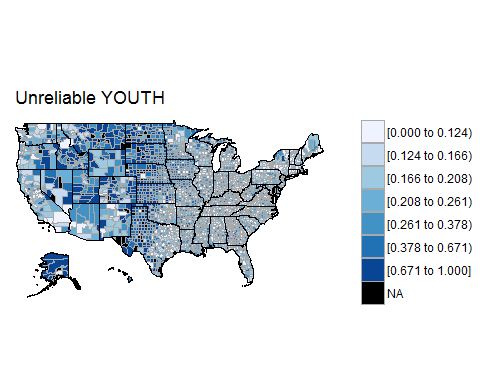{width="5.0526312335958in"
height="4.0421052055993in"}

    ## Warning in super$initialize(map.df, user.df): Your data.frame contains the
    ## following regions which are not mappable: 2201, 2280

    ## Warning in super$initialize(map.df, user.df): The following regions were
    ## missing and are being set to NA: 38043, 38065, 48431, 31007, 31075, 35021,
    ## 31115, 2105, 49009, 48033, 46063, 46075, 2164, 48301, 38087, 13007, 8079,
    ## 46119, 13307, 15005, 32011, 31005, 2100, 48173, 48269, 8033, 2016, 2060,
    ## 48109, 48345, 48235, 48243, 28055, 31165, 30103, 41055, 48443, 46021,
    ## 30011, 30045, 31103, 2282, 26083, 48311, 48261, 48229, 31113, 38083, 30037,
    ## 31171, 31183, 32009, 30069, 31009, 31085, 31117, 38007, 46017, 46137,
    ## 41069, 48359, 48393, 8053, 8057, 8111, 49031, 2195, 2230, 6003, 2068, 2013,
    ## 16025, 16033

{width="5.0526312335958in"
height="4.0421052055993in"}

    ## Warning in super$initialize(map.df, user.df): Your data.frame contains the
    ## following regions which are not mappable: 2201, 2280

    ## Warning in super$initialize(map.df, user.df): The following regions were
    ## missing and are being set to NA: 38043, 38065, 48431, 31007, 31075, 35021,
    ## 31115, 2105, 49009, 48033, 46063, 46075, 2164, 48301, 38087, 13007, 8079,
    ## 46119, 13307, 15005, 32011, 31005, 2100, 48173, 48269, 8033, 2016, 2060,
    ## 48109, 48345, 48235, 48243, 28055, 31165, 30103, 41055, 48443, 46021,
    ## 30011, 30045, 31103, 2282, 26083, 48311, 48261, 48229, 31113, 38083, 30037,
    ## 31171, 31183, 32009, 30069, 31009, 31085, 31117, 38007, 46017, 46137,
    ## 41069, 48359, 48393, 8053, 8057, 8111, 49031, 2195, 2230, 6003, 2068, 2013,
    ## 16025, 16033

{width="5.0526312335958in"
height="4.0421052055993in"}

    ## Warning in super$initialize(map.df, user.df): Your data.frame contains the
    ## following regions which are not mappable: 2201, 2280

    ## Warning in min(xx[xx > upper]): no non-missing arguments to min; returning
    ## Inf

    ## Warning in self$bind(): The following regions were missing and are being
    ## set to NA: 1001, 1009, 1099, 16067, 27091, 27095, 27097, 27099, 27105,
    ## 27109, 27111, 27115, 27117, 27119, 16081, 27129, 27133, 19059, 27141,
    ## 27145, 27149, 27157, 27163, 27171, 28005, 17005, 28009, 28011, 28015,
    ## 28021, 28031, 28039, 19149, 28045, 28051, 28053, 17009, 28059, 28067,
    ## 28073, 23007, 13215, 13239, 27077, 45031, 45035, 45037, 17019, 47011,
    ## 47017, 47021, 47025, 47033, 47035, 47041, 47047, 47049, 47059, 17029,
    ## 47061, 27137, 23015, 23021, 23023, 23031, 28041, 31149, 31151, 31155,
    ## 17035, 31161, 31169, 31173, 31181, 32005, 32007, 32013, 32017, 32023,
    ## 23011, 17049, 39105, 39107, 39117, 39119, 39125, 39129, 39133, 39135,
    ## 39139, 39141, 17055, 39149, 39151, 39157, 39161, 47065, 47067, 47071,
    ## 47077, 47083, 47087, 17065, 47095, 47101, 47107, 47109, 47111, 47119,
    ## 47125, 47135, 47137, 24011, 1107, 18051, 24013, 24021, 24023, 24031, 24033,
    ## 24043, 32031, 32510, 33003, 33009, 18059, 33015, 33019, 34003, 34009,
    ## 34013, 39167, 39171, 39175, 40003, 40011, 18069, 40013, 40017, 40025,
    ## 40029, 40035, 40039, 40045, 40049, 40055, 37193, 18079, 47141, 48045,
    ## 48049, 48055, 48061, 48065, 48067, 48073, 48077, 48081, 18085, 48085,
    ## 48087, 48091, 24047, 25007, 25013, 25015, 25017, 34017, 34019, 18095,
    ## 34021, 34029, 34033, 34035, 34041, 35007, 30055, 30057, 37195, 37199,
    ## 18105, 38005, 38009, 38017, 38027, 38029, 38037, 38039, 38043, 38047,
    ## 38053, 18115, 38059, 38063, 47001, 47003, 40065, 40071, 40083, 40085,
    ## 40091, 40099, 18125, 40101, 40107, 40111, 40117, 40119, 40125, 25021,
    ## 25023, 26003, 26005, 18131, 26007, 30063, 30065, 30071, 30077, 30083,
    ## 30087, 30091, 30097, 30101, 1121, 18139, 38065, 38067, 38071, 38075, 38081,
    ## 38089, 38093, 38097, 38101, 39001, 18153, 39005, 39011, 39013, 39017,
    ## 39019, 42003, 42007, 48361, 48369, 48383, 18173, 48385, 48387, 48395,
    ## 48399, 48403, 48415, 48417, 48419, 48423, 48427, 18179, 48431, 26017,
    ## 26019, 26021, 26027, 26031, 26033, 30109, 31007, 31011, 18183, 31013,
    ## 31019, 31025, 31029, 31033, 31039, 31045, 31051, 31057, 31071, 19009,
    ## 31075, 39023, 39025, 39029, 39033, 39037, 39041, 39043, 39049, 35019,
    ## 19017, 35021, 35025, 35033, 35039, 47143, 47147, 47149, 47155, 47161,
    ## 47167, 19021, 47175, 47177, 45055, 45061, 45065, 45071, 45073, 26041,
    ## 26043, 26047, 19031, 26051, 26065, 26069, 17131, 13191, 31079, 31081,
    ## 31083, 31087, 31099, 19039, 31101, 31105, 31109, 31115, 31119, 28091,
    ## 28097, 28101, 28109, 28119, 2050, 17073, 28121, 28129, 35041, 35043, 35049,
    ## 35057, 35061, 36007, 36011, 36013, 17077, 36019, 36027, 36033, 36035,
    ## 36039, 40131, 40135, 40137, 40143, 40145, 17079, 40149, 41003, 41005,
    ## 41011, 41013, 41021, 41027, 26075, 26079, 26081, 17089, 26087, 26093,
    ## 26095, 26099, 26101, 26115, 28137, 28141, 28143, 28153, 17103, 28155,
    ## 28157, 28163, 29007, 29017, 29023, 29029, 29035, 29041, 29045, 17107,
    ## 36041, 36045, 36051, 36055, 36059, 36063, 36071, 36073, 36075, 48435,
    ## 17121, 48437, 48441, 48447, 48451, 48453, 48457, 48467, 48469, 48477,
    ## 48483, 17129, 48485, 48489, 48499, 49001, 49007, 26071, 26125, 26131,
    ## 26135, 26145, 17139, 26147, 26157, 29047, 29051, 29055, 29057, 29061,
    ## 29067, 29073, 29077, 17145, 29079, 29087, 37011, 37013, 37019, 37025,
    ## 13223, 36081, 36087, 36089, 2105, 17155, 36093, 36099, 36103, 36107, 36117,
    ## 42017, 42023, 45079, 45083, 45085, 17169, 45089, 46005, 46011, 46019,
    ## 46023, 46033, 46039, 46041, 46045, 46051, 17175, 46059, 26159, 26163,
    ## 27001, 27003, 27011, 27017, 27025, 27035, 27037, 17179, 27041, 27043,
    ## 27045, 27053, 27059, 37035, 37037, 37039, 37041, 37047, 17189, 37059,
    ## 37061, 37065, 37069, 37071, 37075, 37077, 37083, 37087, 42027, 17203,
    ## 42029, 42033, 42039, 42045, 42049, 42051, 42055, 42061, 42067, 42073,
    ## 18009, 42079, 41029, 41033, 41039, 41043, 41049, 41051, 41059, 41065,
    ## 41071, 18011, 27063, 27065, 27069, 29105, 29111, 29119, 29125, 29129,
    ## 29139, 29141, 18021, 29147, 29153, 29157, 29161, 29167, 37095, 37099,
    ## 37105, 37111, 37115, 18033, 37121, 37129, 37135, 37139, 37143, 37147,
    ## 37153, 42085, 42089, 42095, 2122, 13125, 42101, 42109, 42111, 42115, 42119,
    ## 42121, 42125, 42133, 49009, 49013, 13129, 49019, 49023, 48001, 48013,
    ## 48015, 48017, 48023, 48025, 48029, 48033, 13131, 48035, 48039, 29171,
    ## 29175, 29177, 29181, 29186, 29187, 29197, 29203, 13139, 29207, 29213,
    ## 29219, 29225, 29510, 30003, 37159, 37163, 37169, 37175, 13157, 39061,
    ## 39071, 39077, 39081, 39087, 39093, 39099, 39101, 44001, 44003, 13169,
    ## 44005, 45001, 45003, 45007, 45017, 45023, 45025, 46063, 46065, 46069,
    ## 13175, 46075, 46079, 46085, 46093, 46097, 46101, 46113, 46115, 46117,
    ## 46121, 13187, 46127, 30005, 30009, 30015, 30019, 30023, 30029, 30035,
    ## 30041, 31129, 13197, 31133, 31141, 19007, 19011, 19015, 19019, 19023,
    ## 19027, 19033, 17081, 13201, 17091, 17093, 17099, 17101, 17105, 17109,
    ## 17111, 17117, 17125, 17127, 2150, 13217, 13185, 13189, 13195, 13199, 13205,
    ## 13209, 13213, 13221, 13229, 13231, 13225, 13235, 13241, 13247, 13255,
    ## 13257, 13267, 13269, 20183, 20187, 20189, 13233, 20197, 20207, 21191,
    ## 21193, 21201, 21205, 21207, 21217, 21221, 21231, 13243, 21233, 21237,
    ## 21239, 22005, 22091, 22093, 22097, 22099, 22103, 22113, 13253, 22117,
    ## 21011, 21013, 21015, 21027, 21029, 17133, 17137, 17141, 17143, 13265,
    ## 17147, 17153, 17159, 17165, 17167, 17177, 17183, 17191, 17195, 17197,
    ## 13277, 18001, 13275, 13279, 13281, 13289, 13295, 13301, 20035, 20041,
    ## 20047, 13285, 20051, 20053, 20057, 20063, 20073, 20077, 20079, 20087,
    ## 22011, 22015, 13293, 22017, 22023, 22031, 22035, 22041, 22043, 22049,
    ## 22051, 22055, 21035, 13303, 21039, 21041, 21045, 21057, 21065, 21067,
    ## 21071, 21079, 21083, 21085, 2164, 20027, 21091, 21097, 21101, 21107, 48267,
    ## 48271, 48277, 48281, 48285, 48287, 20029, 48291, 48293, 48295, 48301,
    ## 48305, 48307, 48317, 48323, 48327, 48331, 20039, 48333, 51800, 51810,
    ## 51840, 53001, 53003, 53005, 53015, 53017, 53019, 20049, 53023, 53025,
    ## 51600, 55101, 55107, 55111, 55113, 55119, 55123, 55125, 20065, 55133,
    ## 55139, 56003, 56009, 56017, 56019, 54023, 54025, 54027, 54033, 20075,
    ## 54037, 54045, 54051, 54053, 54059, 54065, 54069, 54075, 48341, 54083,
    ## 20085, 54087, 54091, 54093, 54097, 54099, 54103, 54105, 54107, 55011,
    ## 55013, 20095, 55019, 55021, 55023, 53029, 49039, 49043, 49045, 49049,
    ## 49057, 50003, 20105, 50007, 50011, 50015, 50021, 56023, 51005, 51011,
    ## 51013, 51015, 51019, 20115, 51025, 51031, 51033, 51036, 51045, 51049,
    ## 51051, 54081, 51061, 51067, 2180, 20127, 51069, 51073, 51081, 51085, 51091,
    ## 51095, 51103, 49037, 51119, 50025, 20135, 53037, 53039, 53059, 53075,
    ## 54017, 54029, 54043, 54055, 54073, 54085, 20145, 54095, 51057, 51115,
    ## 22095, 22111, 21001, 21005, 21007, 21019, 21037, 20155, 21049, 21061,
    ## 21069, 21081, 21093, 21109, 21125, 21131, 40037, 40047, 20163, 37183,
    ## 37187, 38003, 38013, 38025, 38041, 38055, 38069, 38087, 38095, 20173,
    ## 39009, 39021, 54109, 55015, 55027, 49027, 49033, 49041, 49055, 50013,
    ## 20185, 51003, 51009, 51023, 51035, 51053, 51065, 1003, 1027, 1041, 1057,
    ## 20195, 1073, 1091, 1103, 1115, 1129, 21147, 21165, 21181, 19041, 19043,
    ## 20203, 19049, 19057, 19073, 19081, 19091, 19099, 19115, 19131, 19147,
    ## 19157, 20205, 19165, 19179, 19187, 19197, 39031, 39045, 35013, 35017,
    ## 35037, 35059, 2188, 21183, 36017, 36031, 36049, 36065, 36077, 51079, 12129,
    ## 13011, 13019, 13027, 21187, 13033, 13039, 13051, 13061, 2240, 5149, 6011,
    ## 6027, 6047, 6063, 21189, 6077, 6091, 6107, 8011, 8019, 8027, 20013, 20023,
    ## 27071, 27079, 21199, 27087, 27101, 27107, 27125, 27131, 27143, 27159,
    ## 27169, 28007, 28023, 21209, 28035, 28043, 36091, 36101, 36113, 42011,
    ## 42019, 42025, 42037, 42053, 21219, 42057, 42075, 42081, 42099, 42117,
    ## 42131, 1005, 1013, 1019, 6041, 21229, 6053, 6061, 2090, 8041, 8049, 12085,
    ## 12093, 12105, 12121, 12133, 22001, 13007, 13021, 13035, 13047, 13065,
    ## 13075, 28057, 28069, 22119, 22125, 22013, 23017, 24015, 24027, 25001,
    ## 25003, 25027, 26025, 26039, 26049, 44007, 22033, 45021, 45033, 45045,
    ## 47009, 47019, 47037, 47051, 47063, 47075, 47085, 1017, 2198, 22053, 47099,
    ## 47113, 47127, 6019, 6023, 6035, 6037, 13085, 13099, 13117, 22073, 8051,
    ## 8055, 8065, 8079, 8089, 8101, 8117, 9005, 12007, 12019, 22077, 12027,
    ## 12035, 26059, 26063, 26113, 26119, 26129, 26137, 26149, 27005, 22089,
    ## 27013, 27023, 27033, 27047, 27061, 29095, 47133, 47145, 47159, 47165,
    ## 22105, 45047, 45051, 45059, 45069, 45087, 46015, 46025, 46037, 46049,
    ## 46057, 221

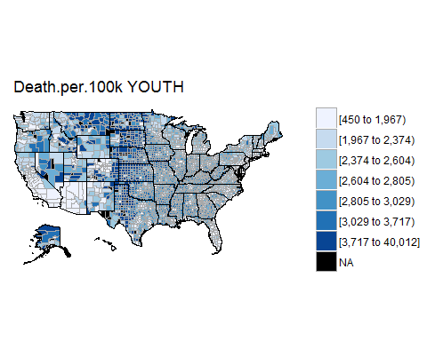{width="5.0526312335958in"
height="4.0421052055993in"}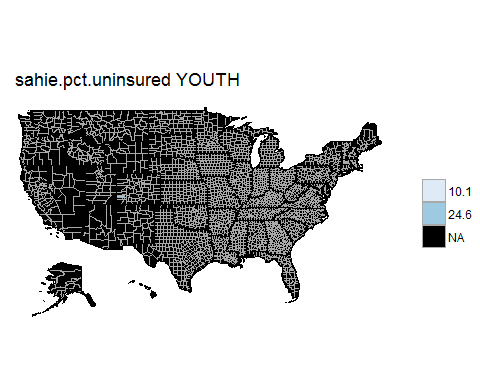{width="5.0526312335958in"
height="4.0421052055993in"}

Another option for county maps:
<https://stackoverflow.com/questions/25875877/remove-border-lines-in-ggplot-map-choropleth>
<https://www.arilamstein.com/blog/2015/07/02/exploring-the-demographics-of-ferguson-missouri/>

    # end of file
